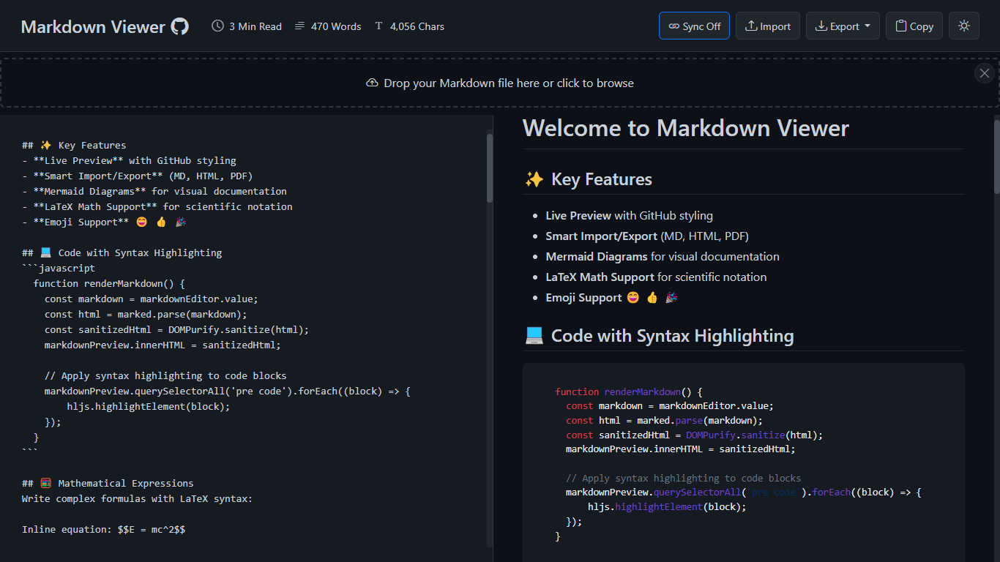
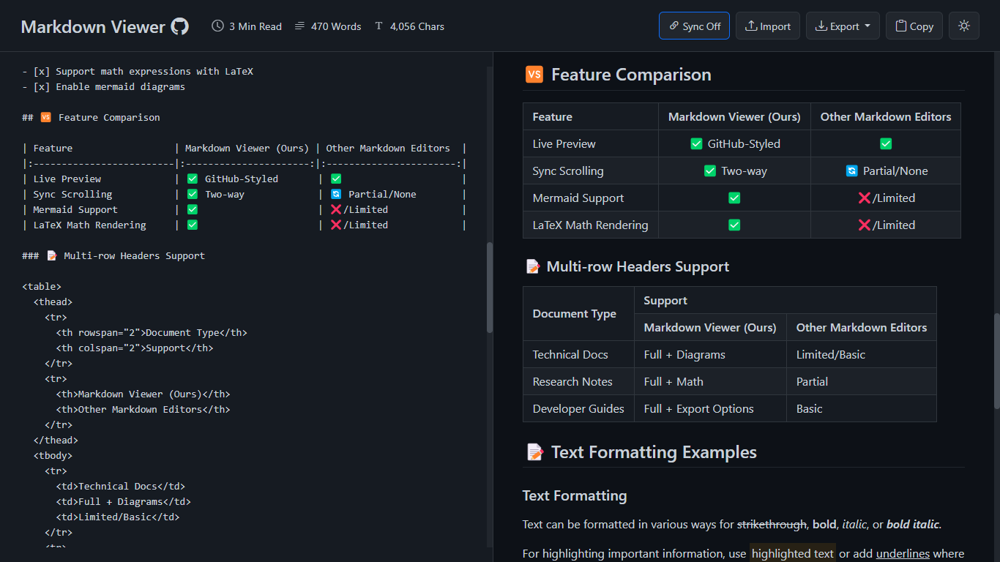

# MDview

    
    <h3>AI-Powered Markdown Editor & Viewer</h3>
    
Write, preview, present, and share — all in your browser, 100% client-side

    <a href="https://markdownview.github.io/">Live Demo</a> • 
    <a href="#-features-at-a-glance">Features</a> • 
    <a href="#-screenshots">Screenshots</a> • 
    <a href="#-usage">Usage</a> • 
    <a href="#-release-notes">Release Notes</a> • 
    <a href="#-license">License</a>

## 🚀 Overview

**MDview** is a professional, full-featured Markdown editor and preview application that runs entirely in your browser. It provides a GitHub-style rendering experience with a split-screen interface, AI-powered writing assistance, multi-format file import, encrypted sharing, slide presentations, and powerful export options — all without any server-side processing.

**No sign-up. No server. No data leaves your device.**

## ✨ Features at a Glance

| Category | Features |
|:---------|:---------|
| **Editor** | Live preview, split/editor/preview modes, sync scrolling, formatting toolbar, find & replace (regex), word wrap toggle, draggable resize divider |
| **Writing Modes** | Zen mode (distraction-free fullscreen), Focus mode (dimmed paragraphs), Dark mode, multiple preview themes (GitHub, GitLab, Notion, Dracula, Solarized) |
| **Rendering** | GitHub-style Markdown, syntax highlighting (180+ languages), LaTeX math (MathJax), Mermaid diagrams (zoom/pan/export), PlantUML diagrams, callout blocks, footnotes, emoji, anchor links |
| **🤖 AI Assistant** | Local Qwen 3.5 (WebGPU/WASM), Gemini 2.0 Flash, Groq Llama 3.3 70B, OpenRouter — summarize, expand, rephrase, grammar-fix, explain, simplify, auto-complete |
| **Import** | MD, DOCX, XLSX/XLS, CSV, HTML, JSON, XML, PDF — drag & drop or click to import |
| **Export** | Markdown, HTML, PDF (smart page-breaks), LLM Memory (4 formats + shareable link) |
| **Sharing** | AES-256-GCM encrypted sharing via Firebase; decryption key stays in URL fragment (never sent to server) |
| **Presentation** | Slide mode using `---` separators with keyboard navigation |
| **Desktop** | Native app via Neutralino.js with system tray and offline support |
| **Code Execution** | Run bash commands directly in preview via [just-bash](https://justbash.dev/) |
| **Extras** | Auto-save (localStorage + cloud), table of contents, image paste, templates, content statistics (words/chars/reading time), fully responsive mobile UI |

## 🤖 AI Assistant

MDview includes a built-in AI assistant panel with **four model options**:

| Model | Provider | Type | Speed |
|:------|:---------|:-----|:------|
| **Qwen 3.5 Small** | Local (WebGPU/WASM) | 🔒 Private — no data leaves browser | ⚡ Fast |
| **Gemini 2.0 Flash** | Google (free tier) | ☁️ Cloud — 1M tokens/min | 🚀 Very Fast |
| **Llama 3.3 70B** | Groq (free tier) | ☁️ Cloud — ultra-low latency | ⚡ Ultra Fast |
| **Auto · Best Free** | OpenRouter (free tier) | ☁️ Cloud — multi-model routing | 🧠 Powerful |

**AI Actions:** Summarize · Expand · Rephrase · Fix Grammar · Explain · Simplify · Auto-complete · Generate Markdown

> [!TIP]
> Click the ✨ **AI** button in the toolbar to open the assistant. Select text and right-click for quick AI actions via the context menu.

## 📂 File Import & Conversion

Import files directly — they're auto-converted to Markdown client-side:

| Format | Library | Notes |
|:-------|:--------|:------|
| **DOCX** | Mammoth.js + Turndown.js | Preserves formatting, tables, images |
| **XLSX / XLS** | SheetJS | Multi-sheet support with markdown tables |
| **CSV** | Native parser | Auto-detection of delimiters |
| **HTML** | Turndown.js | Extracts body content from full pages |
| **JSON** | Native | Pretty-printed code block |
| **XML** | Native | Formatted code block |
| **PDF** | pdf.js | Page-by-page text extraction |

## 📤 Export Options

| Format | Details |
|:-------|:--------|
| **Markdown (.md)** | Raw markdown with timestamped filename |
| **HTML** | Self-contained HTML with all styling |
| **PDF** | Smart page-break detection, cascading adjustments, oversized graphic scaling |
| **LLM Memory** | 4 formats: Standard, System Prompt, OpenAI Instructions, Raw — with token count, metadata, copy/download, and shareable encrypted link |

## 📸 Screenshots

### Code Syntax Highlighting

### Mathematical Expressions Support

### Mermaid Diagrams

### Tables Support

## 📝 Usage

| Action | How |
|:-------|:----|
| **Write** | Type or paste Markdown in the left editor panel |
| **Preview** | See live rendered output in the right panel |
| **Import** | Click 📤 Import, drag & drop, or paste — supports MD, DOCX, XLSX, CSV, HTML, JSON, XML, PDF |
| **Export** | Use the ⬇️ Export dropdown → Markdown, HTML, PDF, or LLM Memory |
| **AI Assistant** | Click ✨ AI → choose a model → ask questions or use quick actions |
| **Dark Mode** | Click the 🌙 moon icon |
| **Sync Scroll** | Click the 🔗 link icon to toggle two-way sync |
| **Share** | Click 📤 Share → generates an encrypted Firebase link |
| **Present** | Click 🎬 Presentation → navigate slides with arrow keys |
| **Zen Mode** | Press `Ctrl+Shift+Z` or click the fullscreen icon |
| **Find & Replace** | Press `Ctrl+F` → supports regex |
| **Templates** | Click the 📄 Templates button for starter documents |

### Mermaid Diagram Toolbar

Hover over any Mermaid diagram to reveal a toolbar:

| Button | Action |
|:-------|:-------|
| ⛶ (arrows) | Open diagram in zoom/pan modal |
| PNG | Download as PNG |
| 📋 (clipboard) | Copy image to clipboard |
| SVG | Download as SVG |

### Supported Markdown Syntax

Headings · **Bold** · *Italic* · ~~Strikethrough~~ · Links · Images · Ordered/Unordered Lists · Tables · Code Blocks (180+ languages) · Blockquotes · Horizontal Rules · Task Lists · LaTeX Equations (inline & block) · Mermaid Diagrams · PlantUML Diagrams · Callout Blocks (`> [!NOTE]`, `> [!TIP]`, `> [!WARNING]`) · Footnotes (`[^1]`) · Emoji Shortcodes · Executable Bash Blocks

## 🔧 Technologies

### Core
| Technology | Purpose |
|:-----------|:--------|
| HTML5 / CSS3 / JavaScript | Core stack |
| [Bootstrap](https://getbootstrap.com/) | Responsive UI framework |
| [Marked.js](https://marked.js.org/) | Markdown parser |
| [highlight.js](https://highlightjs.org/) | Syntax highlighting (180+ languages) |
| [DOMPurify](https://github.com/cure53/DOMPurify) | HTML sanitization |

### Rendering
| Technology | Purpose |
|:-----------|:--------|
| [MathJax](https://www.mathjax.org/) | LaTeX math rendering |
| [Mermaid](https://mermaid-js.github.io/mermaid/) | Diagrams & flowcharts |
| [PlantUML Server](https://www.plantuml.com/) | PlantUML diagram rendering |
| [JoyPixels](https://www.joypixels.com/) | Emoji shortcode support |

### AI
| Technology | Purpose |
|:-----------|:--------|
| [Transformers.js](https://huggingface.co/docs/transformers.js) | Local AI inference (Qwen 3.5 Small) |
| [Groq API](https://groq.com/) | Cloud AI (Llama 3.3 70B) |
| [Google Gemini API](https://ai.google.dev/) | Cloud AI (Gemini 2.0 Flash) |
| [OpenRouter API](https://openrouter.ai/) | Multi-model AI routing |

### Export & Import
| Technology | Purpose |
|:-----------|:--------|
| [html2canvas](https://github.com/niklasvh/html2canvas) + [jsPDF](https://www.npmjs.com/package/jspdf) | PDF generation |
| [FileSaver.js](https://github.com/eligrey/FileSaver.js) | File download handling |
| [Mammoth.js](https://github.com/mwilliamson/mammoth.js) + [Turndown.js](https://github.com/mixmark-io/turndown) | DOCX → Markdown |
| [SheetJS](https://sheetjs.com/) | XLSX/XLS parsing |
| [pdf.js](https://mozilla.github.io/pdf.js/) | PDF text extraction |

### Infrastructure
| Technology | Purpose |
|:-----------|:--------|
| [Firebase Firestore](https://firebase.google.com/docs/firestore) | Cloud sharing & auto-save |
| [Web Crypto API](https://developer.mozilla.org/en-US/docs/Web/API/Web_Crypto_API) | AES-256-GCM encryption |
| [pako](https://github.com/nicmart/pako) | Gzip compression |
| [Neutralino.js](https://neutralino.js.org/) | Desktop app framework |
| [just-bash](https://justbash.dev/) | In-browser bash execution |

## 🤝 Contributing

Contributions are welcome! Please feel free to submit a Pull Request.

1. Fork the project
2. Create your feature branch (`git checkout -b amazing-feature`)
3. Commit your changes (`git commit -m 'Add some amazing feature'`)
4. Push to the branch (`git push origin amazing-feature`)
5. Open a Pull Request

## 📄 License

This project is licensed under the MIT License - see the [LICENSE](LICENSE) file for details.

## 📈 Development Journey

MDview has undergone significant evolution since its inception. What started as a simple markdown parser has grown into a full-featured, AI-powered application with 40+ features. By comparing the [current version](https://markdownview.github.io/) with the [original version](https://a1b91221.markdownviewer.pages.dev/), you can see the remarkable progress in UI design, performance optimization, and feature implementation.

## 📋 Release Notes

| Date | Feature / Update |
|------|-----------------|
| **2026-03-04** | 🏷️ **Rebranded to MDview** — new display name across all pages, meta tags, and templates |
| **2026-03-04** | 🔄 **Non-blocking AI panel** — AI panel opens instantly; Qwen download deferred until first use |
| **2026-03-04** | 🧩 **Multi-model AI selector** — switch between Qwen (local), Groq Llama 3.3, Gemini 2.0 Flash, and OpenRouter |
| **2026-03-04** | 🌐 **Google Gemini 2.0 Flash** — free-tier Gemini AI model with SSE streaming and 1M tokens/min |
| **2026-03-04** | 🔀 **OpenRouter AI** — access free auto-routed models via OpenRouter API |
| **2026-03-04** | 📂 **File format converters** — import DOCX, XLSX/XLS, CSV, HTML, JSON, XML, and PDF |
| **2026-03-04** | 🖥 **Desktop app** — native desktop version via Neutralino.js with system tray and offline support |
| **2026-03-04** | 📐 **Resizable AI panel** — three-column layout (Editor ∣ Preview ∣ AI) with draggable resize |
| **2026-03-04** | ☁️ **Groq Llama 3.3 70B** — cloud AI model via Groq API |
| **2026-03-04** | 🖥️ **Executable bash blocks** — run bash commands in preview via [just-bash](https://justbash.dev/) |
| **2026-03-04** | 🤖 **AI Assistant (Qwen 3.5)** — local AI: summarize, expand, rephrase, grammar-check, explain, simplify, auto-complete |
| **2026-03-04** | 🧠 **AI context menu** — select text, right-click for quick AI actions |
| **2026-03-04** | ☁️ **Cloud auto-save** — periodic encrypted backup to Firebase Firestore |
| **2026-03-04** | 🌱 **PlantUML diagrams** — render PlantUML inside Markdown with live preview |
| **2026-03-04** | 📝 **Word wrap toggle** — switch editor word-wrap on or off |
| **2026-03-04** | 🎯 **Focus mode** — distraction-free writing with dimmed surrounding paragraphs |
| **2026-03-04** | 🔥 **Firebase Firestore sharing** — short share URLs via Firestore |
| **2026-03-04** | 🛠 **Formatting toolbar** — bold, italic, strikethrough, heading, link, image, code, lists, table, undo/redo |
| **2026-03-04** | 🔍 **Find & Replace** — search and replace with regex support |
| **2026-03-04** | 📑 **Table of Contents** — auto-generated, clickable sidebar TOC |
| **2026-03-04** | 💾 **Auto-save** — content saved to localStorage and restored on reload |
| **2026-03-04** | 🧘 **Zen mode** — minimal full-screen editor view (`Ctrl+Shift+Z`) |
| **2026-03-04** | 🎞 **Slide presentation** — present Markdown as slides using `---` separators |
| **2026-03-04** | 📌 **Callout blocks** — `> [!NOTE]`, `> [!WARNING]`, etc. styled |
| **2026-03-04** | 📝 **Footnotes** — `[^1]` footnote syntax with back-references |
| **2026-03-04** | ⚓ **Anchor links** — click headings to copy anchor URLs |
| **2026-03-04** | 🖼 **Image paste** — paste images from clipboard as base64 |
| **2026-03-04** | 🎨 **Preview themes** — GitHub, GitLab, Notion, Dracula, Solarized |
| **2026-03-04** | 🖥 **View modes** — Split, Editor-only, Preview-only with draggable divider |
| **2026-03-04** | 📄 **New document** — one-click button to start fresh |
| **2026-03-04** | 📱 **Mobile menu** — dedicated responsive sidebar menu |
| **2026-03-04** | 📑 **Smart PDF export** — page-break detection, cascading adjustments, graphic scaling |
| **2026-03-03** | 🔐 **Encrypted sharing** — AES-256-GCM encrypted markdown sharing |
| **2026-03-03** | 🌐 **GitHub Pages deployment** — hosted on `markdownview.github.io` |
| **2026-03-03** | 📖 **README overhaul** — comprehensive docs with screenshots |
| **2026-03-01** | 🐛 **Mermaid toolbar UX** — copy button label, toolbar order, modal size improvements |
| **2026-02-28** | ✨ **Code review polish** — rounded dimensions, CSS variable backgrounds |
| **2026-01-10** | 🔧 **Scroll & toolbar UI** — scroll behavior improvements, toolbar refinements |
| **2025-09-30** | 📄 **PDF export refactor** — improved PDF generation |
| **2025-05-09** | 🖨 **PDF rendering fixes** — PDF export bug fixes |
| **2025-05-01** | 🎨 **New UI & dark mode fixes** — refreshed interface |
| **2024-04-12** | 📊 **Reading stats** — word count, character count, reading time |
| **2024-04-09** | 🚀 **Initial commit** — MDview project created |

---

    
Created with ❤️ by the <a href="https://github.com/markdownview">MDview</a> team

