# TextAgent

    
    <h3>Write with AI Agents — Markdown Editor & Viewer</h3>
    
Write, preview, present, and share — all in your browser, 100% client-side

    <a href="https://textagent.github.io/">Live Demo</a> • 
    <a href="#-features-at-a-glance">Features</a> • 
    <a href="#-screenshots">Screenshots</a> • 
    <a href="#-usage">Usage</a> • 
    <a href="#-release-notes">Release Notes</a> • 
    <a href="#-license">License</a>

## 🚀 Overview

**TextAgent** is a professional, full-featured Markdown editor and preview application that runs entirely in your browser. It provides a GitHub-style rendering experience with a split-screen interface, AI-powered writing assistance, voice dictation, multi-format file import, encrypted sharing, slide presentations, executable code & math blocks, and powerful export options — all without any server-side processing.

**No sign-up. No server. No data leaves your device.**

## ✨ Features at a Glance

| Category | Features |
|:---------|:---------|
| **Editor** | Live preview, split/editor/preview modes, sync scrolling, formatting toolbar, find & replace (regex), word wrap toggle, draggable resize divider |
| **Writing Modes** | Zen mode (distraction-free fullscreen), Focus mode (dimmed paragraphs), Dark mode, multiple preview themes (GitHub, GitLab, Notion, Dracula, Solarized, Evergreen) |
| **Rendering** | GitHub-style Markdown, syntax highlighting (180+ languages), LaTeX math (MathJax), Mermaid diagrams (zoom/pan/export), PlantUML diagrams, callout blocks, footnotes, emoji, anchor links |
| **🤖 AI Assistant** | 3 local Qwen 3.5 sizes (0.8B / 2B / 4B via WebGPU/WASM), Gemini 3.1 Flash Lite, Groq Llama 3.3 70B, OpenRouter — summarize, expand, rephrase, grammar-fix, explain, simplify, auto-complete; AI writing tags (Polish, Formalize, Elaborate, Shorten, Image); enhanced context menu; per-card model selection; concurrent block generation; inline review with accept/reject/regenerate; AI-powered image generation |
| **🎤 Voice Dictation** | Speech-to-text with Markdown-aware commands — hash headings, bold, italic, lists, code blocks, links, and more |
| **Import** | MD, DOCX, XLSX/XLS, CSV, HTML, JSON, XML, PDF — drag & drop or click to import |
| **Export** | Markdown, self-contained styled HTML, PDF (smart page-breaks, shared rendering pipeline), LLM Memory (5 formats: XML, JSON, Compact JSON, Markdown, Plain Text + shareable link) |
| **Sharing** | AES-256-GCM encrypted sharing via Firebase; read-only shared links, optional passphrase protection — decryption key stays in URL fragment (never sent to server) |
| **Presentation** | Slide mode using `---` separators, keyboard navigation, multiple layouts & transitions, speaker notes, overview grid, 20+ PPT templates with image backgrounds |
| **Desktop** | Native app via Neutralino.js with system tray and offline support |
| **Code Execution** | 6 languages in-browser: Bash ([just-bash](https://justbash.dev/)), Math (Nerdamer), Python ([Pyodide](https://pyodide.org/)), HTML (sandboxed iframe, `html-autorun` for widgets/quizzes), JavaScript (sandboxed iframe), SQL ([sql.js](https://sql.js.org/) SQLite) · 25+ compiled languages via [Judge0 CE](https://ce.judge0.com): C, C++, Rust, Go, Java, TypeScript, Kotlin, Scala, Ruby, Swift, Haskell, Dart, C#, and more |
| **Security** | Content Security Policy (CSP), SRI integrity hashes, XSS sanitization (DOMPurify), ReDoS protection, Firestore write-token ownership, API keys via HTTP headers, postMessage origin validation, 8-char passphrase minimum, sandboxed code execution |
| **AI Document Tags** | `{{AI:}}` text generation, `{{Think:}}` deep reasoning, `{{Image:}}` image generation (Gemini Imagen) — per-card model selector, concurrent block operations |
| **🔌 API Calls** | `{{API:}}` REST API integration — GET/POST/PUT/DELETE methods, custom headers, JSON body, response stored in `$(api_varName)` variables; inline review panel; toolbar GET/POST buttons |
| **🔗 Agent Flow** | `{{Agent:}}` multi-step pipeline — define Step 1/2/3, chain outputs, per-card model + search provider selector, live step status indicators (⏳/✅/❌), review combined output |
| **🔍 Web Search** | Toggle web search for AI — DuckDuckGo (free), Brave Search, Serper.dev; search results injected into LLM context; source citations in responses; per-agent-card search provider selector |
| **🐧 Linux Terminal** | `{{Linux:}}` tag — two modes: (1) Terminal mode opens full Debian Linux ([WebVM](https://webvm.io)) in new window with `Packages:` field; (2) Compile & Run mode (`Language:` + `Script:`) compiles/executes 25+ languages (C++, Rust, Go, Java, Python, TypeScript, Kotlin, Scala…) via [Judge0 CE](https://ce.judge0.com) with inline output, execution time & memory stats |
| **❓ Help Mode** | Interactive learning mode — click ❓ Help to highlight all buttons, click any button for description + keyboard shortcut + animated demo video; 50% screen demo panel with fullscreen expand; 16 dedicated demo videos mapped to every toolbar button |
| **Extras** | Auto-save (localStorage + cloud), table of contents, image paste, 103+ templates (11 categories: AI, Agents, Coding, Creative, Documentation, Maths, PPT, Project, Quiz, Tables, Technical), template variable substitution (`$(varName)` with auto-detect), table spreadsheet tools (sort, filter, stats, chart, add row/col, inline cell edit, CSV/MD export), content statistics, modular codebase (13+ JS modules), fully responsive mobile UI with scrollable Quick Action Bar (Files, Search, TOC, Share, Copy, Tools, AI, Model, Upload, Help) and formatting toolbar, multi-file workspace sidebar, disk-backed folder workspace (File System Access API — open folder, save `.md` files to disk, refresh from disk, auto-reconnect), compact header mode with collapsible Tools dropdown (Presentation, Zen, Word Wrap, Focus, Voice, Dark Mode, Preview Theme) |
| **Dev Tooling** | ESLint + Prettier (lint, format:check), Playwright test suite — 111 tests across smoke, feature, integration, dev, performance, and QA categories (import, export, share, view-mode, editor, email-to-self, secure share, startup timing, export integrity, persistence, module loading, disk workspace, build validation, load-time, accessibility), pre-commit changelog enforcement, GitHub Actions CI |

## 🤖 AI Assistant

TextAgent includes a built-in AI assistant panel with **three local model sizes** and cloud providers:

| Model | Provider | Type | Speed |
|:------|:---------|:-----|:------|
| **Qwen 3.5 Small (0.8B)** | Local (WebGPU/WASM) | 🔒 Private — no data leaves browser | ⚡ Fast |
| **Qwen 3.5 Medium (2B)** | Local (WebGPU/WASM) | 🔒 Private — smarter, ~1.2 GB | ⚡ Fast |
| **Qwen 3.5 Large (4B)** | Local (WebGPU/WASM) | 🔒 Private — best quality, ~2.5 GB | ⚡ High-end |
| **Gemini 3.1 Flash Lite** | Google (free tier) | ☁️ Cloud — 1M tokens/min | 🚀 Very Fast |
| **Llama 3.3 70B** | Groq (free tier) | ☁️ Cloud — ultra-low latency | ⚡ Ultra Fast |
| **Auto · Best Free** | OpenRouter (free tier) | ☁️ Cloud — multi-model routing | 🧠 Powerful |

**AI Actions:** Summarize · Expand · Rephrase · Fix Grammar · Explain · Simplify · Auto-complete · Generate Markdown · Polish · Formalize · Elaborate · Shorten

> [!TIP]
> Click the ✨ **AI** button in the toolbar to open the assistant. Select text and right-click for quick AI actions via the context menu.

## 📂 File Import & Conversion

Import files directly — they're auto-converted to Markdown client-side:

| Format | Library | Notes |
|:-------|:--------|:------|
| **DOCX** | Mammoth.js + Turndown.js | Preserves formatting, tables, images |
| **XLSX / XLS** | SheetJS | Multi-sheet support with markdown tables |
| **CSV** | Native parser | Auto-detection of delimiters |
| **HTML** | Turndown.js | Extracts body content from full pages |
| **JSON** | Native | Pretty-printed code block |
| **XML** | Native | Formatted code block |
| **PDF** | pdf.js | Page-by-page text extraction |

## 📤 Export Options

| Format | Details |
|:-------|:--------|
| **Markdown (.md)** | Raw markdown with timestamped filename |
| **HTML** | Self-contained styled HTML with all CSS inlined, theme attributes preserved |
| **PDF** | Smart page-break detection, cascading adjustments, oversized graphic scaling |
| **LLM Memory** | 5 formats: XML, JSON, Compact JSON (token-saving), Markdown, Plain Text — with live token count, metadata, copy/download, and shareable encrypted link |

## 📸 Screenshots

### Split-View Editor — Live Preview
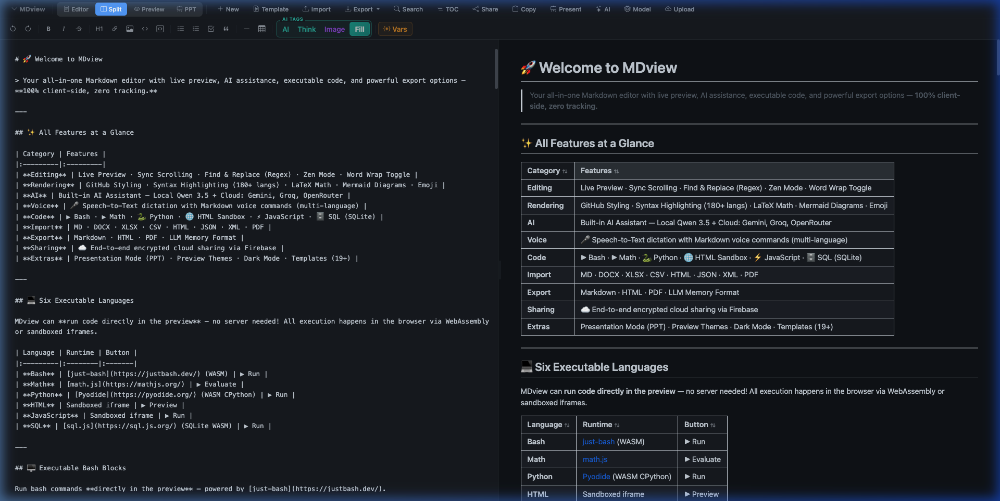

### AI Writing Assistant — Local & Cloud Models
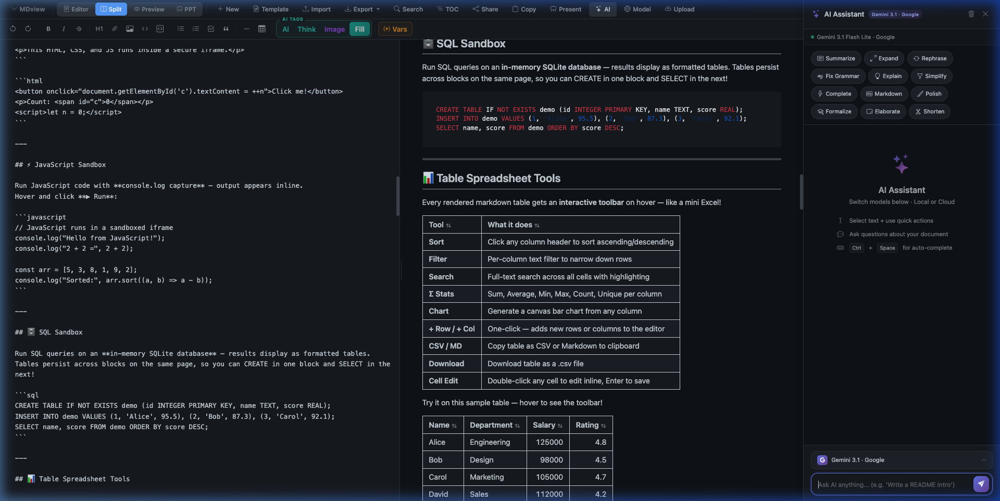

### Templates Gallery — 103+ Templates, 11 Categories
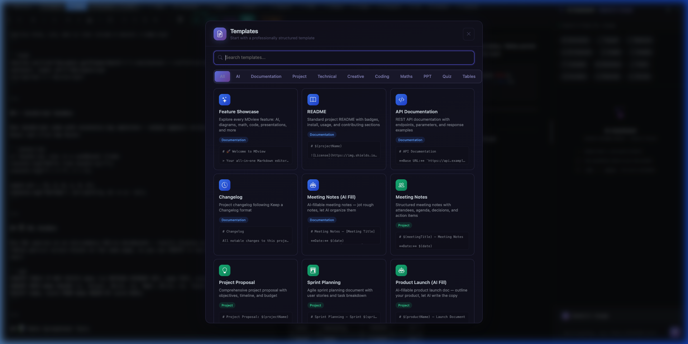

### LaTeX Math & Mermaid Diagrams
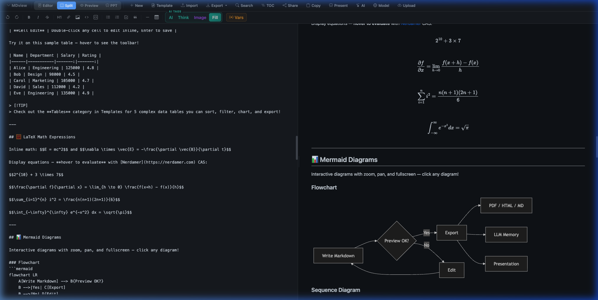

### Code Execution & Table Spreadsheet Tools
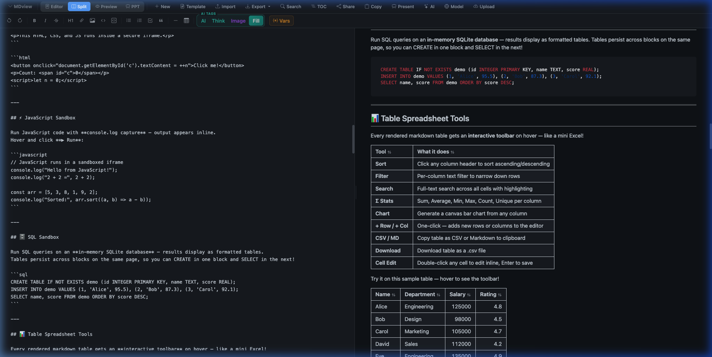

### Presentation Mode — Markdown to Slides
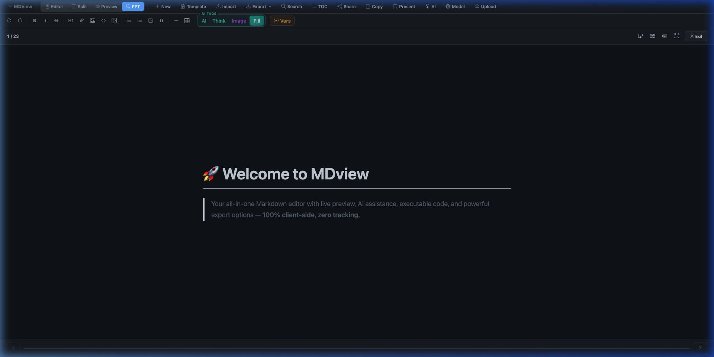

## 🎬 Feature Demos

> Click any feature below to watch a live demo.

<strong>🔒 Privacy-First — No Sign-Up, 100% Client-Side</strong>

**Your data never leaves your browser.** TextAgent runs entirely client-side with no server, no account, and no tracking. Type sensitive content with confidence — even your saved data stays in localStorage on your device.

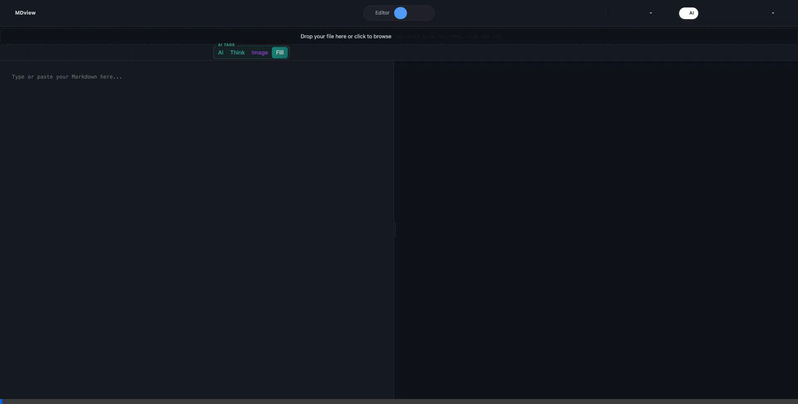

<strong>🤖 AI Writing Assistant — Local & Cloud Models</strong>

**Built-in AI with 3 local model sizes + cloud providers** — choose Qwen 3.5 Small (0.8B), Medium (2B), or Large (4B) for fully private local inference, or use cloud models (Gemini, Groq, OpenRouter). High-end device warning before 4B download.

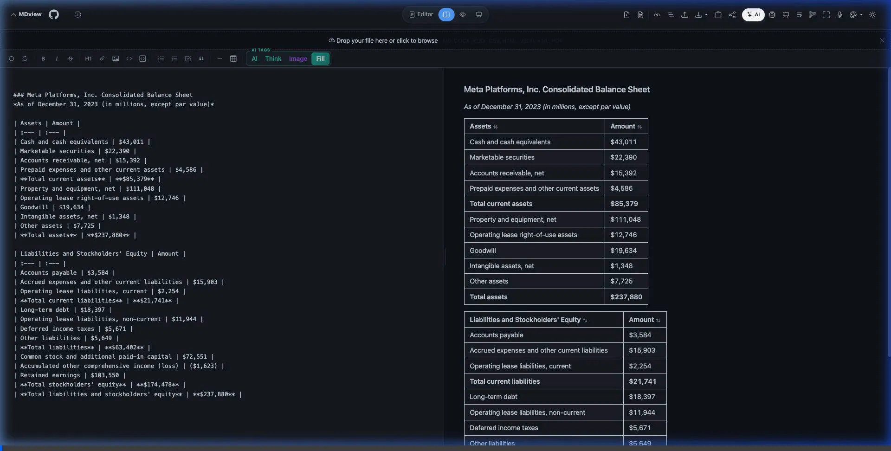

<strong>📄 Templates Gallery — 103+ Templates, 11 Categories</strong>

**Start any document in seconds.** Browse 103+ professionally designed templates across 11 categories: AI, Agents, Coding, Creative, Documentation, Maths, PPT, Project, Quiz, Tables, and Technical. AI-powered templates include `{{AI:}}` tags for one-click document generation.

<strong>💻 Code Execution — Run Python, JS & SQL In-Browser</strong>

**Turn Markdown into an interactive notebook.** Execute code in 6 languages directly in the preview pane — Python (Pyodide), JavaScript, SQL (SQLite), Bash (just-bash), HTML, and Math (Nerdamer). All sandboxed, all client-side.

<strong>🎬 Presentation Mode — Markdown to Slides</strong>

**Present from your Markdown.** Add `---` separators to create slides, then click Present. Navigate with arrow keys, view speaker notes, switch layouts, and use the overview grid. Choose from 20+ PPT templates with image backgrounds.

<strong>📊 Table Spreadsheet Tools — Sort, Stats & Charts</strong>

**Interactive tables with spreadsheet-level power.** Hover over any rendered table to reveal a toolbar with Sort, Filter, Search, Stats (Σ), Chart, Add Row/Col, CSV/MD export, and inline cell editing. Generate bar charts directly from your data.

<strong>🎨 Writing Modes & Themes — Zen, Dark & 6 Themes</strong>

**Your perfect writing environment.** Switch between 6 preview themes (GitHub, GitLab, Notion, Dracula, Solarized, Evergreen), toggle dark mode, and enter Zen mode for distraction-free fullscreen writing. Focus mode dims surrounding paragraphs.

<strong>📂 Import & Export — 8 Formats In, PDF/HTML Out</strong>

**Import anything, export everything.** Drag and drop files in 8 formats (MD, DOCX, XLSX, CSV, HTML, JSON, XML, PDF) — all converted to Markdown client-side. Export as Markdown, HTML, or smart PDF with intelligent page breaks.

<strong>🔐 Encrypted Sharing — Zero-Knowledge Security</strong>

**Share securely with AES-256-GCM encryption.** Choose Quick Share (key in URL fragment, never sent to server) or Secure Share with a custom passphrase. Recipients need the passphrase to decrypt — the server never sees your content or keys.

<strong>🛠 Formatting Toolbar — Bold, Lists, Tables & More</strong>

**Full formatting power at your fingertips.** Bold, italic, strikethrough, headings, links, images, code blocks, ordered and unordered lists, tables, and undo/redo — all accessible from the toolbar without memorizing Markdown syntax.

<strong>🤖 AI Model Selector — Choose Your Engine</strong>

**Pick the right model for the job.** Switch between 3 local Qwen sizes (0.8B / 2B / 4B) and cloud providers (Gemini, Groq, OpenRouter) directly from the AI panel. Per-card model selection lets you use different models for different blocks.

<strong>🔗 Sync Scrolling — Editor & Preview in Lockstep</strong>

**Keep your place effortlessly.** Two-way synchronized scrolling links the editor and preview pane so you always see the rendered output for the line you're editing. Toggle on/off with the link icon.

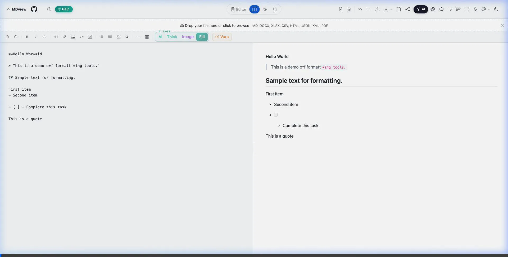

<strong>📑 Table of Contents — Auto-Generated Navigation</strong>

**Navigate long documents instantly.** A clickable sidebar TOC is auto-generated from your headings. Jump to any section with a single click, and the TOC highlights your current position as you scroll.

<strong>🎤 Voice Dictation — Speak Your Markdown</strong>

**Hands-free writing with Markdown awareness.** Dictate naturally and use voice commands for headings, bold, italic, lists, code blocks, and links. The speech engine understands Markdown — say "hash hash" for an H2 heading.

<strong>🏷️ AI Document Tags — Generate Entire Sections</strong>

**One-click document generation.** Use `{{AI:}}` for text, `{{Think:}}` for deep reasoning, and `{{Image:}}` for AI-generated images. Each tag becomes a card with generate, review, accept/reject, and regenerate controls — all operating independently.

<strong>🔀 Template Variables — Dynamic Reusable Documents</strong>

**Templates that adapt to you.** Define `$(varName)` placeholders in any document, click ⚡ Vars to auto-detect them, fill in the generated table, and apply. Built-in globals like `$(date)` and `$(time)` work automatically. 12 templates include variable support.

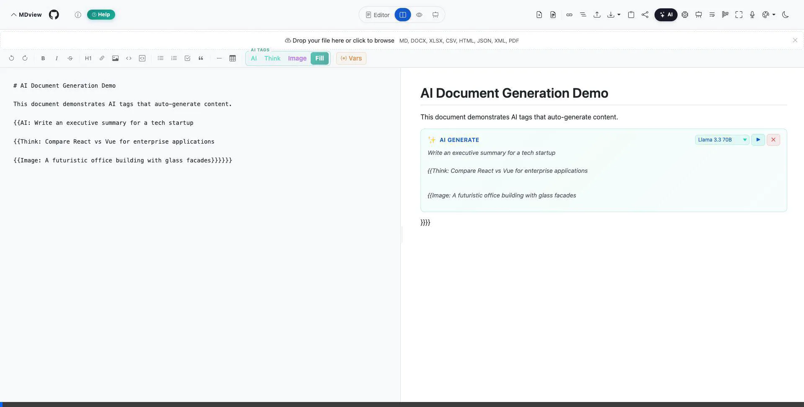

<strong>🔗 Agent Flow — Multi-Step AI Pipeline</strong>

**Chain AI steps together.** Write `{{Agent: Step 1: ... Step 2: ...}}` in markdown — a pipeline card renders with numbered steps and connecting arrows. Each step's output feeds into the next. Choose a model and search provider per card. Run, review, and accept/reject the combined output.

<strong>🐧 Compile & Run — 25+ Languages via Judge0 CE</strong>

**Compile and execute code inline.** Write `{{Linux:}}` tags with `Language:` and `Script:` fields to compile and run C++, Rust, Go, Java, Python, TypeScript, Kotlin, Scala, and 25+ more languages. Output (stdout, stderr, compile errors) appears inline with execution time and memory stats.

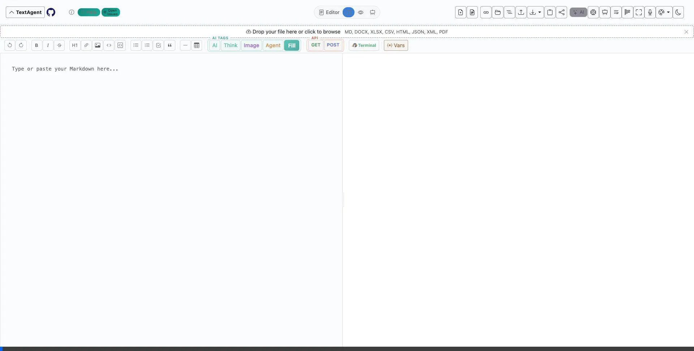

## 📝 Usage

| Action | How |
|:-------|:----|
| **Write** | Type or paste Markdown in the left editor panel |
| **Preview** | See live rendered output in the right panel |
| **Import** | Click 📤 Import, drag & drop, or paste — supports MD, DOCX, XLSX, CSV, HTML, JSON, XML, PDF |
| **Export** | Use the ⬇️ Export dropdown → Markdown, HTML, PDF, or LLM Memory |
| **AI Assistant** | Click ✨ AI → choose a model → ask questions or use quick actions |
| **Dark Mode** | Click the 🌙 moon icon |
| **Sync Scroll** | Click the 🔗 link icon to toggle two-way sync |
| **Share** | Click 📤 Share → generates an encrypted Firebase link |
| **Present** | Click 🎬 Presentation → navigate slides with arrow keys |
| **Zen Mode** | Press `Ctrl+Shift+Z` or click the fullscreen icon |
| **Find & Replace** | Press `Ctrl+F` → supports regex |
| **Templates** | Click the 📄 Templates button for starter documents |

### Mermaid Diagram Toolbar

Hover over any Mermaid diagram to reveal a toolbar:

| Button | Action |
|:-------|:-------|
| ⛶ (arrows) | Open diagram in zoom/pan modal |
| PNG | Download as PNG |
| 📋 (clipboard) | Copy image to clipboard |
| SVG | Download as SVG |

### Supported Markdown Syntax

Headings · **Bold** · *Italic* · ~~Strikethrough~~ · Links · Images · Ordered/Unordered Lists · Tables · Code Blocks (180+ languages) · Blockquotes · Horizontal Rules · Task Lists · LaTeX Equations (inline & block) · Mermaid Diagrams · PlantUML Diagrams · Callout Blocks (`> [!NOTE]`, `> [!TIP]`, `> [!WARNING]`) · Footnotes (`[^1]`) · Emoji Shortcodes · Executable Bash · Python · JavaScript · SQL · HTML Blocks

## 🔧 Technologies

### Core
| Technology | Purpose |
|:-----------|:--------|
| HTML5 / CSS3 / JavaScript | Core stack |
| [Bootstrap](https://getbootstrap.com/) | Responsive UI framework |
| [Marked.js](https://marked.js.org/) | Markdown parser |
| [highlight.js](https://highlightjs.org/) | Syntax highlighting (180+ languages) |
| [DOMPurify](https://github.com/cure53/DOMPurify) | HTML sanitization |

### Rendering
| Technology | Purpose |
|:-----------|:--------|
| [MathJax](https://www.mathjax.org/) | LaTeX math rendering |
| [Mermaid](https://mermaid-js.github.io/mermaid/) | Diagrams & flowcharts |
| [PlantUML Server](https://www.plantuml.com/) | PlantUML diagram rendering |
| [JoyPixels](https://www.joypixels.com/) | Emoji shortcode support |

### AI
| Technology | Purpose |
|:-----------|:--------|
| [Transformers.js](https://huggingface.co/docs/transformers.js) | Local AI inference (Qwen 3.5 — 0.8B / 2B / 4B) |
| [Groq API](https://groq.com/) | Cloud AI (Llama 3.3 70B) |
| [Google Gemini API](https://ai.google.dev/) | Cloud AI (Gemini 3.1 Flash Lite) |
| [OpenRouter API](https://openrouter.ai/) | Multi-model AI routing |

### Export & Import
| Technology | Purpose |
|:-----------|:--------|
| [html2canvas](https://github.com/niklasvh/html2canvas) + [jsPDF](https://www.npmjs.com/package/jspdf) | PDF generation |
| [FileSaver.js](https://github.com/eligrey/FileSaver.js) | File download handling |
| [Mammoth.js](https://github.com/mwilliamson/mammoth.js) + [Turndown.js](https://github.com/mixmark-io/turndown) | DOCX → Markdown |
| [SheetJS](https://sheetjs.com/) | XLSX/XLS parsing |
| [pdf.js](https://mozilla.github.io/pdf.js/) | PDF text extraction |

### Infrastructure
| Technology | Purpose |
|:-----------|:--------|
| [Firebase Firestore](https://firebase.google.com/docs/firestore) | Cloud sharing & auto-save |
| [Web Crypto API](https://developer.mozilla.org/en-US/docs/Web/API/Web_Crypto_API) | AES-256-GCM encryption |
| [pako](https://github.com/nicmart/pako) | Gzip compression |
| [Neutralino.js](https://neutralino.js.org/) | Desktop app framework |
| [just-bash](https://justbash.dev/) | In-browser bash execution |
| [Pyodide](https://pyodide.org/) | In-browser Python (CPython via WASM) |
| [sql.js](https://sql.js.org/) | In-browser SQLite (WASM) |
| [WebVM](https://webvm.io) | Full Debian Linux terminal (CheerpX x86 emulation) |
| [Judge0 CE](https://ce.judge0.com) | Server-side code execution for 25+ compiled languages |

## 🤝 Contributing

Contributions are welcome! Please feel free to submit a Pull Request.

1. Fork the project
2. Create your feature branch (`git checkout -b amazing-feature`)
3. Commit your changes (`git commit -m 'Add some amazing feature'`)
4. Push to the branch (`git push origin amazing-feature`)
5. Open a Pull Request

## 📄 License

This project is licensed under the MIT License - see the [LICENSE](LICENSE) file for details.

## 📈 Development Journey

TextAgent has undergone significant evolution since its inception. What started as a simple markdown parser has grown into a full-featured, AI-powered application with 40+ features. By comparing the [current version](https://textagent.github.io/) with the [original version](https://a1b91221.markdownviewer.pages.dev/), you can see the remarkable progress in UI design, performance optimization, and feature implementation.

## 📋 Release Notes

| Date | Feature / Update |
|------|-----------------|
| **2026-03-10** | 🗂️ **Action Modal & Disk UI Polish** — replaced native `confirm()` and inline rename with unified `showActionModal()` for rename (input field, auto-selects filename), duplicate (blue confirmation), and delete (red destructive); header-only disk controls (refresh ↻, disconnect ✕) replacing footer bar; clickable folder name opens folder picker; same-name rename guard with toast feedback; duplicate tree auto-refresh after disk write; merged CI changelog check into deploy workflow (3→2 workflow runs per push); 10 new Playwright tests (112 total) |
| **2026-03-10** | 📂 **Disk-Backed Workspace** — new folder storage mode via File System Access API; "Open Folder" button in sidebar header; `.md` files read/written directly to disk; `.textagent/workspace.json` manifest; debounced autosave to disk ("💾 Saved to disk" indicator); refresh from disk for external changes; disconnect to revert to localStorage; auto-reconnect on reload via IndexedDB-stored handles; Chromium-only (hidden in unsupported browsers); 22 new Playwright tests |
| **2026-03-10** | 🧹 **Clear Text Buttons** — new "Clear" group in formatting toolbar with Clear All (eraser icon) and Clear Selection (backspace icon); custom in-app confirmation modal with smooth animation (replaces flickering native `confirm()`); both undoable via Ctrl+Z; toast feedback; red-accented styling with dark/light theme; Help mode entries |
| **2026-03-09** | 🎨 **Template Icon Refresh** — main Template button updated from generic file icon to `bi-columns-gap` layout grid (header, mobile menu, QAB, modal header); 11 coding templates upgraded from generic `bi-cpu` to language-specific icons: C (`bi-braces`), C++ (`bi-braces-asterisk`), Rust (`bi-gear-wide-connected`), Go (`bi-arrow-right-circle`), Java (`bi-cup-hot`), Python Algorithms (`bi-graph-up`), TypeScript (`bi-filetype-tsx`), Ruby (`bi-gem`), Kotlin (`bi-hexagon`), Scala (`bi-diamond`), Compile & Run (`bi-play-circle`) |
| **2026-03-09** | 🐧 **Linux Group Expansion** — Linux toolbar group now shows 🐧 Linux + 🔷 C++ inline with `…` overflow dropdown for 🦀 Rust, 🐹 Go, ☕ Java; each inserts a `{{Linux:}}` compile-and-run tag with starter code; `.fmt-linux-group` CSS with green-accented border and `inline-flex` layout |
| **2026-03-09** | 💻 **Coding Tag Group** — new toolbar group with 🐚 Bash + 🔢 Math inline and `…` overflow dropdown for 🐍 Python, 🌐 HTML, ⚡ JS, 🗄️ SQL; AI Tags group also collapsed to AI + Think + `…` (Image, Agent, Fill); shared overflow dropdown CSS and JS handler in `coding-blocks.js` |
| **2026-03-09** | 🧪 **Test Suite Expansion** — added 28 new Playwright tests across 5 spec files: email-to-self flow (validation, loading state, subject fallback, success/error feedback, localStorage persistence), secure share validation (passphrase mismatch, length check, download-section visibility, filename sanitization, credentials content), startup sequencing (share/template/export/AI working without 5s sleep, no `M is not defined` errors), export content integrity (Markdown exact-match, HTML inline `<style>`, `data-theme`/`data-preview-theme` preservation, rendered vs raw output), persistence (theme, preview theme, stats pill, word-wrap, email survive reload) |
| **2026-03-09** | ✉️ **Email to Self** — share result modal includes "Email to Self" section; enter email → document is sent directly to inbox with share link + `.md` file attached; powered by Google Apps Script (free, 100 emails/day); loading state, success/error feedback; email persisted in localStorage; zero third-party dependencies |
| **2026-03-09** | 🔑 **Centralized Storage Keys** — created `js/storage-keys.js` as single source of truth for all ~20 localStorage key strings; replaced scattered raw string literals across 12 JS files with `M.KEYS.*` constants; eliminates storage-key drift bugs (e.g., `mdview-preview-theme` vs `md-viewer-preview-theme`) |
| **2026-03-09** | 🧩 **File Decomposition** — split 4 largest JS modules (~5,500 lines) into 14 focused files: `ai-assistant.js` → 4 modules (core, chat, actions, image); `ai-docgen.js` → 3 modules (core, generate, ui); `executable-blocks.js` → 4 modules (core bash, math, python, sandbox); `table-tools.js` → 3 modules (core, sort-filter, analytics); internal namespaces (`M._ai`, `M._docgen`, `M._exec`, `M._table`) for cross-module communication; phased dynamic imports in `main.js` |
| **2026-03-09** | ⚡ **Bundle Size Reduction** — lazy-loaded mermaid (~518 KB), deferred Phase 2–5 feature modules (AI, exporters, speech, templates, docgen) via `requestIdleCallback`, removed `manualChunks` Vite config; startup bundle reduced from ~4.6 MB to ~1.6 MB (65% reduction); converters, export, math, and mermaid chunks now load on demand |
| **2026-03-09** | 🛠️ **Quality & Config Alignment** — fixed copy-button selector mismatch (`copy-md-button` → `copy-markdown-button`); unified preview-theme storage key to `md-viewer-preview-theme`; HTML export now self-contained with all CSS inlined + theme attributes; PDF export reuses shared rendering pipeline (`renderMarkdownToContainer`); aligned license to MIT across `package.json`, `LICENSE`, and `README`; unified changelog path to `changelogs/` in pre-commit hook + GitHub Actions; removed duplicate `public/firestore.rules` and `public/nginx.conf`; repaired desktop `prepare.js` (removed stale `script.js` copy) and updated `desktop-app/README.md`; added ESLint, Prettier, and Playwright with 4 smoke tests (import, export, share, view-mode) |
| **2026-03-08** | 🐧 **Compile & Run** — `{{Linux:}}` tag now supports `Language:` + `Script:` fields for compiling and executing 25+ languages (C, C++, Rust, Go, Java, Python, TypeScript, Kotlin, Scala, Ruby, Swift, Haskell, Dart, C#, PHP, Lua…) via [Judge0 CE](https://ce.judge0.com); inline output with stdout, stderr, compile errors, execution time & memory stats; 10 new language-specific coding templates |
| **2026-03-08** | 🐧 **Linux Terminal** — new `{{Linux:}}` tag opens a full Debian Linux terminal ([WebVM](https://webvm.io)) in a new browser window; `Packages:` field for package reminders with visual badges; persistent sessions via IndexedDB; toolbar 🐧 Terminal button; Linux Terminal coding template; fully independent module (`linux-docgen.js`) |
| **2026-03-08** | 🔌 **API Component** — new standalone `{{API:}}` tag for REST API calls directly in markdown; supports GET/POST/PUT/DELETE methods, custom headers, JSON body, and `Variable:` to store response in `$(api_varName)`; toolbar GET/POST buttons insert templates; API cards render inline with method badge + URL; execute with ▶ button, review response with Accept/Regenerate/Reject; response variables accessible via ⚡ Vars table; fully independent module (`api-docgen.js`) separated from AI component |
| **2026-03-08** | 🏷️ **Template display tags** — AI templates now show `AI` flavor tags; agent templates show `AI · Agent` tags on template cards for quick visual identification of template type |
| **2026-03-08** | 📜 **MIT License** — changed project license from Apache 2.0 to MIT for broader compatibility and simpler terms |
| **2026-03-08** | 🎨 **New TextAgent icon** — new chalk-style icon replacing the old "M" icon; updated tagline to "Write with AI Agents — Markdown Editor & Viewer" |
| **2026-03-08** | ⬇️ **Agent auto-download** — Agent Flow now auto-downloads local AI model with inline progress bar if not already loaded; graceful fallback to cloud models when local model unavailable |
| **2026-03-08** | 🤖 **Agent Templates** — 15 complex agent templates in new Agents category: Data Science Pipeline, SQL Database Workshop, Full-Stack App Blueprint, AI Research Agent, DevOps Runbook, Financial Modeling, ML Model Evaluation, API Testing Suite, HTML Dashboard Builder, Competitive Intel, Algorithm Visualizer, System Design Document, Data Cleaning Toolkit, Project Retrospective, Science Lab Notebook; each showcases code, math, SQL, HTML, tables, mermaid, and AI tags |
| **2026-03-08** | 🔗 **Agent Flow** — new `{{Agent:}}` markdown tag for multi-step AI pipelines; define steps with `Step 1: ...`, `Step 2: ...`; outputs chain sequentially; pipeline card with numbered steps + connecting arrows; per-card model selector + search provider dropdown (DuckDuckGo/Brave/Serper); live status indicators (⏳/✅/❌); API key prompt for paid search providers; combined output review with accept/reject/regenerate |
| **2026-03-08** | 🔍 **Web Search** — AI assistant can now search the web; toggle search ON in AI panel header; 3 providers: DuckDuckGo (free, default), Brave Search (API key), Serper.dev (API key); search results prepended to LLM context; source citation links below AI responses; per-agent-card search provider selector |
| **2026-03-08** | 🧠 **LLM Memory overhaul** — fixed broken data flow (modular refactor regression); replaced generic format options with 5 useful formats: XML (structured tags), JSON (API-ready), Compact JSON (minified, ~60% token savings), Markdown (universal), Plain Text (no formatting); live per-format token count |
| **2026-03-08** | 🛠️ **Enhanced Quick Action Bar** — compact header now includes File Tree, Help, and collapsible Tools dropdown (Presentation, Zen Mode, Word Wrap, Focus Mode, Voice Dictation, Dark Mode with sun/moon toggle, Preview Theme picker with checkmarks); header toolbar slides behind AI panel instead of shrinking |
| **2026-03-08** | 🐛 **AI panel overlap fix** — header toolbar stays full-width when AI panel opens; sub-header elements (content, dropzone, formatting toolbar) receive `margin-right` to avoid overlap; AI panel overlays naturally via z-index |
| **2026-03-08** | 🐛 **AI worker fix** — fixed "Model unavailable" error caused by CSP missing `huggingface.co` in `connect-src` and static ES module import silently crashing the worker; converted to dynamic `import()` with try/catch for graceful error reporting and retry support |
| **2026-03-07** | 🤖 **Multi-size local Qwen models** — added Qwen 3.5 Medium (2B, ~1.2 GB) and Large (4B, ~2.5 GB) alongside existing Small (0.8B); per-model workers with independent consent tracking; high-end device warning popup before 4B download; dynamic model ID via `setModelId` message to shared `ai-worker.js` |
| **2026-03-07** | 📂 **Workspace sidebar** — multi-file support with sidebar file tree (`Ctrl+B` toggle); create, rename, duplicate, and delete files; per-file localStorage persistence; right-click context menu; active file highlighting; "New" button creates files in workspace instead of new tabs |
| **2026-03-07** | 📱 **Mobile toolbar overflow fix** — Quick Action Bar and formatting toolbar now horizontally scrollable on mobile/tablet instead of overflowing; `overflow-x: hidden` on page; header collapse disabled at sub-desktop widths; GitHub link and Help pill hidden on phones for compact layout |
| **2026-03-07** | 🛡️ **Security hardening v2** — Content Security Policy (CSP) with full CDN allowlist; Firestore write-token ownership to prevent anonymous document overwrites; API keys moved from URL query strings to `x-goog-api-key` headers; `postMessage` origin validation for sandboxed iframes; passphrase minimum increased to 8 characters; Firestore rules fixed for secure-share documents |
| **2026-03-07** | 🐛 **QAB Export fix** — added missing LLM Memory option to the Quick Action Bar Export dropdown, matching the main header Export menu |
| **2026-03-07** | 🎥 **Demo mapping audit** — fixed 10 incorrect Help Mode demo mappings; recorded 6 new dedicated demo videos (AI Model Selector, Sync Scrolling, Table of Contents, Voice Dictation, AI Doc Tags, Template Variables); total demos increased from 10 to 16 |
| **2026-03-07** | ❓ **Interactive Help Mode** — teal ❓ Help pill in header activates learning mode; all buttons get teal ring highlights; click any button for popover with feature name, description, keyboard shortcut, and ▶ Watch Demo button; demo videos play in a 50% screen dark panel with fullscreen expand; all 9 product demos mapped to ~35 toolbar buttons; Esc key navigation; AI Document Tags inline-code rendering fix |
| **2026-03-07** | ▶ **Feature demo badges** — clickable ▶ Demo badges on Feature Showcase headings open fullscreen animated video modal; 9 features mapped to demo videos; right-click + D shortcut; teal gradient badge with dark mode support |
| **2026-03-07** | 🎬 **Product demo videos** — 9 animated WebP demos added to README (Privacy Hero, AI Assistant, Templates Gallery, Code Execution, Presentation Mode, Table Tools, Writing Modes, Import/Export, Encrypted Sharing) showcasing all key features with feature descriptions |
| **2026-03-07** | 🔀 **Template variables** — `$(varName)` substitution engine; in-editor variable table with ⚡ Vars button; auto-detect mode (type variables anywhere → click Vars → table generated → fill → apply); 7 built-in globals (`$(date)`, `$(time)`, etc.); 12 templates updated with variable support for instant reusability |
| **2026-03-06** | 🤖 **AI templates** — new AI category with 13 AI-powered templates (Business Proposal, Research Paper, PRD, Marketing Copy, Lesson Plan, RFC, Cover Letter, SWOT, Content Calendar, Stock Research, Financial Analysis, Investment Thesis, Portfolio Review); one-click `{{AI:}}` / `{{Think:}}` document generation |
| **2026-03-06** | 🐛 **Initial render fix** — fixed preview pane not rendering on first page load by adding forced re-render after app initialization |
| **2026-03-06** | 🖼️ **IMAGE tag support** — new `{{Image: ...}}` AI tag generates images from text prompts via Gemini Imagen; dedicated image model selector per card; AI worker pipelines for image generation |
| **2026-03-06** | 🏷️ **AI Tags button group** — AI, Think, and Fill toolbar buttons grouped into a visually distinct "AI Tags" cluster with shared styling and separator |
| **2026-03-06** | 🎯 **Per-card model selection** — each generated AI card shows a model dropdown to switch models before regenerating; image-specific models filtered into Image tag cards |
| **2026-03-06** | 🌿 **Evergreen theme** — new green-toned preview theme with light and dark variants, custom syntax highlighting, code block, and table styling |
| **2026-03-06** | 🧩 **Independent AI block operations** — each `{{AI:}}` / `{{Think:}}` block generates, reviews, accepts, rejects, and regenerates independently; per-block state tracking with concurrent generation; text-based tag replacement (no index shifting bugs) |
| **2026-03-06** | ⏳ **Generation loading states** — placeholder cards pulse with teal glow and show "Generating..." during AI generation; action buttons dimmed until complete |
| **2026-03-06** | 🧠 **Think mode cleanup** — improved prompts suppress raw reasoning chains; `cleanGeneratedOutput()` strips `<thinking>` tags, reasoning loops, and meta-commentary from output |
| **2026-03-06** | ⬇️ **Inline model download** — local models show "Download (~500 MB)" dialog directly in generation flow instead of redirecting to AI panel |
| **2026-03-06** | 🔀 **Split view default** — shared documents now open in split view (editor + preview) instead of preview-only mode |
| **2026-03-06** | 📊 **Table spreadsheet tools** — interactive toolbar on every rendered table: Sort, Filter, Search, Stats (Σ), Chart (canvas bar chart), Add Row/Col, Copy CSV/MD, Download CSV, inline cell editing (double-click to edit) |
| **2026-03-06** | 📋 **Table templates** — 5 new complex table templates (Sales Dashboard, Project Tracker, Financial Report, Employee Directory, Competitive Analysis) in new Tables category |
| **2026-03-05** | ⚡ **Performance optimizations** — 2-5x faster load: lazy-loading libraries, optimized rendering, improved build chunking, debounced keystroke processing |
| **2026-03-05** | 🔧 **Vite build pipeline** — migrated to Vite for development and production builds with GitHub Pages deployment |
| **2026-03-05** | 🛡️ **Changelog enforcement** — pre-commit hook requires a CHANGELOG-*.md file with every code commit |
| **2026-03-05** | 🎨 **Toolbar overflow menu** — kebab menu for overflowed toolbar items at narrow widths, theme controls moved into overflow |
| **2026-03-05** | 🌙 **FOUC fix** — prevent white→dark flash on page reload with inline theme detection script |
| **2026-03-05** | 🧩 **Quiz templates + html-autorun** — new Quiz category with interactive HTML quizzes that auto-run on render; `html-autorun` code fence hides source and shows output directly |
| **2026-03-05** | ⚙️ **Centralized AI model config** — all model definitions moved to `js/ai-models.js`; dropdown built dynamically; easy to add new providers |
| **2026-03-05** | 🔄 **Gemini 3.1 Flash Lite** — upgraded from Gemini 2.0 Flash to Gemini 3.1 Flash Lite for improved performance |
| **2026-03-05** | 🔐 **Passphrase-protected sharing** — optional passphrase on shared links with unlock modal; share options dialog for link + passphrase vs. open link |
| **2026-03-05** | 🧠 **Enhanced AI context menu** — column-based layout with writing assistance actions (Polish, Formalize, Elaborate, Shorten) alongside existing quick actions |
| **2026-03-05** | 📊 **Inline AI progress bar** — model download and connection status shown inline in the AI panel header |
| **2026-03-05** | 📦 **Template modularization** — split `templates.js` (3080→206 lines) into 7 category-based files under `js/templates/` for maintainability |
| **2026-03-05** | ⚡ **JavaScript sandbox** — execute JS in sandboxed iframe with `console.log/warn/error` capture and inline output display |
| **2026-03-05** | 🗄️ **SQL sandbox** — run SQL queries on in-memory SQLite database (sql.js WASM) with formatted table output and persistent tables across blocks |
| **2026-03-05** | 🐍 **Python sandbox** — run Python code in browser via Pyodide (CPython WASM), with stdout/stderr capture and matplotlib support |
| **2026-03-05** | 🌐 **HTML sandbox** — live HTML/CSS/JS preview in secure sandboxed iframe with auto-resize |
| **2026-03-05** | 💻 **6 Coding templates** — Python Playground, HTML Playground, Bash Scripting, JavaScript Sandbox, HTML+JS Interactive, SQL Playground |
| **2026-03-05** | 🔒 **Read-only shared links** — shared documents are now protected; Edit Copy creates a local fork instead of overwriting the original |
| **2026-03-05** | 🖼️ **Image backgrounds for PPT templates** — 5 presentation templates with Unsplash image backgrounds |
| **2026-03-05** | 🧮 **LaTeX evaluation improvements** — reserved constant handling (E, π), unsupported construct detection (limits, integrals, partials) |
| **2026-03-05** | 🎬 **Enhanced presentation mode** — multiple layouts (title, section, two-column, image), transitions, speaker notes, overview grid |
| **2026-03-05** | 📊 **20+ PPT templates** — new PPT category with professional slide decks and background rendering |
| **2026-03-05** | 🎤 **Voice dictation** — speech-to-text with Markdown-aware commands (hash headings, bold, italic, lists, code, links) |
| **2026-03-05** | 🛡️ **Security hardening** — SRI integrity hashes, XSS fixes, ReDoS protection, encrypted API key storage, Firestore security rules |
| **2026-03-05** | 🧱 **Codebase modularization** — `script.js` refactored into 13 focused modules for maintainability |
| **2026-03-05** | 🧮 **Executable math blocks** — evaluate math expressions in preview using Nerdamer (algebra, calculus, trig) |
| **2026-03-05** | 📚 **6 new templates** — Coding and Maths categories with interactive bash and math blocks |
| **2026-03-05** | 🎨 **Template UI polish** — category pill tabs, improved card layout, better spacing |
| **2026-03-05** | ✨ **AI writing tags** — Polish, Formalize, Elaborate, Shorten actions for selected text or full document |
| **2026-03-05** | 📄 **Feature Showcase as default** — comprehensive showcase loads on first visit |
| **2026-03-04** | 🏷️ **Rebranded to TextAgent** — new display name across all pages, meta tags, and templates |
| **2026-03-04** | 🔄 **Non-blocking AI panel** — AI panel opens instantly; Qwen download deferred until first use |
| **2026-03-04** | 🧩 **Multi-model AI selector** — switch between Qwen (local), Groq Llama 3.3, Gemini, and OpenRouter |
| **2026-03-04** | 🌐 **Google Gemini** — free-tier Gemini AI model with SSE streaming and 1M tokens/min |
| **2026-03-04** | 🔀 **OpenRouter AI** — access free auto-routed models via OpenRouter API |
| **2026-03-04** | 📂 **File format converters** — import DOCX, XLSX/XLS, CSV, HTML, JSON, XML, and PDF |
| **2026-03-04** | 🖥 **Desktop app** — native desktop version via Neutralino.js with system tray and offline support |
| **2026-03-04** | 📐 **Resizable AI panel** — three-column layout (Editor ∣ Preview ∣ AI) with draggable resize |
| **2026-03-04** | ☁️ **Groq Llama 3.3 70B** — cloud AI model via Groq API |
| **2026-03-04** | 🖥️ **Executable bash blocks** — run bash commands in preview via [just-bash](https://justbash.dev/) |
| **2026-03-04** | 🤖 **AI Assistant (Qwen 3.5)** — local AI: summarize, expand, rephrase, grammar-check, explain, simplify, auto-complete |
| **2026-03-04** | 🧠 **AI context menu** — select text, right-click for quick AI actions |
| **2026-03-04** | ☁️ **Cloud auto-save** — periodic encrypted backup to Firebase Firestore |
| **2026-03-04** | 🌱 **PlantUML diagrams** — render PlantUML inside Markdown with live preview |
| **2026-03-04** | 📝 **Word wrap toggle** — switch editor word-wrap on or off |
| **2026-03-04** | 🎯 **Focus mode** — distraction-free writing with dimmed surrounding paragraphs |
| **2026-03-04** | 🔥 **Firebase Firestore sharing** — short share URLs via Firestore |
| **2026-03-04** | 🛠 **Formatting toolbar** — bold, italic, strikethrough, heading, link, image, code, lists, table, undo/redo |
| **2026-03-04** | 🔍 **Find & Replace** — search and replace with regex support |
| **2026-03-04** | 📑 **Table of Contents** — auto-generated, clickable sidebar TOC |
| **2026-03-04** | 💾 **Auto-save** — content saved to localStorage and restored on reload |
| **2026-03-04** | 🧘 **Zen mode** — minimal full-screen editor view (`Ctrl+Shift+Z`) |
| **2026-03-04** | 🎞 **Slide presentation** — present Markdown as slides using `---` separators |
| **2026-03-04** | 📌 **Callout blocks** — `> [!NOTE]`, `> [!WARNING]`, etc. styled |
| **2026-03-04** | 📝 **Footnotes** — `[^1]` footnote syntax with back-references |
| **2026-03-04** | ⚓ **Anchor links** — click headings to copy anchor URLs |
| **2026-03-04** | 🖼 **Image paste** — paste images from clipboard as base64 |
| **2026-03-04** | 🎨 **Preview themes** — GitHub, GitLab, Notion, Dracula, Solarized |
| **2026-03-04** | 🖥 **View modes** — Split, Editor-only, Preview-only with draggable divider |
| **2026-03-04** | 📄 **New document** — one-click button to start fresh |
| **2026-03-04** | 📱 **Mobile menu** — dedicated responsive sidebar menu |
| **2026-03-04** | 📑 **Smart PDF export** — page-break detection, cascading adjustments, graphic scaling |
| **2026-03-03** | 🔐 **Encrypted sharing** — AES-256-GCM encrypted markdown sharing |
| **2026-03-03** | 🌐 **GitHub Pages deployment** — hosted on `textagent.github.io` |
| **2026-03-03** | 📖 **README overhaul** — comprehensive docs with screenshots |
| **2026-03-01** | 🐛 **Mermaid toolbar UX** — copy button label, toolbar order, modal size improvements |
| **2026-02-28** | ✨ **Code review polish** — rounded dimensions, CSS variable backgrounds |
| **2026-01-10** | 🔧 **Scroll & toolbar UI** — scroll behavior improvements, toolbar refinements |
| **2025-09-30** | 📄 **PDF export refactor** — improved PDF generation |
| **2025-05-09** | 🖨 **PDF rendering fixes** — PDF export bug fixes |
| **2025-05-01** | 🎨 **New UI & dark mode fixes** — refreshed interface |
| **2024-04-12** | 📊 **Reading stats** — word count, character count, reading time |
| **2024-04-09** | 🚀 **Initial commit** — TextAgent project created |

---

    
Created with ❤️ by the <a href="https://github.com/Textagent">TextAgent</a> team

