# TextAgent

    
    <h3>Write with AI Agents — Markdown Editor & Viewer</h3>
    
Write, preview, present, and share — all in your browser, 100% client-side

    <a href="https://textagent.github.io/">Live Demo</a> • 
    <a href="#-features-at-a-glance">Features</a> • 
    <a href="#-screenshots">Screenshots</a> • 
    <a href="#-usage">Usage</a> • 
    <a href="#-release-notes">Release Notes</a> • 
    <a href="#-license">License</a>

## 🚀 Overview

**TextAgent** is a professional, full-featured Markdown editor and preview application that runs entirely in your browser. It provides a GitHub-style rendering experience with a split-screen interface, AI-powered writing assistance, voice dictation, multi-format file import, encrypted sharing, slide presentations, executable code & math blocks, and powerful export options — all without any server-side processing.

**No sign-up. No server. No data leaves your device.**

## ✨ Features at a Glance

| Category | Features |
|:---------|:---------|
| **Editor** | Live preview, split/editor/preview/page modes, sync scrolling, formatting toolbar, find & replace (regex), word wrap toggle, draggable resize divider |
| **Writing Modes** | Zen mode (distraction-free fullscreen), Focus mode (dimmed paragraphs), Dark mode, multiple preview themes (GitHub, GitLab, Notion, Dracula, Solarized, Evergreen) |
| **Rendering** | GitHub-style Markdown, syntax highlighting (180+ languages), LaTeX math (MathJax), Mermaid diagrams (zoom/pan/export), PlantUML diagrams, callout blocks, footnotes, emoji, anchor links |
| **🎬 Media Embedding** | Video playback via `` image syntax (`.mp4`, `.webm`, `.ogg`, `.mov`, `.m4v`); YouTube/Vimeo embeds auto-detected; `embed` code block for responsive media grids (`cols=1-4`, `height=N`); Video.js v10 lazy-loaded with native `<video>` fallback; website URLs render as rich link preview cards with favicon + "Open ↗" button |
| **🤖 AI Assistant** | 3 local Qwen 3.5 sizes (0.8B / 2B / 4B via WebGPU/WASM), Gemini 3.1 Flash Lite, Groq Llama 3.3 70B, OpenRouter — summarize, expand, rephrase, grammar-fix, explain, simplify, auto-complete; AI writing tags (Polish, Formalize, Elaborate, Shorten, Image); enhanced context menu; per-card model selection; concurrent block generation; inline review with accept/reject/regenerate; AI-powered image generation; **smart model loading UX** — cache vs download detection (📦/⬇️), HuggingFace source location display, delete cached models from browser storage; **Model Manager** tab (Models \| Manager) with ZIP Export/Import — export cached model as single `.zip`, import to restore into browser Cache API, per-model status badges and cache sizes; all models hosted on [`textagent` HuggingFace org](https://huggingface.co/textagent) with automatic fallback |
| **📌 AI Annotations** | Right-click context menu on selected text → 5 annotation types: ⭐ Highlight, 📝 Sticky Note, ❓ Ask AI, 🔖 Bookmark, 📖 Define; color-coded pills render inline in preview; sliding thread panel for multi-turn AI Q&A with document context, web search, and model selector; annotations stored as HTML comments in markdown source (portable, no external DB); **Study Copy** workflow for annotating shared read-only documents; `findBlockEnd()` structural insertion prevents markdown syntax breakage |
| **🎤 Voice Dictation** | Dual-engine speech-to-text: **Voxtral Mini 3B** (WebGPU, primary, 13 languages, ~2.7 GB) or **Whisper Large V3 Turbo** (WASM fallback, ~800 MB) with consensus scoring; download consent popup with model info before first use; 50+ Markdown-aware voice commands — natural phrases ("heading one", "bold…end bold", "add table", "undo"); auto-punctuation via AI refinement or built-in fallback; streaming partial results |
| **🔊 Text-to-Speech** | Hybrid Kokoro TTS engine — 9 languages (English, Japanese, Chinese, Spanish, French, Hindi, Italian, Portuguese) via [Kokoro 82M v1.0 ONNX](https://huggingface.co/textagent/Kokoro-82M-v1.0-ONNX) (~80 MB, off-thread WebWorker), Korean, German & others via Web Speech API fallback; **chunked synthesis** for long text (sentence-boundary splitting, ~500 chars/chunk, sequential synthesis with per-chunk progress); TTS card with separate ▶ Run (generate audio) / ▷ Play (replay) / 💾 Save (WAV download) buttons; hover any preview text and click 🔊 to hear pronunciation; voice auto-selection by language |
| **🎙️ Podcast Generation** | `{{@Podcast:}}` tag for AI-powered multi-speaker podcast creation from any topic; 3-phase pipeline: web research (Jina API), AI script generation, Kokoro TTS multi-speaker audio synthesis; configurable styles (debate, interview, chat, lecture, storytelling); **Podcast Marketplace** with 15+ curated templates across Tech, Science, Business, Creative, Education categories; real-time progress with phase indicators; WAV audio download; per-segment voice assignments |
| **Import** | TXT, MD, DOCX, XLSX/XLS, CSV, TSV, HTML, JSON, XML, YAML, TOML, PDF — drag & drop or click Upload to import |
| **Export** | Markdown, self-contained styled HTML, PDF (smart page-breaks, shared rendering pipeline), LLM Memory (5 formats: XML, JSON, Compact JSON, Markdown, Plain Text + shareable link) |
| **Sharing** | AES-256-GCM encrypted sharing via Firebase; **compact share links** (`#s=<id>`, ~36 chars vs ~111 chars) with encryption key stored server-side; **custom named links** — optionally choose your own memorable name (e.g. `#s=mynotes`) with case-insensitive uniqueness, slug validation, and reserved-word protection; read-only shared links with auto-dismiss banner + floating "Read-only" pill indicator, **clean read-only view** (composer FAB + agent panel hidden when header collapsed), optional password protection (zero-knowledge — passphrase-derived key never stored); **view-locked links** (lock recipients to PPT or Preview mode, stored in Firestore to prevent URL tampering); **editor links** — cryptographic edit key system (`&ek=<token>`) grants write access to trusted collaborators (SHA-256 verified, AES-GCM encrypted write-token, auto-save to same document); **shared versions tracking** ("Previously Shared" panel with timestamps, view-mode badges, copy/delete actions); backward-compatible with legacy `#id=...&k=...` links |
| **Presentation** | Slide mode using `---` separators, keyboard navigation, multiple layouts & transitions, speaker notes, overview grid, 20+ PPT templates with image backgrounds |
| **Desktop** | Native app via Neutralino.js with system tray and offline support |
| **Code Execution** | 8 languages in-browser: Bash ([just-bash](https://justbash.dev/)), Math (Nerdamer), LaTeX (MathJax + Nerdamer evaluation), Python ([Pyodide](https://pyodide.org/)), HTML (sandboxed iframe, `html-autorun` for widgets/quizzes), React JSX (`jsx-autorun` with Babel transpilation, auto-detected CDN libraries: Recharts, Tailwind, Lucide, Framer Motion, Chart.js, and 6+ more), JavaScript (sandboxed iframe), SQL ([sql.js](https://sql.js.org/) SQLite) · 25+ compiled languages via [Judge0 CE](https://ce.judge0.com): C, C++, Rust, Go, Java, TypeScript, Kotlin, Scala, Ruby, Swift, Haskell, Dart, C#, and more · **▶ Run All** notebook engine — one-click sequential execution with preflight dialog (block table with model/status), pre-execution model loading (AI + TTS auto-loaded before blocks run), progress bar, abort, per-block status badges, detailed console logging, and SQLite shared context store |
| **Security** | Content Security Policy (CSP), SRI integrity hashes, XSS sanitization (DOMPurify), ReDoS protection, Firestore write-token ownership, API keys via HTTP headers, postMessage origin validation, 8-char password minimum, sandboxed code execution, Cloudflare Turnstile CAPTCHA on email endpoint, automated security scanner (`scripts/security-check.sh`) with pre-commit integration |
| **AI Document Tags** | `{{@AI:}}` text generation (`@think: Yes` for deep reasoning), `{{@Image:}}` image generation (Gemini Imagen), `{{@OCR:}}` image-to-text extraction (Text/Math/Table modes via Granite Docling 258M, Florence-2 230M, or GLM-OCR 1.5B, 📷 live camera capture + 📎 image/PDF upload, PDF page rendering via pdf.js), `{{@TTS:}}` text-to-speech playback (Kokoro TTS per card, language selector, ▶ Play / ⬇ Save WAV), `{{@STT:}}` speech-to-text dictation (engine selector: Whisper/Voxtral/Web Speech API, 11 languages, Record/Stop/Insert/Clear), `{{@Translate:}}` translation (target language selector, integrated TTS pronunciation, cloud model routing), `{{@Game:}}` game builder (AI-generated or pre-built, Canvas 2D/Three.js/P5.js, import/export HTML), `{{@Draw:}}` whiteboard (Excalidraw + Mermaid, AI diagram generation with per-card model selector + 🚀 Generate, robust JSON repair for local models, Insert/PNG/SVG export, 📚 Library Browser with 29 bundled packs in 6 categories), `{{@Tools:}}` web tools (Jina Reader scrape + Jina Search, multi-URL scraping, API key modal, Accept/Reject/Copy results), `{{@Research:}}` autonomous experiment loop (Pyodide-powered, AI-driven code optimization with live results table, keep/discard metric tracking, configurable @metric/@direction/@max_iterations), `{{Annotate:}}` canvas annotation overlay (freehand pen/highlighter/eraser/shapes, `@text:` mode renders text with **Pretext-style scanline reflow** — text flows live around strokes in real-time, 📖 Present button switches to live reading/drawing mode, ↩ Undo / 🗑 Clear / 📥 PNG export), `{{@Vision:}}` omni-modal analysis (**Gemma 4 E2B/E4B** local model — image, audio, video frame extraction, text; 📷 camera capture + 📎 upload; video auto-extracted as 4 JPEG keyframes via Canvas; cyan-themed card; dynamic model switching — auto-swaps to Gemma 4 then restores prior model) — `@` prefix syntax on all tag types + metadata fields (`@name`, `@use`, `@think`, `@search`, `@prompt`, `@step`, `@upload`, `@model`, `@engine`, `@lang`, `@prebuilt`); `@model:` field persists selected model per card with intelligent defaults (OCR→`granite-docling`, TTS→`kokoro-tts`, STT→`voxtral-stt`, Image→`imagen-ultra`, Vision→`gemma4-e2b`); editable `@prompt:` textarea and `@step:` inputs in preview cards; description/prompt separation (bare text = label, `@prompt:` = AI instruction); 📎 image/PDF upload for multimodal vision analysis; per-card model selector with document-portable model persistence, concurrent block operations |
| **🔌 API Calls** | `{{API:}}` REST API integration — GET/POST/PUT/DELETE methods, custom headers, JSON body, response stored in `$(api_varName)` variables; inline review panel; toolbar GET/POST buttons |
| **🔗 Agent Flow** | `{{Agent:}}` multi-step pipeline — define Step 1/2/3, chain outputs, per-card model + search provider selector, live step status indicators (⏳/✅/❌), review combined output; `@cloud: yes/no` with ☁️ Cloud / 🖥️ Local badge; `@agenttype:` dropdown selector (openclaw/openfang) for external agents; Docker-based local execution via `agent-runner/server.js`; Agent Execution Settings UI (Codespaces/Local Docker/Custom endpoint); GitHub Codespaces cloud execution via ☁️ toggle; **📦 Agent Containers panel** — floating toolbar panel showing running Docker containers with live status, uptime, instant stop (`docker rm -f`), badge count, daemon readiness check, startup container recovery, and floating toggle accessible when header is fully hidden |
| **🔍 Web Search** | Toggle web search for AI — 7 providers: DuckDuckGo (free), Brave Search, Serper.dev, Tavily (AI-optimized), Google CSE, Wikipedia, Wikidata; search results injected into LLM context; source citations in responses; per-agent-card search provider selector |
| **🔌 Connectors** | Third-party data sources for AI context — **agentic tool calling** on Groq cloud (model decides which tools to invoke, two-pass generation with parallel execution), **query-relevance filter** on local models (keyword-based gating prevents connector noise on general queries); Hacker News connector (top stories with URLs, authors, body text, top 3 community comments, configurable story count 1–20); Weather connector with smart city extraction from natural language (`extractLocationFromQuery`); connector toggle in AI panel header with green active indicator; parallel fetch with web search via `Promise.all`; softened grounding header (use live data when relevant, general knowledge otherwise); connector modal with grid view, detail view, connect/disconnect; state persisted in `localStorage`; extensible registry for Slack, Notion, GitHub, Confluence connectors |
| **🎮 Game Builder** | `{{@Game:}}` tag — AI-generated games (Canvas 2D / Three.js / P5.js) or instant pre-built games via `@prebuilt:` field (chess, snake, shooter, pong, breakout, maths quiz, hiragana, kana master); engine selector pills; per-card model picker; CDN URL normalizer for CSP compliance; auto model-ready check before generation; 📋 Import button for pasting/uploading external HTML game code with source viewer; 📥 Export as standalone HTML; ⛶ fullscreen; single-line field parsing; "Games for Kids" template with 8 playable games |
| **🐧 Linux Terminal** | `{{Linux:}}` tag — two modes: (1) Terminal mode opens full Debian Linux ([WebVM](https://webvm.io)) in new window with `Packages:` field; (2) Compile & Run mode (`Language:` + `Script:`) compiles/executes 25+ languages (C++, Rust, Go, Java, Python, TypeScript, Kotlin, Scala…) via [Judge0 CE](https://ce.judge0.com) with inline output, execution time & memory stats |
| **❓ Help Mode** | Interactive learning mode — click ❓ Help to highlight all buttons, click any button for description + keyboard shortcut + animated demo video; 50% screen demo panel with fullscreen expand; 16 dedicated demo videos mapped to every toolbar button |
| **🧠 Context Memory** | `{{@Memory:}}` tag for workspace intelligence — **hybrid search**: SQLite FTS5 keyword search (40%) + EmbeddingGemma 300M semantic cosine similarity (60%) with heading-aware chunking (~1500 chars/chunk); 💎 Semantic toggle auto-downloads embedding model (~150MB WASM) on first file attach; three storage modes: browser-only (IndexedDB), disk workspace (`.textagent/memory.db`), external folders (IndexedDB); **file conversion**: binary formats (DOCX, XLSX, XLS, Numbers, PDF) auto-converted to markdown via Mammoth.js/SheetJS/PDF.js before indexing; `@use: workspace, my-docs` in AI/Think/Agent tags for multi-source context retrieval; Memory Selector dropdown on AI/Think/Agent cards; amber-accented Memory card with Folder/Files/Rebuild buttons + stats; auto-discovery of workspace files; `Use: none` opt-out; reuses existing sql.js WASM (zero bundle increase) |
| **✉️ Email to Self** | Send documents directly to your inbox from the share modal — email address input with `.md` file attached + share link; powered by Google Apps Script (free, 100 emails/day); Cloudflare Turnstile CAPTCHA verification; dual rate limiting (100/day global + 7/day per recipient); loading state + success/error feedback; email persisted in localStorage; zero third-party dependencies |
| **💾 Disk Workspace** | Folder-backed storage via File System Access API — "Open Folder" in sidebar header; `.md` files read/written directly to disk; `.textagent/workspace.json` manifest; debounced autosave ("💾 Saved to disk" indicator); refresh from disk for external edits; disconnect to revert to localStorage; auto-reconnect on reload via IndexedDB handles; unified action modal for rename/duplicate/delete with confirmation; **"Open File"** — open a single file from disk (`showOpenFilePicker`) and keep it linked so edits autosave back to that exact file independently of folder mode, with per-file write serialization, in-gesture read/write permission, IndexedDB-persisted handles across reloads, and folder-mode coexistence guards; Chromium-only (hidden in unsupported browsers) |
| **📈 Finance Dashboard** | Stock/crypto/index dashboard templates with live TradingView charts; dynamic grid via `data-var-prefix` (add/remove tickers in `@variables` table, grid auto-adjusts); configurable chart range (`1M`, `12M`, `36M`), interval (`D`, `W`, `M`), EMA period (default 52), and card size via `data-height`; single cards auto-expand to full width; interactive 1M/1Y/3Y range + 52D/52W/52M EMA toggle buttons; `@variables` table persists after ⚡ Vars for re-editing; JS code block generates grid HTML from variables |
| **Extras** | Auto-save (localStorage + cloud), table of contents, image paste, 137+ templates (16 categories: AI, Agents, API Explorer, Coding, Creative, Documentation, Finance, Games, Maths, PPT, Project, Quiz, Science, Skills, Tables, Technical), AI Model Manager template (local model reference with sizes, privacy, and capabilities), template variable substitution (`$(varName)` with auto-detect), table spreadsheet tools (sort, filter, stats, chart, add row/col, inline cell edit, CSV/MD export), content statistics, modular codebase (13+ JS modules), fully responsive mobile UI with scrollable Quick Action Bar (Files, Search, TOC, Share, Copy, Tools, AI, Model, Upload, Help) and formatting toolbar, multi-file workspace sidebar, compact header mode with collapsible Tools dropdown (Presentation, Zen, Word Wrap, Focus, Voice, Dark Mode, Preview Theme), Clear All / Clear Selection buttons (undoable via Ctrl+Z), auto-naming (Untitled files derive name from first 10 content characters) |
| **Dev Tooling** | ESLint + Prettier (lint, format:check), Playwright test suite — 592 tests across smoke, feature, integration, dev, regression, performance, quality, and security categories (import, export, share, view-mode, editor, email-to-self, secure share, startup timing, export integrity, persistence, module loading, disk workspace, context memory, exec engine, exec-jsx, build validation, load-time, accessibility, video player, TTS, STT, file converters, stock widget, embed grid, model registry, model tag, game tag, draw docgen, readonly mode, excalidraw library, help mode, page view, table tools, API tag, Linux tag, template loading, inline rename, presentation, static analysis, code smell, XSS hardening, Florence-2 model, Docling model, GLM-OCR model, TTS download), Firestore rules validation (21 tests), automated security scanner (13 checks, 3 severity tiers), pre-commit changelog + security enforcement, GitHub Actions CI |
| **🎥 RecStudio** | Full-screen screen & camera recorder with 4 modes (Screen only, Screen + Camera, Camera only, Whiteboard); Canvas-based compositing at 1920×1080 / 60fps; interactive teleprompter (draggable, resizable, font size A−/A+ 10–48px, scroll speed ◁/▷ 0.5x–5x, play/pause scroll, 3-level transparency toggle with readable text on any background); whiteboard with 7 tools (Pen, Highlighter, Eraser, Line, Rectangle, Ellipse, Text), 10 colors, undo/redo; PiP webcam with shape selector (Circle/Square/Full/Off); device selection dropdowns; countdown timer; recording timer; post-recording review + WebM download; all client-side via MediaRecorder + Canvas APIs |

## 🤖 AI Assistant

TextAgent includes a built-in AI assistant panel with **four local model sizes** and cloud providers:

| Model | Provider | Type | Speed |
|:------|:---------|:-----|:------|
| **Qwen 3.5 Small (0.8B)** | Local (WebGPU/WASM) | 🔒 Private — no data leaves browser | ⚡ Fast |
| **Qwen 3.5 Medium (2B)** | Local (WebGPU/WASM) | 🔒 Private — smarter, ~1.2 GB | ⚡ Fast |
| **Qwen 3.5 Large (4B)** | Local (WebGPU/WASM) | 🔒 Private — best quality, ~2.5 GB | ⚡ High-end |
| **Qwen 3.5 XL (9B)** | Local (WebGPU/WASM) | 🔒 Private — multimodal vision, ~16 GB | 🧠 High-end |
| **Gemini 3.1 Flash Lite** | Google (free tier) | ☁️ Cloud — 1M tokens/min | 🚀 Very Fast |
| **Llama 3.3 70B** | Groq (free tier) | ☁️ Cloud — ultra-low latency | ⚡ Ultra Fast |
| **Auto · Best Free** | OpenRouter (free tier) | ☁️ Cloud — multi-model routing | 🧠 Powerful |
| **Kokoro TTS (82M)** | Local (WebWorker) | 🔒 Private — 9 Languages · ~80 MB | 🔊 Speech |
| **Voxtral STT (3B)** | Local (WebGPU) | 🔒 Private — 13 languages · ~2.7 GB | 🎤 Dictation |
| **Granite Docling (258M)** | Local (WebGPU/WASM) | 🔒 Private — document OCR · ~500 MB | 📄 Document |
| **Florence-2 (230M)** | Local (WebGPU/WASM) | 🔒 Private — OCR + captioning · ~230 MB | 📷 Vision |
| **GLM-OCR (1.5B)** | Local (WebGPU) | 🔒 Private — Advanced OCR · ~650 MB | 📷 Advanced OCR |
| **Gemma 4 E2B** | Local (WebGPU/WASM) | 🔒 Private — omni-modal vision · ~2 GB | 👁️ Vision |
| **Gemma 4 E4B** | Local (WebGPU/WASM) | 🔒 Private — omni-modal vision · ~4 GB | 👁️ Vision Pro |

**AI Actions:** Summarize · Expand · Rephrase · Fix Grammar · Explain · Simplify · Auto-complete · Generate Markdown · Polish · Formalize · Elaborate · Shorten

> [!TIP]
> Click the ✨ **AI** button in the toolbar to open the assistant. Select text and right-click for quick AI actions via the context menu.

## 📂 File Import & Conversion

Import files directly — they're auto-converted to Markdown client-side:

| Format | Library | Notes |
|:-------|:--------|:------|
| **TXT / LOG / RST / INI / CONF** | Native | Loaded directly as text (same as .md) |
| **DOCX** | Mammoth.js + Turndown.js | Preserves formatting, tables, images |
| **XLSX / XLS** | SheetJS | Multi-sheet support with markdown tables |
| **CSV** | Native parser | Auto-detection of delimiters |
| **TSV** | Native parser | Tab-separated values → Markdown table |
| **HTML** | Turndown.js | Extracts body content from full pages |
| **JSON** | Native | Pretty-printed code block |
| **XML** | Native | Formatted code block |
| **YAML / YML** | Native | Wrapped in yaml code block |
| **TOML** | Native | Wrapped in toml code block |
| **PDF** | pdf.js | Page-by-page text extraction |

## 📤 Export Options

| Format | Details |
|:-------|:--------|
| **Markdown (.md)** | Raw markdown with timestamped filename |
| **HTML** | Self-contained styled HTML with all CSS inlined, theme attributes preserved |
| **PDF** | Smart page-break detection, cascading adjustments, oversized graphic scaling |
| **LLM Memory** | 5 formats: XML, JSON, Compact JSON (token-saving), Markdown, Plain Text — with live token count, metadata, copy/download, and shareable encrypted link |

## 📸 Screenshots

### Split-View Editor — Live Preview
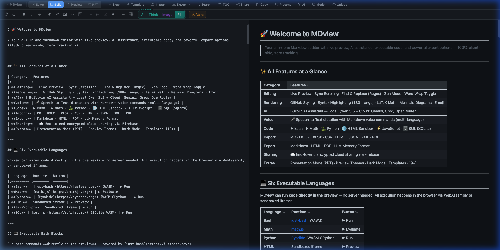

### AI Writing Assistant — Local & Cloud Models
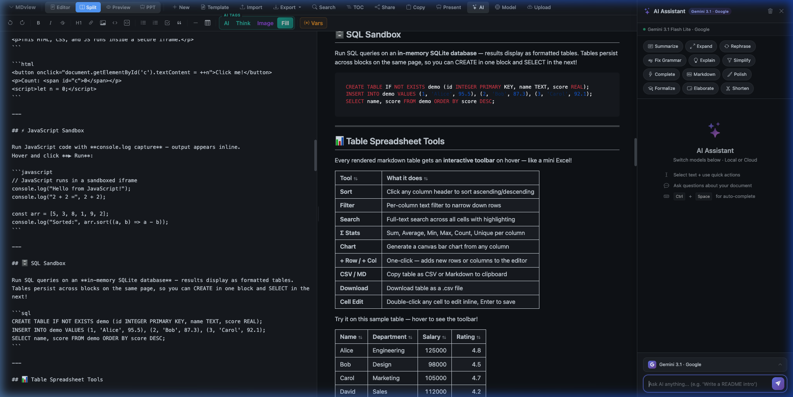

### Templates Gallery — 137+ Templates, 15 Categories
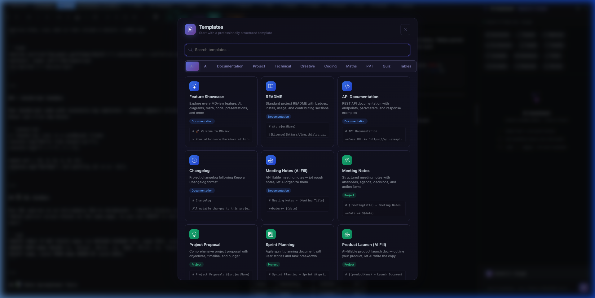

### LaTeX Math & Mermaid Diagrams
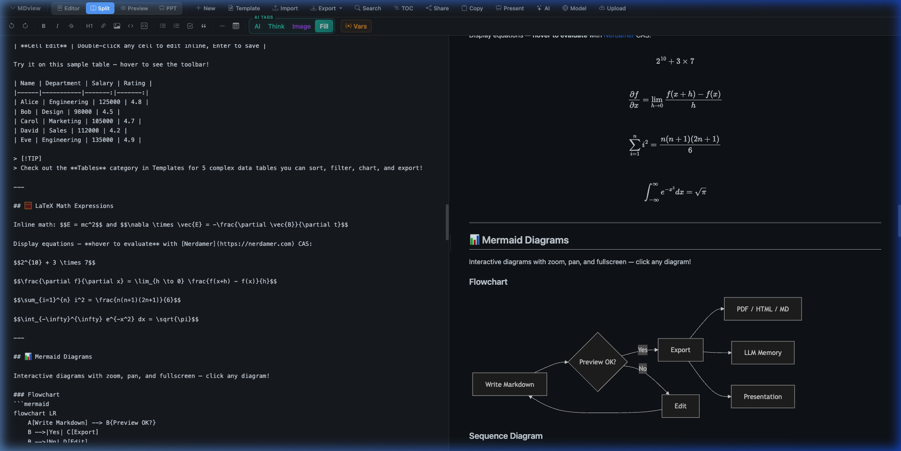

### Code Execution & Table Spreadsheet Tools
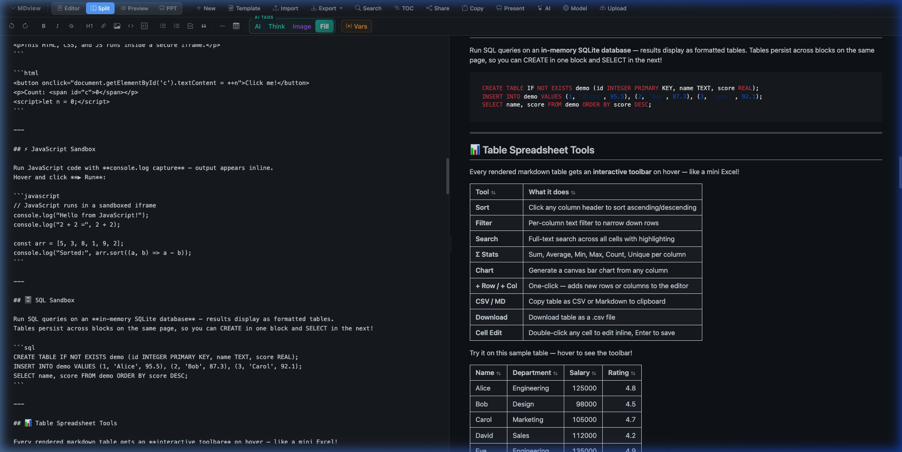

### Presentation Mode — Markdown to Slides
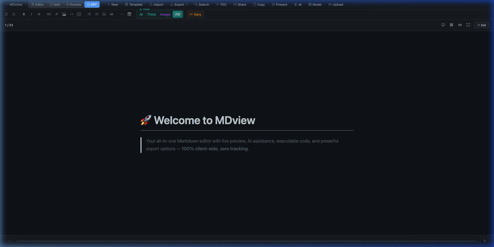

### Context Memory — Workspace Intelligence
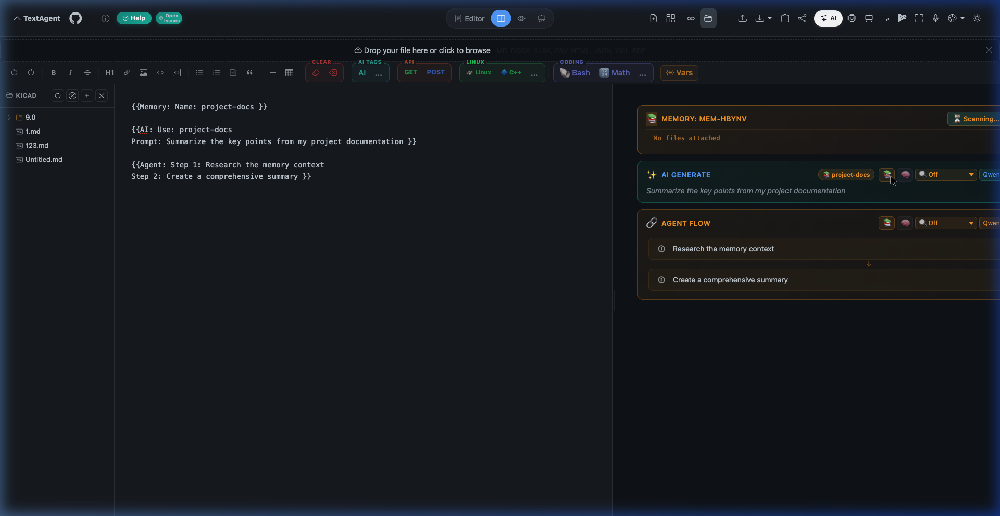

### Help Mode — Interactive Learning
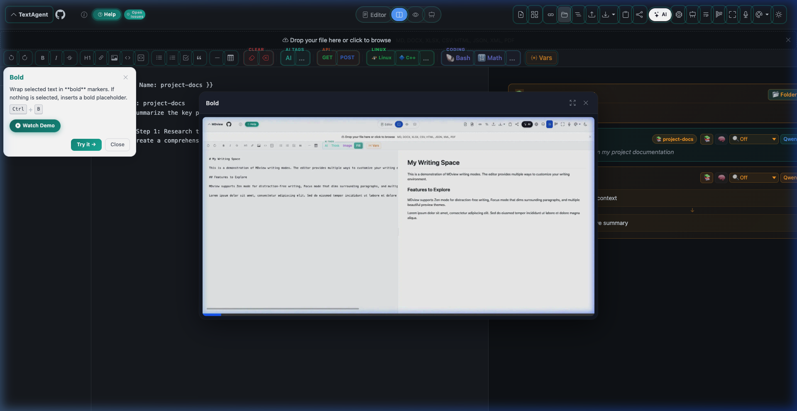

### API Calls & Linux Compile — REST + Code Execution

### Email to Self — Share to Inbox
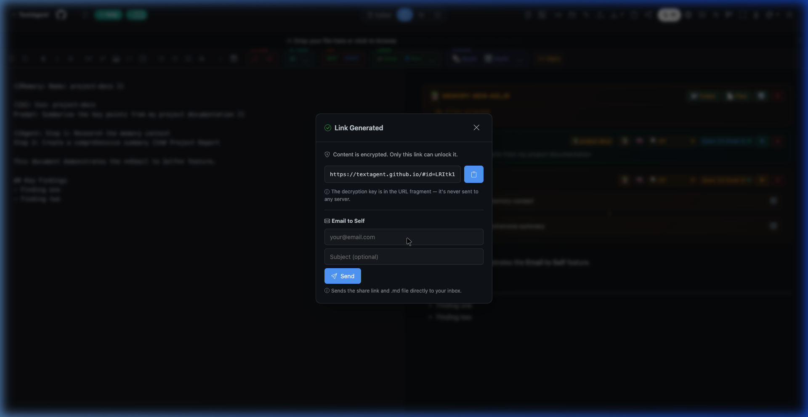

## 🎬 Feature Demos

> Click any feature below to watch a live demo.

<strong>🔒 Privacy-First — No Sign-Up, 100% Client-Side</strong>

**Your data never leaves your browser.** TextAgent runs entirely client-side with no server, no account, and no tracking. Type sensitive content with confidence — even your saved data stays in localStorage on your device.

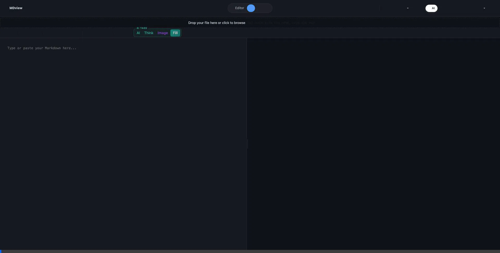

<strong>🤖 AI Writing Assistant — Local & Cloud Models</strong>

**Built-in AI with 3 local model sizes + cloud providers** — choose Qwen 3.5 Small (0.8B), Medium (2B), or Large (4B) for fully private local inference, or use cloud models (Gemini, Groq, OpenRouter). High-end device warning before 4B download.

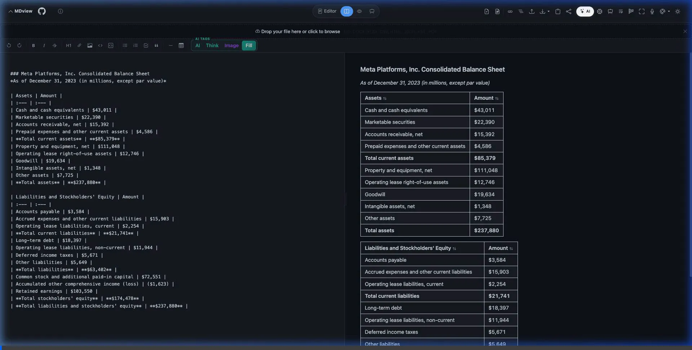

<strong>📄 Templates Gallery — 137+ Templates, 15 Categories</strong>

**Start any document in seconds.** Browse 137+ professionally designed templates across 15 categories: AI, Agents, API Explorer, Coding, Creative, Documentation, Finance, Games, Maths, PPT, Project, Quiz, Skills, Tables, and Technical. AI-powered templates include `{{AI:}}` tags for one-click document generation, the API Explorer lists 1400+ public APIs with click-to-try `{{API:}}` blocks, and the Games category features 8 instant pre-built games.

<strong>💻 Code Execution — Run Python, JS & SQL In-Browser</strong>

**Turn Markdown into an interactive notebook.** Execute code in 6 languages directly in the preview pane — Python (Pyodide), JavaScript, SQL (SQLite), Bash (just-bash), HTML, and Math (Nerdamer). All sandboxed, all client-side.

<strong>🎬 Presentation Mode — Markdown to Slides</strong>

**Present from your Markdown.** Add `---` separators to create slides, then click Present. Navigate with arrow keys, view speaker notes, switch layouts, and use the overview grid. Choose from 20+ PPT templates with image backgrounds.

<strong>📊 Table Spreadsheet Tools — Sort, Stats & Charts</strong>

**Interactive tables with spreadsheet-level power.** Hover over any rendered table to reveal a toolbar with Sort, Filter, Search, Stats (Σ), Chart, Add Row/Col, CSV/MD export, and inline cell editing. Generate bar charts directly from your data.

<strong>🎨 Writing Modes & Themes — Zen, Dark & 6 Themes</strong>

**Your perfect writing environment.** Switch between 6 preview themes (GitHub, GitLab, Notion, Dracula, Solarized, Evergreen), toggle dark mode, and enter Zen mode for distraction-free fullscreen writing. Focus mode dims surrounding paragraphs.

<strong>📂 Import & Export — 15 Formats In, PDF/HTML Out</strong>

**Import anything, export everything.** Drag and drop files in 15+ formats (TXT, MD, DOCX, XLSX, CSV, TSV, HTML, JSON, XML, YAML, TOML, PDF, and more) — all converted to Markdown client-side. Export as Markdown, HTML, or smart PDF with intelligent page breaks.

<strong>🔐 Encrypted Sharing — Zero-Knowledge Security</strong>

**Share securely with AES-256-GCM encryption.** Choose Quick Share (key in URL fragment, never sent to server) or Secure Share with a custom password. Recipients need the password to decrypt — the server never sees your content or keys.

<strong>🛠 Formatting Toolbar — Bold, Lists, Tables & More</strong>

**Full formatting power at your fingertips.** Bold, italic, strikethrough, headings, links, images, code blocks, ordered and unordered lists, tables, and undo/redo — all accessible from the toolbar without memorizing Markdown syntax.

<strong>🤖 AI Model Selector — Choose Your Engine</strong>

**Pick the right model for the job.** Switch between 3 local Qwen sizes (0.8B / 2B / 4B) and cloud providers (Gemini, Groq, OpenRouter) directly from the AI panel. Per-card model selection lets you use different models for different blocks.

<strong>🔗 Sync Scrolling — Editor & Preview in Lockstep</strong>

**Keep your place effortlessly.** Two-way synchronized scrolling links the editor and preview pane so you always see the rendered output for the line you're editing. Toggle on/off with the link icon.

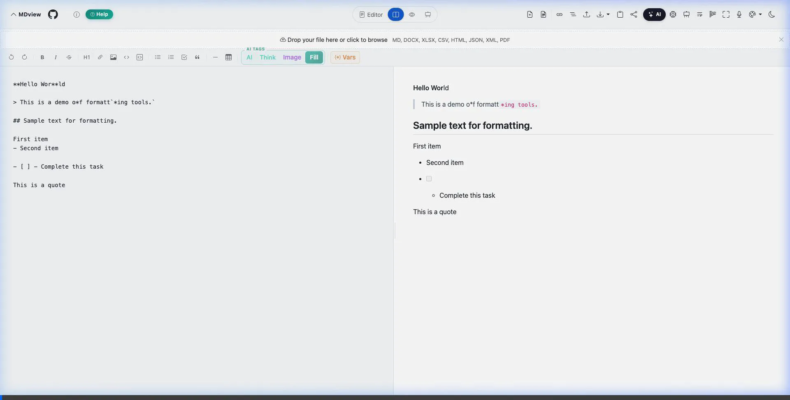

<strong>📑 Table of Contents — Auto-Generated Navigation</strong>

**Navigate long documents instantly.** A clickable sidebar TOC is auto-generated from your headings. Jump to any section with a single click, and the TOC highlights your current position as you scroll.

<strong>🎤 Voice Dictation — Speak Your Markdown</strong>

**Hands-free writing with Markdown awareness.** Triple-engine ASR combines Web Speech API, Voxtral Mini 3B (WebGPU, primary, 13 languages) or Whisper Large V3 Turbo (WASM fallback) with consensus scoring. Download consent popup shows model size and privacy info before first use. 50+ voice commands with natural phrases — say "heading one" or "title" for H1, "bold text end bold" for **text**, "add table" for a markdown table, "undo" to take it back. Auto-punctuation adds capitalization and periods, with LLM refinement when a model is loaded.

<strong>🏷️ AI Document Tags — Generate Entire Sections</strong>

**One-click document generation.** Use `{{AI:}}` for text (with `@think: Yes` for deep reasoning) and `{{Image:}}` for AI-generated images. Each tag becomes a card with generate, review, accept/reject, and regenerate controls — all operating independently.

<strong>🔀 Template Variables — Dynamic Reusable Documents</strong>

**Templates that adapt to you.** Define `$(varName)` placeholders in any document, click ⚡ Vars to auto-detect them, fill in the generated table, and apply. Built-in globals like `$(date)` and `$(time)` work automatically. 12 templates include variable support.

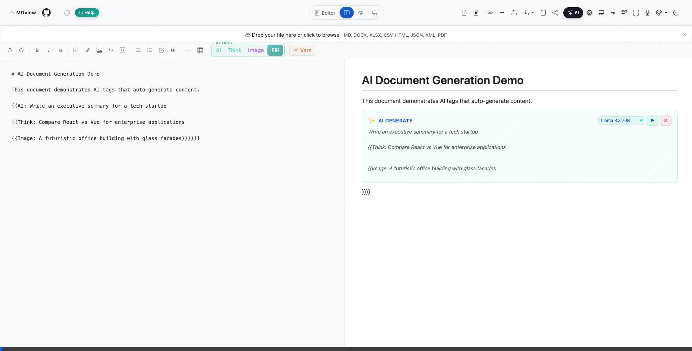

<strong>🔗 Agent Flow — Multi-Step AI Pipeline</strong>

**Chain AI steps together.** Write `{{Agent: Step 1: ... Step 2: ...}}` in markdown — a pipeline card renders with numbered steps and connecting arrows. Each step's output feeds into the next. Choose a model and search provider per card. Run, review, and accept/reject the combined output.

#### Agent Execution Decision Tree

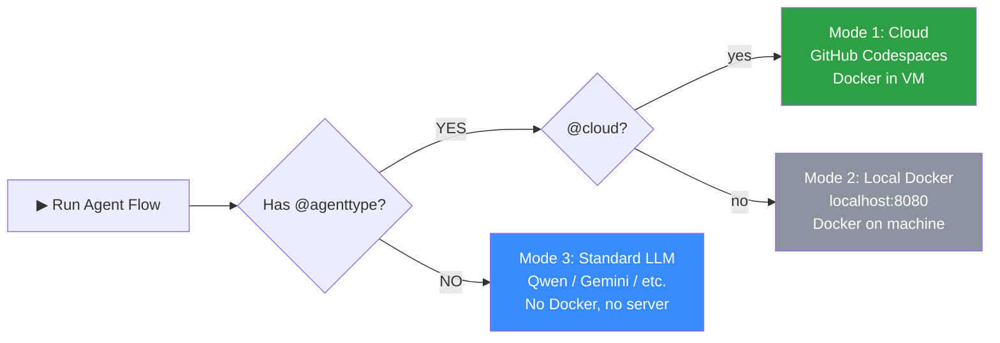
```mermaid
graph LR
    A["▶ Run Agent Flow"] --> B{"Has @agenttype?"}
    B -->|YES| C{"@cloud?"}
    B -->|NO| F["Mode 3: Standard LLM<br/>Qwen / Gemini / etc.<br/>No Docker, no server"]
    C -->|yes| D["Mode 1: Cloud<br/>GitHub Codespaces<br/>Docker in VM"]
    C -->|no| E["Mode 2: Local Docker<br/>localhost:8080<br/>Docker on machine"]

    style D fill:#2ea043,color:#fff
    style E fill:#8b949e,color:#fff
    style F fill:#388bfd,color:#fff
```

<strong>🐧 Compile & Run — 25+ Languages via Judge0 CE</strong>

**Compile and execute code inline.** Write `{{Linux:}}` tags with `Language:` and `Script:` fields to compile and run C++, Rust, Go, Java, Python, TypeScript, Kotlin, Scala, and 25+ more languages. Output (stdout, stderr, compile errors) appears inline with execution time and memory stats.

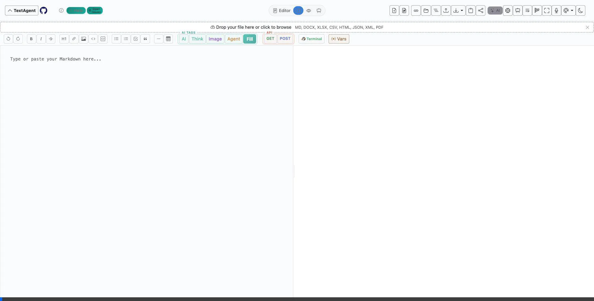

<strong>📂 Workspace Sidebar — Multi-File Management</strong>

**Manage multiple files in one workspace.** Toggle the sidebar with the File Tree button to see all your files. Create, rename, duplicate, and delete files via right-click context menu. Each file has independent localStorage persistence. Active file highlighting and smooth switching.

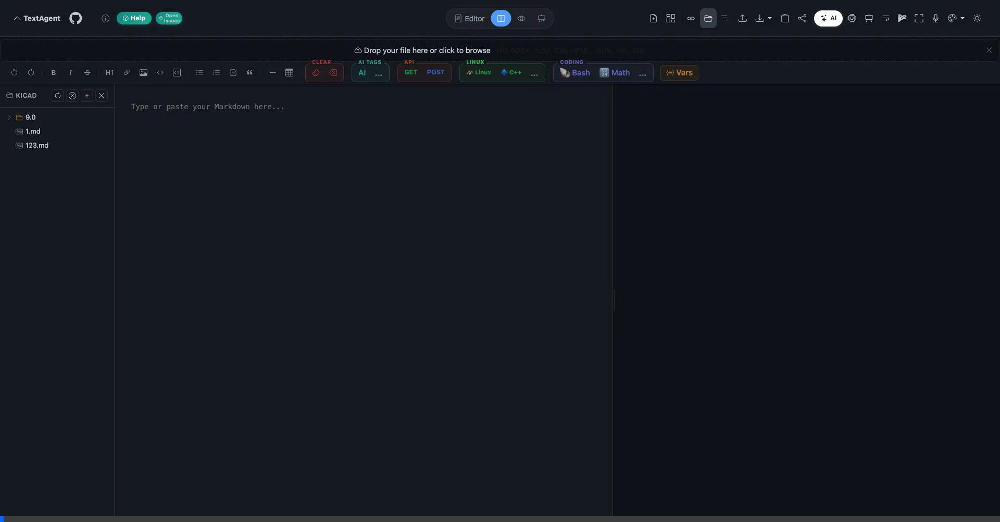

<strong>🧠 Context Memory — Workspace Intelligence</strong>

**Give AI access to your workspace.** Use `{{Memory:}}` tags to index workspace files and external folders with SQLite FTS5 full-text search. Add `Use: workspace` to any AI/Think/Agent tag to auto-retrieve relevant context. Memory Selector dropdown on each card lets you toggle sources. Amber-accented Memory cards show attached files with Folder/Files/Rebuild controls.

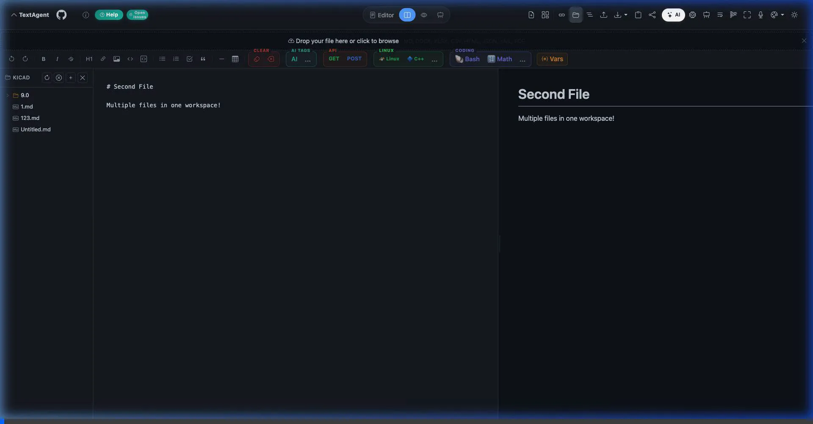

<strong>❓ Help Mode — Interactive Learning</strong>

**Learn every feature instantly.** Click the ❓ Help button to activate learning mode — all buttons get teal ring highlights. Click any button for a popover with feature name, description, keyboard shortcut, and ▶ Watch Demo button. Demo videos play in a 50% screen panel with fullscreen expand. 16 dedicated demo videos mapped to every toolbar button.

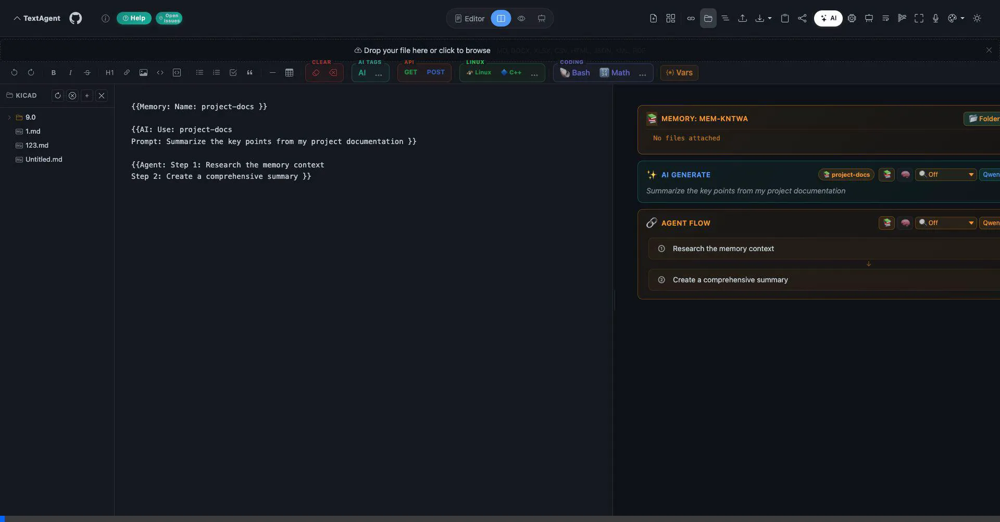

<strong>✉️ Email to Self — Share to Inbox</strong>

**Send documents directly to your inbox.** After generating a share link, enter your email in the "Email to Self" section — the document is sent with the share link and `.md` file attached. Powered by Google Apps Script (free, 100 emails/day). Email is persisted in localStorage for convenience.

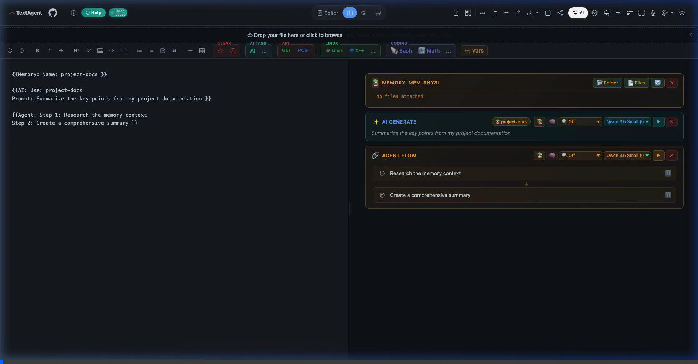

<strong>💾 Disk-Backed Workspace — Save to Folder</strong>

**Work directly with files on disk.** Click "Open Folder" to connect a local folder via File System Access API. Files are read/written directly to disk with debounced autosave. Refresh from disk for external changes, disconnect to revert to localStorage, and auto-reconnect on reload. Unified action modal for rename, duplicate, and delete with confirmation.

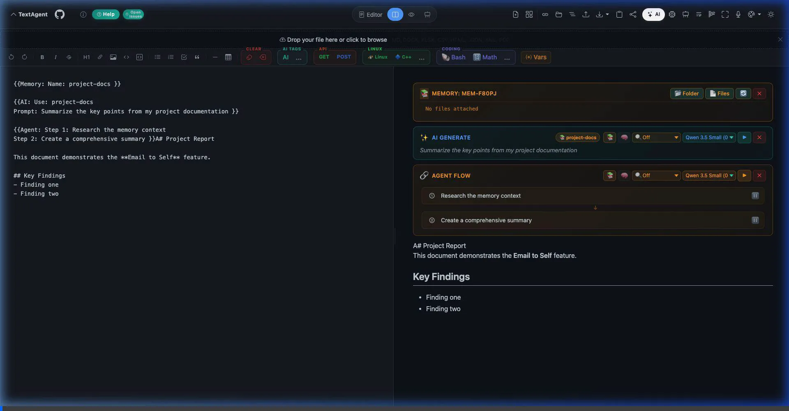

<strong>🔌 API Calls & Linux Tags — REST + Compile</strong>

**Call APIs and compile code from Markdown.** Use `{{API:}}` tags for REST API calls (GET/POST/PUT/DELETE) with response stored in variables. Use `{{Linux:}}` tags with `Language:` and `Script:` fields to compile 25+ languages. Toolbar sections provide quick-insert buttons for API (GET/POST) and Linux (🐧 Linux, 🔷 C++) with overflow dropdowns for more languages.

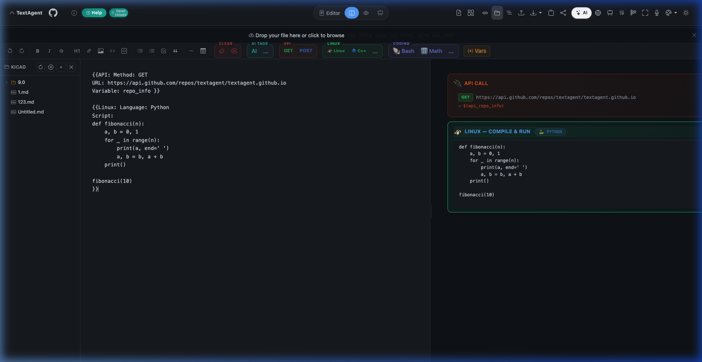

<strong>🏷️ DocGen Preview Editing — Editable Prompts & Steps</strong>

**Edit prompts and steps directly in preview cards.** Use `@prompt:` for editable AI instructions (bare text stays as a static description label), edit `@step:` inputs inline in Agent Flow cards, and attach images with 📎 for multimodal vision analysis. All edits sync back to the editor in real-time.

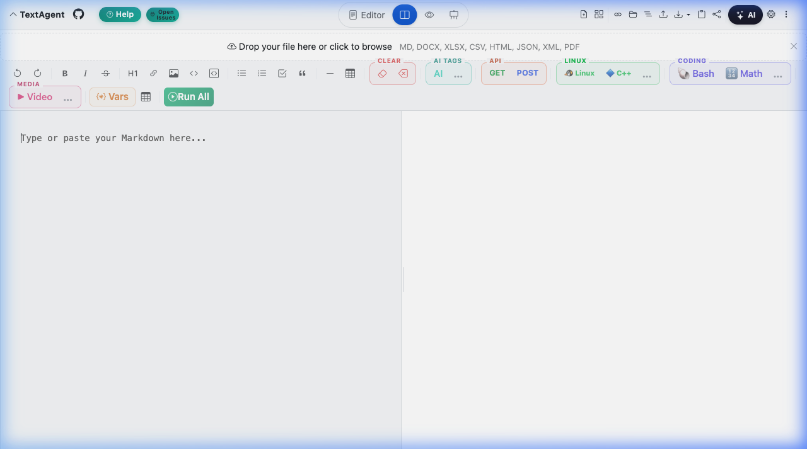

<strong>▶ Run All — Notebook Execution Engine</strong>

**Execute everything with one click.** Run All executes every code block, AI tag, API call, and Linux compile in document order. 11 runtime adapters with a progress bar, per-block status badges (⏳/⚡/✅/❌), abort support, and a SQLite shared context store for cross-block data sharing.

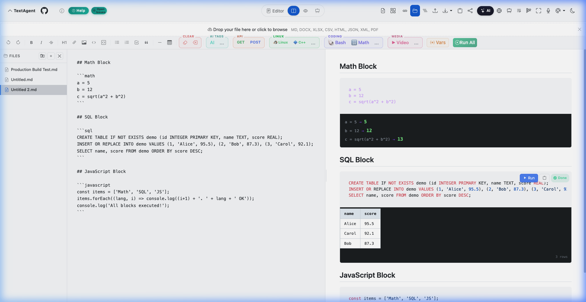

<strong>🎮 Game Builder — AI-Generated & Pre-Built Games</strong>

**Build and play games in your markdown.** Use `{{@Game:}}` tags with engine selector (Canvas 2D / Three.js / P5.js) for AI-generated games, or `@prebuilt:` for 8 instant games (chess, snake, shooter, pong, breakout, maths quiz, hiragana, kana master). Import external HTML, export standalone, and go fullscreen.

<strong>📈 Finance Dashboard — Live TradingView Charts</strong>

**Create live stock dashboards.** Load a Finance template, customize tickers via the `@variables` table, and get a responsive grid of TradingView charts with configurable range (1M/1Y/3Y), interval (D/W/M), EMA period, and card height. Interactive toggle buttons and dynamic grid expansion with full-width single cards.

<strong>🔊 Text-to-Speech — Kokoro TTS Engine</strong>

**Hear any text read aloud.** Use `{{@TTS:}}` tags for per-card text-to-speech with language selector. Powered by Kokoro 82M v1.0 ONNX (~80 MB, WebWorker) for 9 languages, with Web Speech API fallback. Run to generate audio, Play to replay, Save to download as WAV.

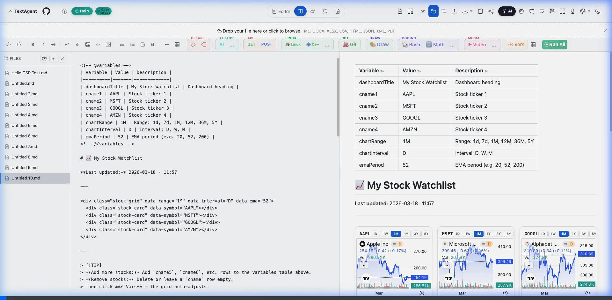

<strong>📷 OCR — Image to Text Extraction</strong>

**Extract text from images and PDFs.** Use `{{@OCR:}}` tags with three models: Granite Docling 258M, Florence-2 230M, or GLM-OCR 1.5B. Three modes (Text/Math/Table) with 📷 live camera capture (rear camera on mobile, capture/retake/accept flow) and 📎 upload for images and PDFs. PDFs rendered page-by-page via pdf.js.

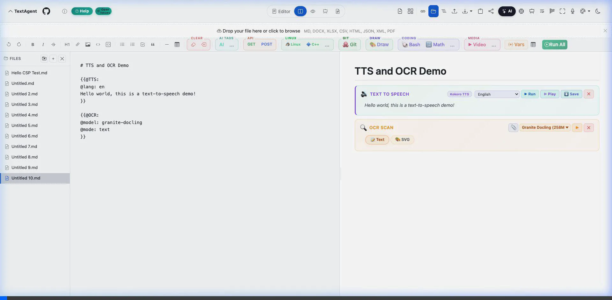

<strong>🎨 Draw — Excalidraw Whiteboard & AI Diagrams</strong>

**Collaborative whiteboard in your markdown.** Use `{{@Draw:}}` tags for an embedded Excalidraw canvas with AI diagram generation (describe a diagram → Generate), Excalidraw/Mermaid tool switcher, Insert/PNG/SVG export, and a 📚 Library Browser with 29 bundled packs (600+ items) across 6 categories.

<strong>🎬 Media Embedding — Video, YouTube & Embed Grid</strong>

**Embed rich media in your markdown.** Use `` for video playback, paste YouTube/Vimeo URLs for auto-embeds, and create responsive media grids with the `embed` code block (`cols=1-4`, `height=N`). Website URLs render as rich link preview cards with favicon and "Open ↗" button.

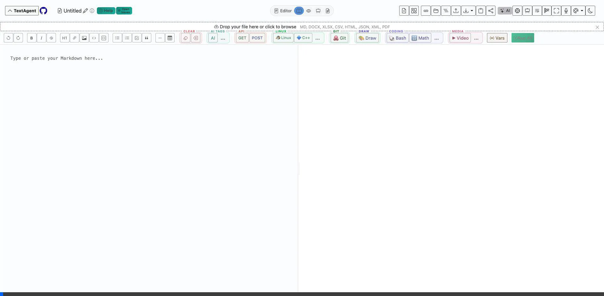

## 📝 Usage

| Action | How |
|:-------|:----|
| **Write** | Type or paste Markdown in the left editor panel |
| **Preview** | See live rendered output in the right panel |
| **Import** | Click ☁️ Upload or drag & drop — supports TXT, MD, DOCX, XLSX, CSV, TSV, HTML, JSON, XML, YAML, TOML, PDF |
| **Export** | Use the ⬇️ Export dropdown → Markdown, HTML, PDF, or LLM Memory |
| **AI Assistant** | Click ✨ AI → choose a model → ask questions or use quick actions |
| **Dark Mode** | Click the 🌙 moon icon |
| **Sync Scroll** | Click the 🔗 link icon to toggle two-way sync |
| **Share** | Click 📤 Share → generates an encrypted Firebase link |
| **Present** | Click 🎬 Presentation → navigate slides with arrow keys |
| **Zen Mode** | Press `Ctrl+Shift+Z` or click the fullscreen icon |
| **Find & Replace** | Press `Ctrl+F` → supports regex |
| **Templates** | Click the 📄 Templates button for starter documents |

### Mermaid Diagram Toolbar

Hover over any Mermaid diagram to reveal a toolbar:

| Button | Action |
|:-------|:-------|
| ⛶ (arrows) | Open diagram in zoom/pan modal |
| PNG | Download as PNG |
| 📋 (clipboard) | Copy image to clipboard |
| SVG | Download as SVG |

### Supported Markdown Syntax

Headings · **Bold** · *Italic* · ~~Strikethrough~~ · Links · Images · Ordered/Unordered Lists · Tables · Code Blocks (180+ languages) · Blockquotes · Horizontal Rules · Task Lists · LaTeX Equations (inline & block) · Mermaid Diagrams · PlantUML Diagrams · Callout Blocks (`> [!NOTE]`, `> [!TIP]`, `> [!WARNING]`) · Footnotes (`[^1]`) · Emoji Shortcodes · Executable Bash · Python · JavaScript · SQL · HTML Blocks

## 🔧 Technologies

### Core
| Technology | Purpose |
|:-----------|:--------|
| HTML5 / CSS3 / JavaScript | Core stack |
| [Bootstrap](https://getbootstrap.com/) | Responsive UI framework |
| [Marked.js](https://marked.js.org/) | Markdown parser |
| [highlight.js](https://highlightjs.org/) | Syntax highlighting (180+ languages) |
| [DOMPurify](https://github.com/cure53/DOMPurify) | HTML sanitization |

### Rendering
| Technology | Purpose |
|:-----------|:--------|
| [MathJax](https://www.mathjax.org/) | LaTeX math rendering |
| [Mermaid](https://mermaid-js.github.io/mermaid/) | Diagrams & flowcharts |
| [PlantUML Server](https://www.plantuml.com/) | PlantUML diagram rendering |
| [JoyPixels](https://www.joypixels.com/) | Emoji shortcode support |

### AI
| Technology | Purpose |
|:-----------|:--------|
| [Transformers.js](https://huggingface.co/docs/transformers.js) | Local AI inference (Qwen 3.5 — 0.8B / 2B / 4B) |
| [Groq API](https://groq.com/) | Cloud AI (Llama 3.3 70B) |
| [Google Gemini API](https://ai.google.dev/) | Cloud AI (Gemini 3.1 Flash Lite) |
| [OpenRouter API](https://openrouter.ai/) | Multi-model AI routing |

### Export & Import
| Technology | Purpose |
|:-----------|:--------|
| [html2canvas](https://github.com/niklasvh/html2canvas) + [jsPDF](https://www.npmjs.com/package/jspdf) | PDF generation |
| [FileSaver.js](https://github.com/eligrey/FileSaver.js) | File download handling |
| [Mammoth.js](https://github.com/mwilliamson/mammoth.js) + [Turndown.js](https://github.com/mixmark-io/turndown) | DOCX → Markdown |
| [SheetJS](https://sheetjs.com/) | XLSX/XLS parsing |
| [pdf.js](https://mozilla.github.io/pdf.js/) | PDF text extraction |

### Infrastructure
| Technology | Purpose |
|:-----------|:--------|
| [Firebase Firestore](https://firebase.google.com/docs/firestore) | Cloud sharing & auto-save |
| [Web Crypto API](https://developer.mozilla.org/en-US/docs/Web/API/Web_Crypto_API) | AES-256-GCM encryption |
| [pako](https://github.com/nicmart/pako) | Gzip compression |
| [Neutralino.js](https://neutralino.js.org/) | Desktop app framework |
| [just-bash](https://justbash.dev/) | In-browser bash execution |
| [Pyodide](https://pyodide.org/) | In-browser Python (CPython via WASM) |
| [sql.js](https://sql.js.org/) | In-browser SQLite (WASM) |
| [WebVM](https://webvm.io) | Full Debian Linux terminal (CheerpX x86 emulation) |
| [Judge0 CE](https://ce.judge0.com) | Server-side code execution for 25+ compiled languages |

## 🤝 Contributing

Contributions are welcome! Please feel free to submit a Pull Request.

1. Fork the project
2. Create your feature branch (`git checkout -b amazing-feature`)
3. Commit your changes (`git commit -m 'Add some amazing feature'`)
4. Push to the branch (`git push origin amazing-feature`)
5. Open a Pull Request

## 📄 License

This project is licensed under the MIT License - see the [LICENSE](LICENSE) file for details.

## 📈 Development Journey

TextAgent has undergone significant evolution since its inception. What started as a simple markdown parser has grown into a full-featured, AI-powered application with 40+ features. By comparing the [current version](https://textagent.github.io/) with the [original version](https://a1b91221.markdownviewer.pages.dev/), you can see the remarkable progress in UI design, performance optimization, and feature implementation.

## 📋 Release Notes

| Date | Commits | Feature / Update |
|------|---------|-----------------:|
| **2026-06-22** | — | 📄 **Open File From Disk** — new "Open File" button (`ws-open-file`) in the workspace sidebar opens a single file via `showOpenFilePicker` and keeps it **linked** so edits autosave back to that exact file, independently of folder mode; single-file handle API in `disk-workspace.js` (`openSingleFile`/`linkSingleFile`/`writeSingleFile`/`unlinkSingleFile`/`unlinkAllSingleFiles`/`restoreSingleFiles`) with IndexedDB-persisted handles (`file:<id>`) surviving reloads; `M.wsOpenDiskFile()` creates a deduped, manually-named workspace entry. **Fixed (critical):** edits never reached disk — the per-keystroke autosave (`cloud-share.js` → `saveToLocalStorage`) had only a folder-mode disk branch and never called `writeSingleFile`; added a single-file write-back branch (before the folder branch) + `pagehide`/`beforeunload` flush. **Fixed (major):** in-gesture `readwrite` permission request on open; per-id write serialization queue (prevents out-of-order corruption); delete/rename guards so single-linked files never trigger folder-mode `removeEntry`/`renameFileInPath` (could destroy a same-named file in a connected folder); deleting the last file no longer truncates the linked file; folder connect/reconnect unlinks single-file handles instead of orphaning them. **Fixed (minor):** no redundant identical-content write on open, orphaned-handle pruning, persistence-failure warning, `.txt`/`.log` extension preserved on rename, no auto-published cloud copy for local files. Verified live + 30 passing `disk-workspace.spec.js` tests, no regressions |
| **2026-04-15** | — | 🎙️ **Podcast Generation System** — new `{{@Podcast:}}` document tag for AI-powered multi-speaker podcast creation; 3-phase pipeline (web research via Jina API → AI script generation with `[Speaker]` markers → Kokoro TTS multi-speaker audio synthesis); configurable styles (debate, interview, chat, lecture, storytelling); `parseScript()` speaker segmentation; `createWavBlob()` Float32Array→WAV encoder; real-time progress UI with phase indicators; WAV audio download; **Podcast Marketplace** with 15+ curated templates across 5 categories (Tech, Science, Business, Creative, Education); search/filter, template cards with metadata; `podcast-docgen.js` (~1046 lines) + `podcast-marketplace.js` (~923 lines) + `css/podcast-docgen.css` + `css/podcast-marketplace.css` + `js/templates/podcasts.js` |
| **2026-04-15** | — | 🔧 **TTS Worker Multi-Speaker Fix** — fixed critical bug where Web Worker silently dropped `speak-multi` messages after async `init` handler completed; root cause: service worker (`sw.js`) used cache-first strategy for `.js` files, serving stale `tts-worker.js` indefinitely; fix: (1) extracted `processMultiSegments()` as standalone async function, (2) bundled segments with `init` message via `pendingSegments` field for same-handler-execution processing, (3) added cache-busting `?v=` param to worker URL, (4) excluded worker files from service worker caching, (5) bumped `CACHE_NAME` v2→v3, (6) added `worker.onerror` handler, (7) per-chunk 90s timeout, event loop yields, voice pre-fetch phase, heartbeat logger, version stamping |
| **2026-04-08** | — | ⭐ **Star on GitHub Button** — new gold/amber gradient pill button in header next to Issues button linking to the GitHub repo for starring; `.star-github-pill` CSS class with dark mode variant; fixed Issues button inline styles that prevented proper `.help-mode-pill` rendering |
| **2026-04-05** | — | 🔬 **Interactive Periodic Table Template** — new Science template category (`bi-atom` icon) with full 118-element interactive periodic table; React + Babel `html-autorun` block; 18×10 grid layout with 11 color-coded element categories (nonmetal, noble gas, alkali, alkaline, transition, post-transition, metalloid, halogen, lanthanide, actinide, unknown); search filter and category highlight; element detail view with 4 tabbed sections (Overview, Properties, Structure, Uses & Hazards); interactive Bohr model atom visualization with concentric orbit rings, animated electrons, 3D nucleus cluster, mouse drag rotation/tilt, scroll zoom; dark/light theme toggle (30+ CSS tokens per theme); lanthanide (57–71) and actinide (89–103) rows with labels; left-aligned header controls |
| **2026-04-04** | — | 🤖 **Agentic Tool Calling** — transitioned AI assistant from firehose context injection to **model-driven tool calling** for Groq cloud models; `buildToolDefinitions()` registers enabled connectors (Weather, HN, GitHub, Slack) + web search as OpenAI-format tools; model decides which tools to call via `tool_choice: 'auto'`; `executeToolCall()` runs tools in parallel; `handleToolCalls()` orchestrates two-pass generation (Pass 1: tool selection, Pass 2: synthesis with results); **query-relevance filter** (`queryNeedsConnectors()`) for local models — keyword-based gating prevents weather/news injection on general queries like "what is algebra?"; `extractLocationFromQuery()` with 5 extraction strategies (preposition patterns, weather patterns, capitalized words) for smart geocoding; softened grounding header allows general knowledge answers when connector data is irrelevant; Groq worker updated with non-streaming tool detection path and `rawMessages` for Pass 2; model-aware context budgets (4K local / 30K cloud); WebGPU buffer overflow translated to user-friendly error messages; model-size-aware context limits (0.8B→4K, 2B→8K, 4B+→32K chars) |
| **2026-04-03** | — | 💾 **Offline Model Manager** — new Manager tab in AI model selector (Models \| Manager) with ZIP-based Export (reads all cached model files from Cache API, bundles into single `.zip` via built-in CRC32 + STORE-mode ZIP creator — zero external dependencies), Import (accepts `.zip` file, extracts entries, restores to browser Cache API via manifest URL mapping), and Delete (clears browser cache); per-model status badges (In browser cache / Downloaded to disk / Not downloaded) with actual cache sizes; button labels refactored from Download/Upload to Export/Import with `bi-box-arrow-down`/`bi-box-arrow-in-up` icons; Science template category added; works in all browsers — no File System Access API required |
| **2026-04-03** | — | 🤖 **Qwen 3.5 XL (9B) Local Model** — added `textagent/Qwen3.5-9B-Onnx` (~16 GB) as the largest local multimodal Qwen model; supports vision (image-text-to-text); marked `requiresHighEnd`; placed after 4B in size progression (0.8B → 2B → 4B → 9B) |
| **2026-04-03** | — | 🔌 **Connector AI Pipeline** — new "My Connectors" system for plugging third-party data sources into the AI assistant; Hacker News connector fetches top stories with full URLs, author metadata, self-post body text, and top community comments; connector toggle in AI panel header with green active indicator; unified parallel fetch pipeline (`Promise.all`) merges connector + web search context; grounding instruction header ("LIVE DATA...Answer using this data") forces models to use fetched data; **Fixed:** Gemma 4 E4B worker completely discarded `context` parameter — only `userPrompt` was used in the messages array; context now injected as `context + "\n---\nUser question: " + userText`; Gemma 4 system prompt enhanced with "data is real and live" grounding instruction; context trimmed to 6000 chars for WebGPU memory safety; connector label click bug fixed (`e.preventDefault()` stops checkbox toggle via event bubbling); `hasActiveConnectors()` decoupled from DOM — reads `localStorage` directly; auto-repair re-enables connected-but-paused connectors on init; default HN stories 10→5; connector registry extensible for Slack, Notion, GitHub, Confluence |
| **2026-04-03** | — | 👁️ **Gemma 4 Vision Tag** — new `{{@Vision:}}` DocGen tag backed by Gemma 4 E2B/E4B running locally via WebGPU/WASM; `ai-worker-gemma4.js` Web Worker with `Gemma4Processor` instantiation (bypasses `AutoProcessor` which lacks `image_processor_type`) and system-prompt persona fix; primary `onnx-community/gemma-4-E2B-it-ONNX` with `textagent/gemma-4-E4B-it-ONNX` fallback; cyan-themed Vision card with 📷 camera capture + 📎 omni-modal upload (image/audio/video); **video frame extraction** — `extractVideoFrames()` seeks 4 evenly-spaced timestamps in a hidden `<video>` element, draws each to Canvas at max 1280px, stores as JPEG 0.85; audio stored as direct base64; upload handler detects Vision card type, sets `accept="image/*,audio/*,video/*"`; generation handler maps attachments to typed inputs and calls `switchToModel('gemma4-e2b')` before execution, restores prior model after; 👁️ Vision toolbar button in AI Tags dropdown; Fixed: Vision card double-rendering raw `@upload:` / `@prompt:` lines caused by broken `\\s*` regex (quadruple-escaped) — now correct `\s*`; removed duplicate static text row; `gemma4-e2b` / `gemma4-e4b` entries in `ai-models.js` with `isDocModel: true` + `supportsVision: true` |
| **2026-04-02** | `55538f3` | 🔧 **DocGen Reject Block Fix** — fixed: rejecting a generated Translate/OCR/TTS/STT/Image/AI block restored a generic hardcoded "AI Generate" card, losing all type-specific UI (language dropdown, mode pills, camera button, step inputs, etc.); reject handler now calls `M.transformDocgenMarkdown(block.fullMatch)` to re-render the exact original typed card with all controls intact; `data-ai-index` patched on restored card and all children; review panel header label+icon now shows correct type for all blocks ("🌐 Translate — Review", "🔍 OCR Scan — Review", etc.) instead of always "✨ AI Generate — Review" |
| **2026-04-02** | `f012a30`, `971de55` | ⚡ **Share Link Loading Overlay** — eliminates the flash of bare UI when opening shared links (`#space=`, `#s=`, `#id=`, `#d=`); full-screen branded loading splash (TextAgent logo + spinner) activates before any JS loads via inline hash detection in `<head>`; theme-aware (dark `#0d1117` / light `#f6f8fa`); fades out smoothly (0.35s) once content is ready; `hideShareLoader()` called at every terminal path (success, error, form-gate); 15-second safety timeout auto-dismisses on network failure |
| **2026-04-02** | `6f495fe` | ✏️ **Annotate DocGen + Pretext Reflow Engine** — new `{{Annotate:}}` DocGen tag with canvas-based freehand annotation overlay; `@text:` source mode renders text on-canvas with real-time Pretext-style scanline reflow (~0.5–1.5ms/frame, O(width) per row); freehand strokes build an offscreen mask; per-row `getImageData` scans free x-intervals; words packed into intervals via `canvas.measureText()` (same arithmetic as Pretext `layoutNextLine()`); tools: pen, highlighter, eraser, line, arrow, rect, circle; color swatches + size slider; `📖 Present` button calls `M.setViewMode('preview')` — hides editor, annotation stays fully drawable while reading; `↩ Undo` / `🗑 Clear` / `📥 PNG` actions; Fixed: `data-text` stripped by DOMPurify — added `data-text`, `data-reflow` to `ADD_ATTR` + hidden `` textContent as primary storage (survives sanitization without whitelisting); `annotate-docgen.js` (~710 lines) + `annotate-docgen.css` (~340 lines); interactive demo: `public/pretext-reflow-demo.html` — 4-tab demo (Float Image, Draw Exclusion, Both Together, API explainer) |
| **2026-04-02** | `1519804` | 📬 **Space Recovery by Email + Email Link Fix** — Spaces "Recover" view now has two tabs: **By Email** (default — enter email + access key, Firestore queries by hashed `eh` field to recover all matching spaces) and **By Slug** (existing flow); email pre-filled from localStorage; recovers multiple spaces at once if same key used; "Email to Self" now embeds all generated links (Share Link, Editor Link, Respondent Link, Password) directly in the email body so they always appear in the sent email |
| **2026-04-02** | `fe7bde6` | 🔬 **Research Loop UX Fixes** — fixed table-tools toolbar hijacking research results table (skips `research-results-table` class); fixed results table `max-height: 350px` clipping to `600px`; moved `research-loop.js` import to Phase 3b-ext3 with try/catch to prevent silent load failures; clicking row now shows only the extracted `PROMPT` text with `📋 Copy` button (not full scorer code); added search pills panel (`@search:` field) with provider API key prompts; DOMPurify allowlist expanded for `input`, `label`, `checked`, `data-research-*` attrs; iframe sandbox height raised from 800→5000px |
| **2026-04-01** | | 🔬 **Research Loop Tag** — new `{{@Research:}}` tag for autonomous AI-driven experiment optimization (inspired by Karpathy's autoresearch); Propose→Execute→Evaluate→Keep/Discard loop runs entirely in-browser via Pyodide (Python in WASM); configurable `@metric`, `@direction` (lower/higher), `@max_iterations`, `@model`, `@goal`; multiline `@code: \|` (mutable) and `@test: \|` (fixed harness) fields; metric extraction from stdout (`METRIC:xxx`); AI prompt includes experiment history with strategy shift hints after 3 consecutive failures; live results table with status badges (baseline/keep/discard/crash), delta indicators, progress bar; per-card model selector; Start/Stop controls; glass card UI with purple accents and pulse animation; `js/research-loop.js` (~795 lines) + `css/research-loop.css` (~300 lines) |
| **2026-04-01** | | 🎨 **AI Panel UI Redesign** — centered initial chat state (Claude-like welcome with input + model selector clustered in middle, transitions to bottom-pinned on first message via CSS `:has(.ai-welcome-message)`); merged separate Attach File (paperclip) and Screenshot (camera) buttons into single `+` button with unified dropdown menu (Attach File / Capture Page / Capture Screen / Upload Image, `+` rotates to `×` when open); merged header bar and status bar into single compact header (status text inline below title, download progress bar still standalone); fixed download progress bar stuck at 96% after model load |
| **2026-03-31** | | 📷 **Screenshot to AI** — new 📷 camera button in the AI chat input bar with three capture modes: Capture Page (`html2canvas` full-page snapshot, AI panel hidden during capture), Capture Screen (`getDisplayMedia` screen-share with frame extraction from a hidden DOM-attached video element), and Upload Image (file picker); captured image auto-injected into `pendingAttachments` and sent to AI for analysis; fixed black-screen capture bug (video must be in DOM for GPU decoder, wait for `timeupdate` event not just `requestAnimationFrame`); self-healing button injection via `injectButtonIfMissing()` with 2s fallback poll; CSS-independent dropdown via inline `style.display` toggling; vision model warning toast; `js/ai-screenshot.js` new module (~300 lines) + `css/ai-panel.css` styles + `js/modal-templates.js` template update + `src/main.js` registration |
| **2026-03-31** | | 🦀 **OpenClaw Integration Blog Post** — published detailed technical post (`CHANGELOG-openclaw-textagent-integration.md`) documenting how OpenClaw runs natively inside TextAgent's Docker-based Agent Flow; covers `AGENT_CLI_MAP`, native CLI invocation (`openclaw agent --message ... --json`), API key forwarding, structured JSON response parsing, multi-step context chaining, cloud mode via GitHub Codespaces, and security boundaries |
| **2026-03-31** | | 🤖 **Qwen 3.6 Plus Preview via OpenRouter** — added `qwen/qwen3.6-plus-preview:free` (Alibaba) as a new free cloud model; appears in the model selector as "Qwen 3.6 Plus Preview · Alibaba · Free · via OpenRouter"; reuses existing `ai-worker-openrouter.js` and shared OpenRouter API key |
| **2026-03-31** | | 🎥 **RecStudio Teleprompter & Light Mode Fix** — fixed teleprompter textarea not expanding to fill panel height (changed container `overflow: auto` → `hidden`, set textarea `height: 100%` with `min-height: 0`); reduced text padding for maximum usable area; fixed "Share screen" button rendering as solid black block in light/day mode (added `background: #fff` override) |
| **2026-03-30** | | 🎥 **RecStudio — Screen & Camera Recorder** — new full-screen recording overlay with 4 capture modes (Screen only, Screen + Camera, Camera only, Whiteboard); Canvas-based compositing at 1920×1080 / 60fps via requestAnimationFrame; interactive teleprompter panel (draggable via header + touch, resizable via CSS handle, font size controls A−/A+ 10–48px, scroll speed ◁/▷ 0.5x–5x, play/pause auto-scroll, 3-level transparency toggle with dark text + white glow shadow for readability on any background); whiteboard with 7 tools (Pen, Highlighter, Eraser, Line, Rectangle, Ellipse, Text), 10 color presets, 3 stroke widths, undo/redo; PiP webcam with shape selector (Circle/Square/Full/Off); mic and camera device selection dropdowns; countdown timer; recording timer HH:MM:SS; post-recording review screen with video playback + WebM download; SVG line-art icon system; 4 footer controls (Teleprompter, Shape, Mic, Camera) with dropdown menus; zero-chrome idle state; `rec-studio.js` (~1170 lines) + `rec-studio.css` (~750 lines) |
| **2026-03-30** | | 📲 **PWA Install UX** — redesigned install flow with always-visible gradient pill button (pulse animation), polished install modal (app icon, description, Install/Skip), early `beforeinstallprompt` capture in `<head>` script to prevent timing race, browser-aware fallback instructions (iOS: Share → Add to Home Screen, Safari: File → Add to Dock), mobile hamburger menu "Install App" button, auto-hide when running in standalone PWA mode |
| **2026-03-30** | | 📱 **Mobile AI Panel Optimization** — maximized chat area on mobile (≤767px) by hiding secondary UI elements by default; removed duplicate model badge and "AI Assistant" text from header; search toggle restyled as compact icon-only button (turns solid green when enabled); model selector merged into chat input bar as compact gradient icon; quick actions and search providers now independently toggleable via separate grid and globe buttons; mobile dark mode toggle fixed with icon/label sync; ~60% header height reduction on mobile |
| **2026-03-30** | | 📂 **File Import Expansion** — added 15 new file extensions to the import pipeline: `.txt`, `.text`, `.log`, `.rst`, `.ini`, `.conf`, `.cfg`, `.env`, `.properties` as plain text; `.yaml`/`.yml` wrapped in yaml code block; `.toml` wrapped in toml code block; `.tsv` parsed as tab-separated Markdown table; updated file input `accept` attribute with all new extensions and MIME types; updated dropzone label and error toast; total supported extensions now 25 |
| **2026-03-29** | | 🔑 **Secure Session Editing** — cryptographic Edit Key (`ek`) system for collaborative editing of shared documents; 24-char random edit key hashed via SHA-256 and stored as `ekHash` in Firestore; write-token encrypted with edit key via AES-GCM stored as `eWt`; editor links (`&ek=<token>`) grant write access without exposing raw write-tokens; verification in both compact (`#s=`) and secure (`#id=&secure=1`) share paths; edit mode bypasses form/quiz access gate; auto-save preserves `ekHash`/`eWt` fields; "Editor Link" section in share result modal with purple badge; "Copy All Links" includes editor link; email/download credentials include editor link; Firestore rules updated for new fields |
| **2026-03-29** | | 🚀 **21× Cloud Context Window** — raised cloud AI worker context limits from 6K to 128K chars for Groq (Llama 3.3 70B) and OpenRouter (GPT-5.4, Claude, Qwen 35B); Gemini raised from 32K to 128K (4×); chat history per-message doubled from 4K to 8K chars; Gemini worker migrated to shared `ai-worker-common.js` (eliminated ~80 lines of duplicate system prompts); local Qwen workers deliberately kept at 32K chars — Qwen 3.5 hybrid GDN architecture degrades beyond 25-50K tokens for small (0.8B-4B) models; existing degenerate output circuit breaker and `presence_penalty: 2.0` safety nets preserved |
| **2026-03-28** | | 🤖 **AI-Assisted Quiz Generation** — new Skill Injection system for `{{Quiz:}}` tags: `QUIZ_SYNTAX_SKILL` constant injected into AI prompts with exact pipe-format documentation for all 8 question types; `postProcessQuizLines()` auto-fixes common AI output errors (missing colons, swapped MCQ pipes, wrong types); `@prompt:` field with prompt textarea for natural-language quiz creation; per-card AI model selector dropdown; Practice/Test mode toggle button; creator Next button always enabled; flexible `{{Quiz :}}` parsing (space before colon); `requestAiTask` with try/catch and toast error handling |
| **2026-03-28** | | 🤖 **Qwen Loop Fix** — switched to Qwen 3.5 official generation params (`presence_penalty: 2.0`, `repetition_penalty: 1.0`); added degenerate output circuit breaker (unique-word ratio monitoring in 200-char sliding window, auto-abort at 30% threshold); `trimToLastSentence()` graceful cleanup on abort; `no_repeat_ngram_size: 6` secondary guard; fixes all local Qwen models producing garbage/looping text |
| **2026-03-28** | | 🔗 **Space-Aware Sharing** — moved "Add to Space" dropdown to the pre-share modal; generates unified `#space=<slug>&s=<id>` URLs that load the document within its space context; converted management items to clickable anchor tags opening directly to the doc |
| **2026-03-28** | | 🎓 **Quiz Progress Bar Fix** — fixed progress bar not syncing with respondent navigation; bar now tracks current question position instead of answered-question count; `gotoScreen()` now updates HUD on every navigation |
| **2026-03-27** | | 📊 **ECharts Chart System** — new `{{Chart:}}` DocGen tag with 7 declarative chart types (bar, line, pie, scatter, radar, gauge, heatmap) and raw ECharts JS code mode; `chart-docgen.js` (~720 lines) parser/builder/transformer; `chart-docgen.css` + `echarts.css` styling; lazy-loaded ECharts CDN via `window.getECharts()`; 📊 Chart toolbar button, composer chip, mobile integration; 11 chart gallery templates (Line, Bar, Pie, Scatter, Sunburst, Treemap, Advanced, Sankey, Parallel, Graph) with ~4,200 lines of copy-paste-ready examples; new Charts template category |
| **2026-03-27** | | 📂 **Spaces** — personal document hub with email-based ownership and access key recovery; `space-manager.js` (~760 lines) CRUD, Firestore sync, hub rendering; `spaces.css` (~540 lines) glassmorphic modal UI; Spaces modal with create/recover/manage views; "Add to Space" picker in share modal; `#space=<slug>` URL routing; Firestore `/spaces/{spaceId}` collection rules with field validation, write-token ownership, 50-item limit |
| **2026-03-27** | | 📊 **Chart Bug Fixes** — fixed 6 bugs in `{{Chart:}}` DocGen: ECharts memory leak (old instances never disposed on re-render), `@code` brace-depth tracker desyncing on braces inside strings/comments, `stripTypeScript` regex mangling valid JS object values, fragile `- 2` insert offset in Add Series, confusing area-style default logic, and block index desync from re-parsing `fullMatch` substrings; extracted `parseConfigFromBody()` shared helper; added `M._activeCharts` disposal tracking |
| **2026-03-26** | | 🔊 **Kokoro TTS Fixes** — patched Kokoro-JS `generate_from_ids` in `tts-worker.js` to manually slice Float32 arrays and explicitly construct `style` and `speed` Tensors, preventing runtime shape errors for non-English voices; added voice file fallback mechanism to automatically fetch from `onnx-community` if the primary `textagent` HuggingFace org is missing the binary |
| **2026-03-26** | | 🎓 **Quiz DocGen** — new `{{@Quiz:}}` declarative tag for interactive quizzes in markdown; 9 question types (MCQ, True/False, Fill-in-blank, Match, Order, Short, Essay, Likert, Multi-select); dual modes: Practice (Duolingo-style instant feedback) and Test (free navigation, no answers revealed); user info screen with email format validation; gamified HUD (XP, hearts, progress bar, stars); response viewer with NEEDS REVIEW badges, ✅ Correct / ❌ Wrong grade toggle for manual grading, live score recalculation; mobile touch support for match and order drag-drop; 8 quiz templates across 7 domains (Maths, Science, History, English, CS, Geography, Biology); `quiz-docgen.js` (~1100 lines), `quiz-docgen.css` (~690 lines), `form-engine.js` response viewer enhancements |
| **2026-03-25** | | 📈 **Stock Dashboard Sizing** — Stock grid now supports custom card heights via `data-height` attribute and single stock cards automatically span full width for better layout utilization |
| **2026-03-25** | | ❓ **Help Mode FAQ & Templates** — Help Mode popovers now feature interactive, copy-pasteable FAQ examples with one-click copy buttons and clickable Template chips that instantly load complete document examples; significantly improves the discoverability of advanced features like `{{@Form:}}` and `{{var}}` chaining directly from the toolbar |
| **2026-03-25** | | 🧜 **Mermaid Diagram Catalog** — added a comprehensive template containing working syntax examples for all 18 natively supported Mermaid diagram types (including advanced Architecture, Sankey, and C4 diagrams); fixed a rendering issue with `requirementDiagram` in Mermaid v11.6 by quoting hyphenated IDs |
| **2026-03-25** | | 🔊 **Chunked TTS for Large Text** — removed 1000-char hard truncation for Kokoro TTS; added `splitIntoChunks()` sentence-boundary text splitter (~500 chars/chunk via `.!?` + whitespace, paragraph breaks, or word boundaries) in `tts-worker.js`; each chunk synthesized sequentially and concatenated into a single audio result; `chunk-progress` messages from worker displayed as real-time toast notifications ("Synthesizing chunk 3/12…"); short texts (< 500 chars) still processed as single chunk with zero overhead; enables synthesis of arbitrarily long text (multi-story documents, full articles) |
| **2026-03-24** | | ❓ **Help Mode CSS & Text Polish** — added ~430 lines of CSS for interactive Help Mode: `.help-mode-pill` gradient active state, `@keyframes helpPulse` dashed border animation on all interactive buttons, glass-morphic `.help-popover` card (header/body/footer, `kbd` badges, gradient Watch Demo button), `.help-demo-panel` slide-in with fullscreen toggle, full dark mode variants, responsive rules at 768px; polished 60+ `HELP_DATA` descriptions to be punchier and more engaging (active voice, action verbs, removed verbose prefixes) |
| **2026-03-24** | `810d3b1` | 🐍 **Python Package Auto-Loading** — `exec-python.js` now uses `pyodide.loadPackagesFromImports(code)` to automatically detect and install any Pyodide-supported Python package (numpy, pandas, scipy, scikit-learn, matplotlib, sympy, networkx, etc.) before execution; no more hardcoded package lists — new libraries work without platform upgrades; fixed matplotlib import failure (package was never loaded into Pyodide runtime); suppressed `plt.show()` "non-GUI backend" UserWarning since AGG backend renders charts as inline PNG images |
| **2026-03-23** | `a3902c3` | 📷 **OCR Camera Capture** — new 📷 camera button on `{{@OCR:}}` cards for live camera capture; `getUserMedia` with rear-camera preference (`facingMode: 'environment'`); modal overlay with live video feed, 📸 Capture → preview → 🔄 Retake / ✅ Use Photo flow; captured images stored as JPEG (0.85 quality, max 1280px) in `blockUploads` map; native `<input capture="environment">` fallback for browsers without `getUserMedia`; amber-themed modal CSS with dark/light support; Escape/overlay-click/✕ dismissal |
| **2026-03-23** | `4180969` | 💎 **Hybrid Semantic Search & File Conversion** — Memory indexer now supports hybrid search: FTS5 keyword matching (40%) + EmbeddingGemma 300M cosine similarity (60%); new `public/embedding-worker.js` Web Worker with WASM backend (WebGPU shader workaround); `memory_embeddings` table stores 256-dim float arrays per chunk; 💎 Semantic toggle on Memory card auto-downloads model (~150MB) when files are attached; binary file conversion integrated — DOCX (Mammoth.js), XLSX/XLS/Numbers (SheetJS), PDF (PDF.js+OCR), CSV, HTML, JSON, XML auto-converted to markdown before chunking; `M.convertFileToMarkdown()` public API exposed in `file-converters.js`; `.numbers` Apple Numbers format added to import pipeline |
| **2026-03-23** | `183639c`, `4caa423` | 🐛 **GLM-OCR Model Download Fix** — fixed GLM-OCR model failing to download; `glm_ocr` model type was not supported in Transformers.js `4.0.0-next.7`; upgraded to `4.0.0-next.8` which includes `glm_ocr` model class mapping; both `ai-worker-glm-ocr.js` and `public/ai-worker-glm-ocr.js` updated |
| **2026-03-23** | `e3c3cef` | 🌐 **API Explorer Template** — comprehensive API Explorer template listing ALL 1400+ public APIs from [public-apis/public-apis](https://github.com/public-apis/public-apis) across 51 categories; each category includes working `{{API:}}` blocks for no-auth APIs (click-to-try GET requests) plus reference tables for auth-required APIs with Auth type, HTTPS, and CORS info; auto-generated from GitHub raw README via Node.js parser; new `api-explorer` template category with `bi-globe2` icon; template count 136→137+, categories 14→15 |
| **2026-03-23** | `3a95410` | 🎨 **Read-Only UI Cleanup** — composer FAB and floating panel hidden in read-only mode (`body.editor-readonly`); agent panel and toggles hidden when both read-only AND header-hidden (`body.editor-readonly.header-hidden`); removed redundant Import button from header toolbar, mobile menu, and QAB (Upload/drag-and-drop dropzone covers same 8-format import functionality); updated Help Mode entry for Upload button |
| **2026-03-23** | `0aeff80` | 📝 **Auto-Naming from Content** — workspace files named "Untitled" now auto-derive their filename from the first 10 ASCII characters of content; strips leading `#` headings; debounced 400ms on editor input; skipped for manually renamed files and disk-mode files; empty content reverts to "Untitled.md"; `manuallyRenamed` map prevents overriding intentional renames |
| **2026-03-23** | `0aeff80` | 📦 **Agent Panel Floating Toggle** — Agent Containers panel now accessible when header is fully hidden (level 2) via a floating pill-style button next to the restore pill; 35% resting opacity with full reveal on hover; QAB "Agents" item wired to panel toggle; badge count synced across header button and floating button |
| **2026-03-23** | `656b131` | 🏷️ **Custom Named Share Links** — users can now provide a custom name (e.g. `mynotes`) when sharing, producing clean URLs like `#s=mynotes`; custom name input added to Share Options modal (Quick Share + Secure Share) and LLM Memory "Share as Link" card; case-insensitive uniqueness enforced via Firestore (`validateSlug()` with `/^[a-z0-9][a-z0-9-]{0,48}[a-z0-9]$/` regex); 18 reserved words blocked (`js`, `css`, `index`, `admin`, etc.); inline error message for unavailable names; empty field falls back to auto-generated short IDs |
| **2026-03-23** | `b9d90c4` | 🛠️ **Web Tools Tag** — new `{{@Tools:}}` tag system for in-document web scraping and search; `@scrape:` mode fetches URL content as clean Markdown via [Jina Reader API](https://jina.ai/reader/) (`r.jina.ai`); `@search:` mode performs web search via [Jina Search API](https://jina.ai/search/) (`s.jina.ai`); multi-URL scraping with comma-separated URLs (auto-prepends `https://`); interactive preview card with Scrape/Search action pills, textarea input, ▶ Run button; 🔑 API key modal (localStorage) for higher rate limits (500 vs 20 RPM); Accept/Reject/Copy result flow; `tools-docgen.js` standalone module (Phase 3k); `tools-docgen.css` with cyan theme + dark mode; toolbar buttons (🔗 Scrape, 🔍 Search in Tools group); composer chips; CSP updated for Jina domains; textarea focus tracking prevents re-render loop during editing |
| **2026-03-22** | `385d78b` | 🔗 **Compact Share Links** — share URLs reduced from ~111 chars to ~36 chars; new `#s=<shortId>` format with `generateShortId()` (epoch_base36 + 5 random alphanumeric chars) and `createCompactShare()` reusable function; encryption key stored server-side in Firestore (`k` field); collision-safe ID generation with retry; `loadSharedMarkdown()` handles both compact `#s=` and legacy `#id=...&k=...` formats; `cloudAutoSave()` updated for compact format; LLM Memory export uses same compact flow; Firestore rules updated to allow `k` field; secure (passphrase) shares remain zero-knowledge and unaffected |
| **2026-03-21** | `37c5e7f` | 👁️ **Share Preview Default** — shared links now default to Preview mode; shared preview links auto-hide full header; Preview button switches to Split view mode |
| **2026-03-21** | `f7d614c` | 📦 **Agent Container Management Panel** — floating `📦 Agent Containers` panel in header toolbar showing running Docker agent containers with green status dot, uptime, and model info; `GET /api/agents/status` and `POST /api/agents/stop` endpoints on both `server.js` (port 8080) and Vite plugin (port 8877); live `docker ps` scan for cross-server container detection; instant stop via `docker rm -f`; daemon readiness wait (port 50051 polling) prevents OpenFang first-run failures; startup container scan recovers running containers after server restart; toolbar badge auto-refreshes every 15s; panel auto-refreshes every 5s while open; Stop All button |
| **2026-03-20** | `0e6a2b6`, `67c7559` | 🐳 **OpenClaw/OpenFang Docker Integration** — Dockerfiles rewritten from Python 3.12 placeholders to Node.js 22 + `npm install -g openclaw@latest`/`openfang@latest`; `agent-runner/server.js` now wraps step descriptions in `openclaw agent --message "..." --json` (native CLI invocation) instead of raw shell commands; API keys (`OPENAI_API_KEY`, `ANTHROPIC_API_KEY`, etc.) auto-forwarded into containers via `-e` flags; structured JSON response parsing with fallback to raw stdout; context from previous steps prepended to agent message for multi-step flows; `setup.sh` updated with API key guidance |
| **2026-03-20** | `53fd5e0`, `5c04161` | 🤖 **Agent Execution & Compose Mode** — `@agenttype:` field with dropdown selector (openclaw/openfang) on Agent cards; `@cloud: yes/no` with green ☁️ Cloud / gray 🖥️ Local badges; Docker-based local agent runner (`agent-runner/`) with auto-build/start/exec lifecycle; Agent Execution Settings UI in GitHub auth modal (Codespaces/Local Docker/Custom endpoint + URL persistence); Floating Composer widget (FAB + expandable panel, chip bar, slash menu); default Agent template includes `@cloud: no`; `updateBlockField` fix to preserve `@cloud: no`; 24 Playwright tests |
| **2026-03-19** | `290e239` | ☁️ **Agent Cloud Execution** — new `@cloud: yes` field and ☁️ toggle button on Agent Flow cards to route step execution to free GitHub Codespaces; `github-auth.js` Device Flow OAuth module (no backend/redirect needed); `agent-cloud.js` Codespaces API adapter (create/exec/stop/cleanup with idle timeout and custom endpoint fallback); GitHub auth modal reusing `ai-consent-modal` layout; 5 new storage keys; Phase 3k module loading; CSS for cloud toggle + device code UI; [implementation plan](docs/agent-cloud/implementation_plan.md) and [walkthrough](docs/agent-cloud/walkthrough.md); 20 new Playwright tests |
| **2026-03-18** | `c71ba07` | 🧪 **Test Coverage Expansion** — 51 new Playwright tests across 8 new spec files for previously untested features: Help Mode (toggle, popover, shortcuts, demo, Escape, click interception), Page View (enter/exit A4, page frames, counter, zoom), Table Tools (container, toolbar, badges, editable cells, tiny table skip), API Tag (parsing, config, fenced block ignore, card rendering), Linux Tag (terminal/script modes, Stdin, fenced ignore, cards), Template System (modal open/close, categories, search, card rendering), Inline Rename (title chip, filename, QAB, modal), Presentation Mode (PPT switching, slide content, view mode bar); total test count 521 → 572 |
| **2026-03-18** | `041220d` | 🛡️ **Turnstile CSP Fix** — added `https://challenges.cloudflare.com` to CSP `script-src`, `style-src`, `img-src`, and `frame-src` directives to allow Cloudflare Turnstile CAPTCHA widget to fully load and render; changed referrer policy from `no-referrer` to `strict-origin-when-cross-origin` so Turnstile can verify the hostname for CAPTCHA validation |
| **2026-03-18** | `81245a1` | ✏️ **Inline File Rename** — clickable document title chip in header showing active file name (without `.md`); click to open rename modal with name pre-selected; title chip also added to Quick Action Bar (collapsed header) for always-visible rename access; both chips auto-sync on file switch, rename, or create; pencil icon appears on hover; responsive hiding on narrow screens (main header) with QAB always visible |
| **2026-03-18** | `81245a1` | 🎬 **Feature Demo Expansion** — 6 new demo recordings (Game Builder, Finance Dashboard, Text-to-Speech, OCR, Draw/Excalidraw, Media Embedding); demo badges now guarded to only render on Feature Showcase template (prevents false-positive keyword matches on user documents); product metadata updated to 136 templates across 14 categories (was 103/11); Feature Showcase template updated with Draw, Page View, View-Locked Sharing, and Turnstile sections; dev tooling stats updated (572 tests, Firestore validation, security scanner) |
| **2026-03-18** | `e8c55df` | 🛡️ **Security Hardening** — postMessage origin validation: replaced all `postMessage(..., '*')` with `window.location.origin` in `draw-docgen.js` (~6 sites) and `excalidraw-embed.html` (~14 sites); added `e.origin` guard on all `message` listeners; removed API key forwarding via postMessage; Firestore rules: new `validView()` helper restricts `view` field to `ppt`/`preview`, added to all three rule branches (create quick/secure, update); Cloudflare Turnstile CAPTCHA integrated into email endpoint with server-side token verification; dual rate limiting (100/day global + 7/day per recipient address); new `scripts/security-check.sh` with 13 automated checks across 3 severity tiers, integrated into pre-commit hook; `tests/firestore/firestore-rules.test.js` with 21 zero-dependency validation tests; `npm run test:firestore` and `npm run security` scripts added |
| **2026-03-18** | `5d5ca03` | 🚀 **AI Diagram Generation** — natural language → Excalidraw JSON via LLM; new AI prompt section in `{{Draw:}}` cards with text input, model selector dropdown, and 🚀 Generate button; `EXCALIDRAW_CHEAT_SHEET` system prompt teaches LLM the element schema (rectangle, ellipse, diamond, text, arrow, line); `repairJson()` auto-fixes common LLM JSON mistakes (trailing commas, truncated output, missing brackets); `@model:` field in Draw tags for per-card model persistence; cancel/retry support; Gemini API key forwarding to Excalidraw embed; 37 new Playwright tests (22 draw-docgen, 7 readonly-mode, 8 excalidraw-library) + 5 regression pins |
| **2026-03-18** | `dd889c4` | 🤖 **Draw AI Diagram Generation** — refactored `{{Draw:}}` AI generation to match Image/Git card pattern: always-visible prompt bar with per-card model selector dropdown + 🚀 Generate button; `excalidraw_diagram` task type with Excalidraw cheat sheet injected into AI workers; robust `repairJson()` pipeline handles common local-model JSON mistakes (trailing commas, stray quotes, truncated output, missing commas); last-resort individual object extraction recovers partial diagrams; removed duplicate ~300-line in-iframe AI bar from `excalidraw-embed.html`; 23 tests pass |
| **2026-03-18** | `45d1064` | 📷 **GLM-OCR Model** — added [GLM-OCR (1.5B)](https://huggingface.co/textagent/GLM-OCR-ONNX) as third local OCR model alongside Granite Docling and Florence-2; `ai-worker-glm-ocr.js` Web Worker using q4f16 quantization (~650 MB, WebGPU required); primary `textagent/GLM-OCR-ONNX` with `onnx-community/GLM-OCR-ONNX` fallback; `glm-ocr` entry in `ai-models.js` with `isDocModel: true`; documentation updated; 7 new Playwright model registry tests |
| **2026-03-18** | `3982358` | 📚 **Excalidraw Library Browser** — 29 bundled library packs (600+ items) organized in 6 categories (Architecture & System Design, UI/UX & Wireframing, Icons & Logos, Cloud & DevOps, Data & Algorithms, AI/Science & Education) with slide-in Library Browser panel; each library card with name, description, and toggle switch for on-demand loading; real-time search/filter; injected via MutationObserver into Excalidraw's native Library sidebar as "📦 Browse & Add Library Packs" button; libraries include Software Architecture, System Design Components, AWS Icons, Google Icons (139 items), UML/ER, Wireframing, Deep Learning, Math Teacher, Charts, Graphs, and more |
| **2026-03-18** | `390d559` | 🎨 **Draw DocGen Integration** — full `{{Draw:}}` tag pipeline: `transformDrawMarkdown` + `bindDrawPreviewActions` in renderer, 🎨 Draw toolbar button, `excalidraw.com` added to CSP `frame-src`, `draw-docgen.css` (309-line standalone stylesheet with card UI, tool pills, Mermaid editor, dark mode), `draw-docgen.js` lazy-loaded as Phase 3j; DOMPurify allowlist expanded with `data-draw-index`, `data-draw-tool`, `data-tool`, `data-skill` |
| **2026-03-17** | `5d0ddff` | 🎨 **Excalidraw Export Fix** — fixed broken Insert/PNG/SVG export buttons (`excalidrawAPI` was `null` due to Excalidraw 0.17+ using `excalidrawAPI` prop instead of `ref`); replaced canvas-scraping with native `exportToBlob`/`exportToSvg` APIs; Insert now replaces `{{Draw:}}` tag with image and closes whiteboard; inserted images use compact `gen-img:` registry (no raw base64 in editor) |
| **2026-03-17** | `5fa2aaf` | 🔒 **View-Locked Sharing & Shared Versions** — sharers can lock recipients to PPT or Preview mode via new pill selector in share modal; view lock stored server-side in Firestore (tamper-proof — stripping `&view=ppt` from URL doesn't bypass); `setViewMode()` guard blocks mode switching; non-matching view buttons visually disabled; "Previously Shared" section in share modal shows past shares per document with timestamps, view-mode badges (PPT/Preview), secure badge, and Copy/Delete buttons; shared versions tracked in localStorage keyed by parent cloud doc ID |
| **2026-03-17** | `067f1ae` | 🎨 **Three-Level Header & Read-Only Pill** — new three-level header visibility toggle (Full → Compact QAB → fully Hidden with floating "TextAgent" restore pill at top-center, 35% opacity, hover to reveal); header level persists via `localStorage`; "Read-only" shared-view pill repositioned from top-right to bottom-right corner with upward slide-in animation |
| **2026-03-17** | `be8e97b` | 🎨 **Shared Banner Auto-Dismiss UX** — green "Viewing shared markdown (read-only)" banner now auto-hides after 4s with smooth slide-up animation; collapses to a floating green "🔒 Read-only" pill in the top-right corner; clicking the editor or pill re-expands the full banner with Edit Copy/Close buttons (auto-hides again after 5s); dynamic `SHARE_BASE_URL` uses `localhost` in dev and `textagent.github.io` in production |
| **2026-03-17** | `cddc9d0` | 🚀 **AI Worker Limits Upgrade** — raised all task-specific token limits to industry-standard values (e.g. `chat`/`generate`/`markdown` 512→8192, `expand`/`elaborate` 512→4096, `summarize` 256→2048, `autocomplete` 128→512); unified document context limits to 16K/32K chars across Qwen, Gemini, and Common workers; expanded chat history from 10→30 messages with 8x per-message content (500→4000 chars) |
| **2026-03-16** | `8f98493` | 🐛 **Hiragana Quiz & Kana Master Fix** — fixed Hiragana Quiz showing black screen due to double-escaped `</script>` tag preventing script execution; fixed Kana Master hearts (♥) and celebration emoji (🎌) rendering as literal escape sequences instead of Unicode characters |
| **2026-03-16** | `94c51ed` | 🇯🇵 **Japanese Quiz Games & Game Gen Improvements** — 2 new prebuilt games: Hiragana Quiz (`@prebuilt: hiragana`, 12-kana falling-block quiz) and Kana Master (`@prebuilt: kanamaster`, full 46-kana with combos, levels, particles, screen shake); rewritten Canvas 2D/Three.js/P5.js engine prompts with strict completeness rules and 8K-char budget; `normalizeGameCdnUrls()` rewrites AI-generated CDN URLs to CSP-approved sources; `ensureModelReady()` pre-generation check; OpenRouter worker retry logic with exponential backoff for 500/502/503/429; CSP updated with `unpkg.com` and `threejs.org` script sources; prebuilt game count 6→8 |
| **2026-03-16** | `11ccd7c` | 🐛 **Debug Template Upgrade** — upgraded "Debug This Error" from single-pass AI prompt to 3-phase pipeline (Triage & Classify with 14-pattern common-fix lookup table → Root Cause & Fix with before/after diffs and DO/DON'T rules → Verify & Prevent via Agent multi-step with verification commands, preventive guard code, and related-issue sweep); added `language` and `codeSnippet` variables |
| **2026-03-16** | `11ccd7c` | 🤖 **5 New Agent Templates** — Performance Profiler (N+1 detection, memory leaks, O(n²) loops, caching strategy), Implementation Planner (feature→phased plan with task breakdown, risk assessment), Git Commit Reviewer (diff→conventional commits, breaking change detection, changelog), Deployment Checklist (stack→CI/CD pipeline, Docker config, rollback plan), Cost-Aware LLM Pipeline (model routing, budget tracking, fallback strategies) |
| **2026-03-16** | `633a735` | 🎮 **Game Template Fixes** — fixed emoji encoding (HTML entities→native Unicode), wrapped localStorage in try/catch for sandboxed iframes, added Breakout touch events for mobile, removed duplicate code blocks from game template, added `allow-same-origin` to game iframe sandbox, added Canvas 2D arcade game templates (platformer, top-down shooter, rhythm, tile match, tower defense) |
| **2026-03-16** | `1c86d60` | 📄 **Page View (A4 Document Mode)** — new split-layout "Page" view mode (editor left, A4 page frames right) with automatic content reflow into 210×297mm page frames; `<!-- pagebreak -->` HTML comment markers force new pages; `page-view.js` reflow engine measures element heights and distributes across pages; `page-view.css` with shadows, page numbers, dark mode, responsive mobile; button added to header/mobile/QAB; `setViewMode()` extended with `view-page` class and enter/exit lifecycle |
| **2026-03-16** | `895c72f` | 🛡️ **Security Scan Upgrade & ECC-Inspired Agents** — upgraded Security Scan from single-pass OWASP checklist to 3-step pipeline (Vulnerability Scan → Attack Simulation → Remediation Plan) with language/framework/scanDepth variables, ❌/✅ code patterns, A-F grading, and pre-deployment checklist; added 5 new ECC-inspired agent templates (TDD Guide, Database Review, Generate E2E Tests, API Design Review, Fix Build Errors) |
| **2026-03-16** | `895c72f` | 🤖 **Agent Templates Tab** — new Agents category with 9 specialized AI agent templates (Plan a Feature, Review My Code, Security Scan, Clean Up Code, Generate Docs, Python Review, Design Architecture, Debug This Error, SQL Optimizer); `bi-robot` icon; category pill in template modal; multi-step Agent pipelines with contextual variables |
| **2026-03-16** | `1c86d60` | 📄 **Page View Mode** — new A4-style paginated document preview with `<!-- pagebreak -->` support; `page-view.js` + `page-view.css` modules; `data-pagebreak` renderer support |
| **2026-03-16** | `6bbb686` | 📱 **Mobile Layout Gap Fix** — eliminated a massive white gap that appeared between the toolbar and editor/presentation preview on mobile devices (≤1080px) by fixing a CSS flexbox bug where the closed workspace sidebar still consumed vertical height in column mode |
| **2026-03-16** | `5182bd0` | 🐛 **File-Switch State Reset** — fixed Run All button staying in "Stop" mode when switching .md files; fixed document variables leaking across files; new `resetFileSessionState()` in `workspace.js` aborts execution, force-resets `_running` flag, clears Run All button/progress bar/variables/exec context on every file switch; new `forceReset()` in `exec-controller.js` for immediate hard-reset of internal state |
| **2026-03-15** | `b26e6df` | 🚀 **Run All Engine & TTS UX** — pre-execution model readiness check auto-loads all required models (AI + Kokoro TTS) before block execution starts; detailed `[RunAll]` console logging with `console.table` block summary, per-block timing, variable resolution status (✅/⚠), and completion summary; Stop button now works during model loading via `M._execAborted` cross-module flag; `ensureModelReadyAsync()` rewritten with fail-fast on missing consent/API key; compact preflight dialog (960px, smaller fonts, all 8 columns visible); `waitForModelReady()` handles Kokoro TTS via `M.tts.isKokoroReady()`; TTS card split into 3 buttons: ▶ Run (generate audio only), ▷ Play (replay stored audio), 💾 Save (download WAV); new `M.tts.generate()`, `playLastAudio()`, `isKokoroReady()`, `initKokoro()` APIs; AI model fallback in `run-requirements.js` correctly defaults to text models |
| **2026-03-14** | `b6a692e` | 🔗 **AI Variable Controls** — new unified 🔗 Vars button on AI and Agent cards opens combined dropdown with 📤 Output Variable (text input to name the block's result) and 📥 Input Variables (checkbox picker listing declared `@var:` names from other blocks + runtime vars); variable chaining enables multi-block AI pipelines (`@var: research` → `@input: research`); declared variables appear before execution with "declared" badge; Doc Variables Panel (`{•} Vars` toolbar button) now shows ⏳ Pending Vars section for declared-but-unexecuted variables; `@var:` and `@input:` directives stripped from displayed prompt text |
| **2026-03-14** | `82ef2bb` | 🧠 **Think Mode Refinement & Multi-Select Search** — Think mode (`@think: Yes` / 🧠 toggle) now uses two-pass generation: first generates with thinking enabled, then passes the draft back to the model to add important details, examples, and missing information; removed complex ReAct pattern in favor of simple refinement; multi-select search provider dropdown on AI Generate and Agent Flow cards (checkbox pills, activate multiple engines simultaneously); search results fetched in parallel and merged |
| **2026-03-14** | `71400c2` | 🔑 **API Key Re-entry & Git UX** — fixed bug where incorrect cloud API keys couldn't be re-entered (dropdown re-click now re-shows key modal); "Change API Key" link in error status bar for auth failures; 🔑 key icon button on cloud model cards in DocGen setup panel with "Key Set"/"Key Required" badges; 🐙 Git toolbar button now shows centered confirmation dialog warning that local models have small context windows and cloud models (Groq, Gemini, OpenRouter) are recommended for repo analysis; Git analysis auto-opens API key modal on key/model-not-ready errors |
| **2026-03-13** | `4478b31` | 🔍 **Two-Phase Search UX** — search thinking block now shows a distinct "✨ Rewriting query…" phase with `bi-stars` icon before transitioning to "🌐 Searching the web…"; `createSearchThinkingBlock()` accepts `isRewriting` flag; `updateThinkingBlockQuery()` smoothly transitions inner status text; smart detection skips rewrite phase when model is unavailable or busy |
| **2026-03-13** | `6b110f3` | 🔀 **Multi-Provider Parallel Search** — activate multiple search engines simultaneously; results from all active providers fetched in parallel via `Promise.all()`, deduplicated by URL, tagged with source, and grouped by provider for LLM context; new checkbox pill UI replaces single-select dropdown; per-pill 🔑 API key buttons; at least one provider always active; backward-compatible localStorage migration |
| **2026-03-13** | `63f722b` | 💬 **Chat History Memory** — AI chat now maintains conversation context across turns; `chatHistory` array tracks user/assistant messages (10-turn cap); LLM-powered `refineSearchQuery()` rewrites follow-up questions into self-contained web search queries via `M.requestAiTask()`; fallback proper-noun extraction when model is busy; all 5 workers (Qwen, Groq, OpenRouter, Gemini, LFM) inject history between system prompt and user message; "Clear Chat" resets memory; consolidated worker files to `public/` (deleted 6 root-level duplicates that shadowed source in Vite dev) |
| **2026-03-13** | `4b269cf` | 🔍 **4 New Search Providers** — added Tavily (AI-optimized, returns clean summarized results for LLM injection, 1,000/mo free), Google Custom Search Engine (official Google results, 100/day free), Wikipedia API (free encyclopedia search), and Wikidata API (free structured knowledge); total providers now 7; updated all dropdown selectors (AI panel, AI cards, Agent cards); Wikipedia/Wikidata skip API key prompt |
| **2026-03-13** | `24c97fa` | 🔍 **Search thinking block** — web search results now appear in a collapsible "thinking" `
` block *before* the AI response streams; two-phase UX: spinner appears instantly when search starts, populates with results (or "no results") when complete; source citation pills below; removed duplicate inline search details from AI response bubbles; fixed duplicate user message bug in `sendToAi()` dedup check |
| **2026-03-13** | `19d5d96` | 📐 **LaTeX coding block** — new `📐 LaTeX` toolbar button in Coding dropdown inserts `$$...$$` display math blocks; default template `\frac{\sqrt{2025} + \sqrt{3025}}{\sqrt{25}}` evaluates to 20 via Nerdamer; MathJax renders in preview; Playwright test added |
| **2026-03-13** | `064e0c7` | 🐛 **Run All output fix** — `▶ Run All` now renders output for every block (bash, JS, SQL, math); fixed `findBlockContainer` producing wrong CSS selectors for bash/JS containers; added `renderBlockOutput()` for DOM rendering during Run All; SQL default template changed to `CREATE TABLE IF NOT EXISTS` for idempotent re-runs; math default template now pre-assigns `x = 5` before `x^2 + 2*x + 1` |
| **2026-03-13** | `31c4b64` | 📄 **Feature Showcase update** — synced in-app Feature Showcase template with all recent features; added 7 new rows to Features at a Glance table (Media Embedding, TTS, Game Builder, Finance Dashboard, Disk Workspace, Email to Self, Context Memory); 9 new dedicated sections with examples and tips; AI Document Tags table expanded to 9 tag types; AI model table expanded with Kokoro/Voxtral/Docling/Florence-2; Voice Dictation updated to dual-engine; 14 new task list items; Dev Tooling test count updated to 484 |
| **2026-03-13** | `2e0e2ec` | 🎮 **Game Builder** — new `{{@Game:}}` tag for AI-generated and pre-built interactive games in markdown; engine selector pills (Canvas 2D / Three.js / P5.js); `@prebuilt:` field for 6 instant games (chess, snake, shooter, pong, breakout, maths quiz for kids); 📋 Import button to paste or upload external HTML game code with source viewer/editor; 📥 Export as standalone HTML; ⛶ fullscreen mode; `game-prebuilts.js` pre-built HTML library; `game-docgen.js` standalone module; `game-docgen.css` with purple gaming aesthetic and dark mode; single-line field parsing with lookahead regex; "Games for Kids" template category with all 6 pre-built games and syntax reference; `srcdoc` added to DOMPurify whitelist; 🎮 Game toolbar button in AI Tags dropdown |
| **2026-03-12** | `9106fd1` | 🏷️ **@model Tag Field** — new `@model:` metadata field on all AI DocGen tag types (`{{@AI:}}`, `{{@Agent:}}`, `{{@Image:}}`, `{{@OCR:}}`, `{{@TTS:}}`, `{{@STT:}}`, `{{@Translate:}}`); persists selected model in document text for portability; intelligent defaults per tag type (OCR→`granite-docling`, TTS→`kokoro-tts`, STT→`voxtral-stt`, Image→`imagen-ultra`, AI/Agent→current model); dropdown shows all registered models, changing it syncs `@model:` back to editor; validated against `AI_MODELS` registry (invalid IDs silently ignored); fully backward-compatible with existing tags |
| **2026-03-12** | `ef63c42` | 🔧 **Model Loading UX** — smart cache vs download detection in all 7 AI workers (📦 Loading from cache / ⬇️ Downloading from huggingface.co/textagent/...); source location display showing HuggingFace model path during loading; 🗑️ Delete Model button in consent dialog to clear Cache API + OPFS cached files and reset consent; `deleteModelCache()` function exposed on `M._ai`; workers forward Transformers.js `status` field (`initiate`/`progress`/`done`) with `source` and `loadingPhase`; new `.ai-progress-source` info bar and `.ai-consent-btn-danger` styling with dark mode |
| **2026-03-12** | `e46a70d` | 🎤 **STT Tag Block & Florence-2 & TTS Download** — new `{{@STT:...}}` tag block for in-preview speech-to-text dictation with engine selector (Whisper V3 Turbo / Voxtral Mini 3B / Web Speech API), 11-language picker, Record/Stop/Insert/Clear buttons, amber-accented CSS with recording pulse animation; Florence-2 (230M) vision OCR+captioning model added (`textagent/Florence-2-base-ft`); TTS ⬇ Save button with float32→WAV encoder for audio download; PDF-to-image OCR renderer via pdf.js (2x scale, max 3 pages); Granite Docling migrated to `textagent/` with `onnx-community/` fallback, fp16 embed_tokens, degeneration loop guard, raw base64→data URL fix; Qwen3 AutoTokenizer fix for text-only models; OCR mode forwarding to doc-model workers |
| **2026-03-12** | `dbb571c`, `9d8059a` | 🧪 **Comprehensive Test Suite** — 12 new Playwright spec files (108 tests) across 5 categories targeting past 3 days of code changes: **Functional** — unit tests for video player (URL detection, HTML builders, embed grid), TTS engine (API surface, state), speech commands (DOM elements, language selector), file converters (MD/CSV/JSON/XML/HTML import), stock widget (rendering, sandbox, double-render prevention); integration tests for embed grid pipeline and AI_MODELS registry. **Regression** — 12 tests pinning recent bug fixes (file upload crash, template confirmation, stock variable, embed rendering, mermaid stability, dark mode, XSS). **Performance** — module init timing (TTS/STT/video/stock/converter < 5–8s), complex render < 5s, embed grid < 3s. **Static Analysis** — ESLint, file size < 100KB, debugger/eval detection, CSS !important audit, IIFE patterns, worker files, HTTPS enforcement. **Security** — embed grid XSS (javascript:/data: URI), video player HTML escaping, YouTube privacy mode, TradingView sandbox, Vimeo DNT, link security, CSP validation. Total test count: 299 |
| **2026-03-12** | `f7ca256` | 🎤 **Voxtral STT** — [Voxtral Mini 3B](https://huggingface.co/textagent/Voxtral-Mini-3B-2507-ONNX) as primary speech-to-text engine on WebGPU (~2.7 GB, q4, 13 languages, streaming partial output via `TextStreamer`); Whisper Large V3 Turbo as WASM fallback (~800 MB, q8); `voxtral-worker.js` new WebWorker with `VoxtralForConditionalGeneration` + `VoxtralProcessor`; `speechToText.js` WebGPU detection + dual-worker routing; download consent popup (`showSttConsentPopup`) with model name/size/privacy info before first download; `STT_CONSENTED` localStorage key; model duplicated to `textagent/` HuggingFace org with `onnx-community/` fallback |
| **2026-03-12** | `0f58296` | 🛡️ **Code Audit Fixes** — sandboxed `jsAdapter` in `exec-sandbox.js` (was raw `eval()` on main thread, now iframe-sandboxed); `mirror-models.sh` model IDs updated to `textagent`, Kokoro v1.0→v1.1-zh, GitLab refs removed; Whisper speech worker forwarded user's language selection instead of hardcoded English; shared `ai-worker-common.js` module extracts `TOKEN_LIMITS` + `buildMessages()` from 3 workers; cloud workers load as ES modules |
| **2026-03-12** | `591467b` | 🏠 **Model Hosting Migration** — all 7 ONNX models (Qwen 3.5 0.8B/2B/4B, Qwen 3 4B Thinking, Whisper Large V3 Turbo, Kokoro 82M v1.0/v1.1-zh) duplicated to self-owned [`textagent` HuggingFace org](https://huggingface.co/textagent); model IDs updated from `onnx-community/` to `textagent/` across all workers; automatic fallback to `onnx-community/` namespace if textagent models unavailable; GitLab mirror removed from runtime code |
| **2026-03-12** | `7b9f846` | 🔊 **Kokoro TTS** — hybrid text-to-speech engine: 9 languages (English, Japanese, Chinese, Spanish, French, Hindi, Italian, Portuguese) via [Kokoro 82M v1.0 ONNX](https://huggingface.co/textagent/Kokoro-82M-v1.0-ONNX) (~80 MB, off-thread WebWorker via `kokoro-js`), Korean, German & others via Web Speech API fallback; hover preview text → click 🔊 for pronunciation; voice auto-selection by language; `textToSpeech.js` main module + `tts-worker.js` WebWorker + `tts.css` styling; model-hosts.js for configurable hosting with auto-fallback |
| **2026-03-12** | `7b9f846` | 📷 **OCR Tag** — new `{{@OCR:}}` document tag for image-to-text extraction; amber-accented card with mode pills (Text/Math/Table); 📎 image upload with `@upload:` editor sync; Qwen model default; vision-capable model flags (`supportsVision`) on Qwen 3.5 Flash, 35B-A3B, and DeepSeek V3.2 |
| **2026-03-12** | `7b9f846`, `1ec8b90` | 🏗️ **Model Architecture** — ai-worker.js refactored for architecture-aware loading (`qwen3` text-only vs `qwen3_5` vision); `setModelId` accepts `architecture` + `dtype` params; automatic fallback to HuggingFace when primary host fails; `moonshine-medium-worker.js` deleted (replaced by unified `speech-worker.js`); Language Learning template with TTS pronunciation tips; SQLite-compatible SQL in Technical template |
| **2026-03-11** | `7b9f846` | ▶ **Run All Notebook Engine** — one-click `▶ Run All` button executes every code/tag block in document order; 11 runtime adapters (bash, math, python, html, js, sql, docgen-ai, docgen-image, docgen-agent, api, linux-script); Block Registry with FNV-1a stable IDs; Execution Controller with fixed-bottom progress bar, per-block status badges (pending/running/done/error), and abort support; SQLite `_exec_results` context store for cross-block data sharing; DocGen/API adapters use auto-accept mode (skip review panel); Linux adapter submits to Judge0 CE; deferred adapter queue for module loading order; `exec-engine.css` styling; 12 new Playwright tests (191 total) |
| **2026-03-11** | `8442426`, `30520b9` | 🎬 **Video Playback & Embed Grid** — video playback in markdown preview via `` image syntax with `.mp4/.webm/.ogg/.mov/.m4v` detection; YouTube/Vimeo auto-detected and rendered as privacy-enhanced `<iframe>` embeds; Video.js v10 lazy-loaded from CDN with native `<video>` fallback; new `embed` code block for responsive media grids (`cols=1-4`, `height=N`) auto-detecting video vs website URLs; website URLs render as rich link preview cards (favicon via Google Favicons API, domain, title, "Open ↗" button); dark/light mode styling; CSP updated (`media-src`, `frame-src`, `img-src`, `script-src`, `style-src`); DOMPurify whitelist expanded for video/iframe elements |
| **2026-03-11** | `79ed005`, `b7ca695` | 🏷️ **DocGen Preview Editing** — editable `@prompt:` textarea in AI/Image preview cards (bare text = static description label, `@prompt:` = actual AI instruction sent to model); editable `@step:` inputs in Agent Flow cards with debounced sync back to editor; 📎 image upload button on AI/Image/Agent cards with `@upload: filename` editor sync and thumbnail preview; `ensureModelReady()` helper prevents "AI model not ready" error (handles local download consent + cloud API key prompt); Image card model selector now includes vision/multimodal models with separator; description/prompt separation in parser (`block.description` vs `block.prompt`) |
| **2026-03-11** | `cce3dce`, `1ec8b90` | 🎤 **Speech-to-Text Enhancements** — dual-engine voice dictation (Web Speech API + **Whisper Large V3 Turbo** ONNX, WER ~7.7%) with consensus scoring; WebGPU acceleration (fp16) with WASM (q8) fallback; auto-punctuation enabled by default (AI refinement with 5s timeout + built-in capitalize/period fallback); 50+ voice commands with natural ASR-friendly aliases ("heading one"/"title" for H1, "undo"/"take that back", "add table"/"add link", "strikethrough…end strike", "ellipsis"/"open quote"); stronger hallucination filter (100-word max, non-ASCII rejection); streaming partial result display; improved model loading progress with file sizes |
| **2026-03-10** | `ce6051d` | 📈 **Stock Dashboard** — new Finance template category (3 templates: Stock Watchlist, Crypto Tracker, Market Overview) with live TradingView Advanced Chart widgets and 52-period EMA overlay; dynamic `data-var-prefix` grid engine expands one `stock-card` per non-empty variable; configurable `chartRange`, `chartInterval`, `emaPeriod` via `@variables` table; interactive 1M/1Y/3Y range + 52D/52W/52M EMA toggle buttons; `@variables` block persists after ⚡ Vars for re-editing; JS code block dynamically reads `$(cname*)` variables to generate grid HTML; `data-range`, `data-interval`, `data-ema` forwarded through DOMPurify; 179 Playwright tests pass |
| **2026-03-10** | — | 🛡️ **CSP Fix for Badges** — added `https://img.shields.io` to the `img-src` directive in `index.html` and `nginx.conf` Content-Security-Policy to allow GitHub license and version badges to render correctly; updated legacy domain to `textagent.github.io`. |
| **2026-03-10** | — | 🧪 **Toolbar Tags Tests Fix** — fixed 4 failing Playwright tests in `toolbar-tags.spec.js` by updating expected tag syntaxes to the new `@` prefix format (`{{@AI:}}`, `{{@Image:}}`, `{{@Agent:}}`), removing the deprecated `Think` tag test, and resolving a race condition where the test suite executed too fast by explicitly waiting for Phase 3 lazy-loaded modules (`M.formattingActions`) to register; added JSDoc types to silence TypeScript execution errors. |
| **2026-03-10** | — | 📸 **Help Mode & Feature Demos** — 6 new demo recordings (Workspace Sidebar, Context Memory, Help Mode, Email to Self, Disk Workspace, API & Linux Tags); 4 new README screenshots; 12 new Help Mode button entries (Memory Tag, File Tree, C++/Rust/Go/Java compile, 6 coding block languages); 4 updated help entries with more specific demos; Feature Demos DEMO_MAP expanded 9 → 24 entries; README now has 10 screenshots and 24 feature demos |
| **2026-03-10** | `b40eb1f`…`413a9d9` | 📚 **Context Memory** — `{{@Memory:}}` tag and `@use:` field for workspace intelligence; `js/context-memory.js` module with SQLite FTS5 full-text search (heading-aware chunking, ~1500 chars/chunk); three storage modes: browser-only (IndexedDB blob), disk workspace (`.textagent/memory.db`), external memory (IndexedDB blob); `@use: workspace, my-docs` in AI/Think/Agent tags auto-retrieves relevant context; `@` prefix on all tag types (`{{@AI:}}`, `{{@Agent:}}`, `{{@Memory:}}`, `{{@Image:}}`) and metadata fields (`@name`, `@use`, `@think`, `@search`, `@prompt`, `@step`); re-render on page refresh; backward-compatible with old format; amber-accented Memory card with Folder/Files/Rebuild buttons + stats display; reuses existing sql.js WASM (zero bundle size increase); 40 new Playwright tests (151 total) |
| **2026-03-10** | `33d3e10`…`8d386d5` | 🗂️ **Action Modal & Disk UI Polish** — replaced native `confirm()` and inline rename with unified `showActionModal()` for rename (input field, auto-selects filename), duplicate (blue confirmation), and delete (red destructive); header-only disk controls (refresh ↻, disconnect ✕) replacing footer bar; clickable folder name opens folder picker; same-name rename guard with toast feedback; duplicate tree auto-refresh after disk write; merged CI changelog check into deploy workflow (3→2 workflow runs per push); 10 new Playwright tests (112 total) |
| **2026-03-10** | `f572795`…`eb7f4dd` | 📂 **Disk-Backed Workspace** — new folder storage mode via File System Access API; "Open Folder" button in sidebar header; `.md` files read/written directly to disk; `.textagent/workspace.json` manifest; debounced autosave to disk ("💾 Saved to disk" indicator); refresh from disk for external changes; disconnect to revert to localStorage; auto-reconnect on reload via IndexedDB-stored handles; Chromium-only (hidden in unsupported browsers); 22 new Playwright tests |
| **2026-03-10** | `6444beb` | 🧹 **Clear Text Buttons** — new "Clear" group in formatting toolbar with Clear All (eraser icon) and Clear Selection (backspace icon); custom in-app confirmation modal with smooth animation (replaces flickering native `confirm()`); both undoable via Ctrl+Z; toast feedback; red-accented styling with dark/light theme; Help mode entries |
| **2026-03-09** | `b26e50b` | 🎨 **Template Icon Refresh** — main Template button updated from generic file icon to `bi-columns-gap` layout grid (header, mobile menu, QAB, modal header); 11 coding templates upgraded from generic `bi-cpu` to language-specific icons: C (`bi-braces`), C++ (`bi-braces-asterisk`), Rust (`bi-gear-wide-connected`), Go (`bi-arrow-right-circle`), Java (`bi-cup-hot`), Python Algorithms (`bi-graph-up`), TypeScript (`bi-filetype-tsx`), Ruby (`bi-gem`), Kotlin (`bi-hexagon`), Scala (`bi-diamond`), Compile & Run (`bi-play-circle`) |
| **2026-03-09** | `b26e50b` | 🐧 **Linux Group Expansion** — Linux toolbar group now shows 🐧 Linux + 🔷 C++ inline with `…` overflow dropdown for 🦀 Rust, 🐹 Go, ☕ Java; each inserts a `{{Linux:}}` compile-and-run tag with starter code; `.fmt-linux-group` CSS with green-accented border and `inline-flex` layout |
| **2026-03-09** | `b26e50b` | 💻 **Coding Tag Group** — new toolbar group with 🐚 Bash + 🔢 Math inline and `…` overflow dropdown for 🐍 Python, 🌐 HTML, ⚡ JS, 🗄️ SQL; AI Tags group also collapsed to AI + Think + `…` (Image, Agent, Fill); shared overflow dropdown CSS and JS handler in `coding-blocks.js` |
| **2026-03-09** | `d4ee2b9`, `2afc780` | 🧪 **Test Suite Expansion** — added 28 new Playwright tests across 5 spec files: email-to-self flow (validation, loading state, subject fallback, success/error feedback, localStorage persistence), secure share validation (password mismatch, length check, download-section visibility, filename sanitization, credentials content), startup sequencing (share/template/export/AI working without 5s sleep, no `M is not defined` errors), export content integrity (Markdown exact-match, HTML inline `<style>`, `data-theme`/`data-preview-theme` preservation, rendered vs raw output), persistence (theme, preview theme, stats pill, word-wrap, email survive reload) |
| **2026-03-09** | `b5cb10b`…`c4e9c68` | ✉️ **Email to Self** — share result modal includes "Email to Self" section; enter email → document is sent directly to inbox with share link + `.md` file attached; powered by Google Apps Script (free, 100 emails/day); loading state, success/error feedback; email persisted in localStorage; zero third-party dependencies |
| **2026-03-09** | `aa16645`, `5721a07` | 🔑 **Centralized Storage Keys** — created `js/storage-keys.js` as single source of truth for all ~20 localStorage key strings; replaced scattered raw string literals across 12 JS files with `M.KEYS.*` constants; eliminates storage-key drift bugs (e.g., `mdview-preview-theme` vs `md-viewer-preview-theme`) |
| **2026-03-09** | `ca4cbb6` | 🧩 **File Decomposition** — split 4 largest JS modules (~5,500 lines) into 14 focused files: `ai-assistant.js` → 4 modules (core, chat, actions, image); `ai-docgen.js` → 3 modules (core, generate, ui); `executable-blocks.js` → 4 modules (core bash, math, python, sandbox); `table-tools.js` → 3 modules (core, sort-filter, analytics); internal namespaces (`M._ai`, `M._docgen`, `M._exec`, `M._table`) for cross-module communication; phased dynamic imports in `main.js` |
| **2026-03-09** | `f9850a9` | ⚡ **Bundle Size Reduction** — lazy-loaded mermaid (~518 KB), deferred Phase 2–5 feature modules (AI, exporters, speech, templates, docgen) via `requestIdleCallback`, removed `manualChunks` Vite config; startup bundle reduced from ~4.6 MB to ~1.6 MB (65% reduction); converters, export, math, and mermaid chunks now load on demand |
| **2026-03-09** | `55090ba` | 🛠️ **Quality & Config Alignment** — fixed copy-button selector mismatch (`copy-md-button` → `copy-markdown-button`); unified preview-theme storage key to `md-viewer-preview-theme`; HTML export now self-contained with all CSS inlined + theme attributes; PDF export reuses shared rendering pipeline (`renderMarkdownToContainer`); aligned license to MIT across `package.json`, `LICENSE`, and `README`; unified changelog path to `changelogs/` in pre-commit hook + GitHub Actions; removed duplicate `public/firestore.rules` and `public/nginx.conf`; repaired desktop `prepare.js` (removed stale `script.js` copy) and updated `desktop-app/README.md`; added ESLint, Prettier, and Playwright with 4 smoke tests (import, export, share, view-mode) |
| **2026-03-08** | `a3661c2` | 🐧 **Compile & Run** — `{{Linux:}}` tag now supports `Language:` + `Script:` fields for compiling and executing 25+ languages (C, C++, Rust, Go, Java, Python, TypeScript, Kotlin, Scala, Ruby, Swift, Haskell, Dart, C#, PHP, Lua…) via [Judge0 CE](https://ce.judge0.com); inline output with stdout, stderr, compile errors, execution time & memory stats; 10 new language-specific coding templates |
| **2026-03-08** | `ed2d968` | 🐧 **Linux Terminal** — new `{{Linux:}}` tag opens a full Debian Linux terminal ([WebVM](https://webvm.io)) in a new browser window; `Packages:` field for package reminders with visual badges; persistent sessions via IndexedDB; toolbar 🐧 Terminal button; Linux Terminal coding template; fully independent module (`linux-docgen.js`) |
| **2026-03-08** | `bcca7e8` | 🔌 **API Component** — new standalone `{{API:}}` tag for REST API calls directly in markdown; supports GET/POST/PUT/DELETE methods, custom headers, JSON body, and `Variable:` to store response in `$(api_varName)`; toolbar GET/POST buttons insert templates; API cards render inline with method badge + URL; execute with ▶ button, review response with Accept/Regenerate/Reject; response variables accessible via ⚡ Vars table; fully independent module (`api-docgen.js`) separated from AI component |
| **2026-03-08** | `4981f79`…`222a0f6` | 🏷️ **Template display tags** — AI templates now show `AI` flavor tags; agent templates show `AI · Agent` tags on template cards for quick visual identification of template type |
| **2026-03-08** | `623b831` | 📜 **MIT License** — changed project license from Apache 2.0 to MIT for broader compatibility and simpler terms |
| **2026-03-08** | `31674b5` | 🎨 **New TextAgent icon** — new chalk-style icon replacing the old "M" icon; updated tagline to "Write with AI Agents — Markdown Editor & Viewer" |
| **2026-03-08** | `6facbf4` | ⬇️ **Agent auto-download** — Agent Flow now auto-downloads local AI model with inline progress bar if not already loaded; graceful fallback to cloud models when local model unavailable |
| **2026-03-08** | `d72ebce` | 🤖 **Agent Templates** — 15 complex agent templates in new Agents category: Data Science Pipeline, SQL Database Workshop, Full-Stack App Blueprint, AI Research Agent, DevOps Runbook, Financial Modeling, ML Model Evaluation, API Testing Suite, HTML Dashboard Builder, Competitive Intel, Algorithm Visualizer, System Design Document, Data Cleaning Toolkit, Project Retrospective, Science Lab Notebook; each showcases code, math, SQL, HTML, tables, mermaid, and AI tags |
| **2026-03-08** | `be5c804` | 🔗 **Agent Flow** — new `{{Agent:}}` markdown tag for multi-step AI pipelines; define steps with `Step 1: ...`, `Step 2: ...`; outputs chain sequentially; pipeline card with numbered steps + connecting arrows; per-card model selector + search provider dropdown (DuckDuckGo/Brave/Serper); live status indicators (⏳/✅/❌); API key prompt for paid search providers; combined output review with accept/reject/regenerate |
| **2026-03-08** | `be5c804` | 🔍 **Web Search** — AI assistant can now search the web; toggle search ON in AI panel header; 3 providers: DuckDuckGo (free, default), Brave Search (API key), Serper.dev (API key); search results prepended to LLM context; source citation links below AI responses; per-agent-card search provider selector |
| **2026-03-08** | `75e8d12` | 🧠 **LLM Memory overhaul** — fixed broken data flow (modular refactor regression); replaced generic format options with 5 useful formats: XML (structured tags), JSON (API-ready), Compact JSON (minified, ~60% token savings), Markdown (universal), Plain Text (no formatting); live per-format token count |
| **2026-03-08** | `1942e4e` | 🛠️ **Enhanced Quick Action Bar** — compact header now includes File Tree, Help, and collapsible Tools dropdown (Presentation, Zen Mode, Word Wrap, Focus Mode, Voice Dictation, Dark Mode with sun/moon toggle, Preview Theme picker with checkmarks); header toolbar slides behind AI panel instead of shrinking |
| **2026-03-08** | `1942e4e` | 🐛 **AI panel overlap fix** — header toolbar stays full-width when AI panel opens; sub-header elements (content, dropzone, formatting toolbar) receive `margin-right` to avoid overlap; AI panel overlays naturally via z-index |
| **2026-03-08** | `b835fb3` | 🐛 **AI worker fix** — fixed "Model unavailable" error caused by CSP missing `huggingface.co` in `connect-src` and static ES module import silently crashing the worker; converted to dynamic `import()` with try/catch for graceful error reporting and retry support |
| **2026-03-07** | `a0b6d64` | 🤖 **Multi-size local Qwen models** — added Qwen 3.5 Medium (2B, ~1.2 GB) and Large (4B, ~2.5 GB) alongside existing Small (0.8B); per-model workers with independent consent tracking; high-end device warning popup before 4B download; dynamic model ID via `setModelId` message to shared `ai-worker.js` |
| **2026-03-07** | `8eae1da` | 📂 **Workspace sidebar** — multi-file support with sidebar file tree (`Ctrl+B` toggle); create, rename, duplicate, and delete files; per-file localStorage persistence; right-click context menu; active file highlighting; "New" button creates files in workspace instead of new tabs |
| **2026-03-07** | `0c50d2f` | 📱 **Mobile toolbar overflow fix** — Quick Action Bar and formatting toolbar now horizontally scrollable on mobile/tablet instead of overflowing; `overflow-x: hidden` on page; header collapse disabled at sub-desktop widths; GitHub link and Help pill hidden on phones for compact layout |
| **2026-03-07** | `8d92678` | 🛡️ **Security hardening v2** — Content Security Policy (CSP) with full CDN allowlist; Firestore write-token ownership to prevent anonymous document overwrites; API keys moved from URL query strings to `x-goog-api-key` headers; `postMessage` origin validation for sandboxed iframes; password minimum increased to 8 characters; Firestore rules fixed for secure-share documents |
| **2026-03-07** | `44e8e20` | 🐛 **QAB Export fix** — added missing LLM Memory option to the Quick Action Bar Export dropdown, matching the main header Export menu |
| **2026-03-07** | `39f2e63` | 🎥 **Demo mapping audit** — fixed 10 incorrect Help Mode demo mappings; recorded 6 new dedicated demo videos (AI Model Selector, Sync Scrolling, Table of Contents, Voice Dictation, AI Doc Tags, Template Variables); total demos increased from 10 to 16 |
| **2026-03-07** | `83fce8c` | ❓ **Interactive Help Mode** — teal ❓ Help pill in header activates learning mode; all buttons get teal ring highlights; click any button for popover with feature name, description, keyboard shortcut, and ▶ Watch Demo button; demo videos play in a 50% screen dark panel with fullscreen expand; all 9 product demos mapped to ~35 toolbar buttons; Esc key navigation; AI Document Tags inline-code rendering fix |
| **2026-03-07** | `a3f4263` | ▶ **Feature demo badges** — clickable ▶ Demo badges on Feature Showcase headings open fullscreen animated video modal; 9 features mapped to demo videos; right-click + D shortcut; teal gradient badge with dark mode support |
| **2026-03-07** | `28d07a4`, `a275c28` | 🎬 **Product demo videos** — 9 animated WebP demos added to README (Privacy Hero, AI Assistant, Templates Gallery, Code Execution, Presentation Mode, Table Tools, Writing Modes, Import/Export, Encrypted Sharing) showcasing all key features with feature descriptions |
| **2026-03-07** | `87d664e` | 🔀 **Template variables** — `$(varName)` substitution engine; in-editor variable table with ⚡ Vars button; auto-detect mode (type variables anywhere → click Vars → table generated → fill → apply); 7 built-in globals (`$(date)`, `$(time)`, etc.); 12 templates updated with variable support for instant reusability |
| **2026-03-06** | `76f5b81` | 🤖 **AI templates** — new AI category with 13 AI-powered templates (Business Proposal, Research Paper, PRD, Marketing Copy, Lesson Plan, RFC, Cover Letter, SWOT, Content Calendar, Stock Research, Financial Analysis, Investment Thesis, Portfolio Review); one-click `{{AI:}}` / `{{Think:}}` document generation |
| **2026-03-06** | `70a6cda` | 🐛 **Initial render fix** — fixed preview pane not rendering on first page load by adding forced re-render after app initialization |
| **2026-03-06** | `35d700a`, `c612fdc` | 🖼️ **IMAGE tag support** — new `{{Image: ...}}` AI tag generates images from text prompts via Gemini Imagen; dedicated image model selector per card; AI worker pipelines for image generation |
| **2026-03-06** | `36cab73` | 🏷️ **AI Tags button group** — AI, Think, and Fill toolbar buttons grouped into a visually distinct "AI Tags" cluster with shared styling and separator |
| **2026-03-06** | `c612fdc` | 🎯 **Per-card model selection** — each generated AI card shows a model dropdown to switch models before regenerating; image-specific models filtered into Image tag cards |
| **2026-03-06** | `e28b59a` | 🌿 **Evergreen theme** — new green-toned preview theme with light and dark variants, custom syntax highlighting, code block, and table styling |
| **2026-03-06** | `8745921` | 🧩 **Independent AI block operations** — each `{{AI:}}` / `{{Think:}}` block generates, reviews, accepts, rejects, and regenerates independently; per-block state tracking with concurrent generation; text-based tag replacement (no index shifting bugs) |
| **2026-03-06** | `35d700a` | ⏳ **Generation loading states** — placeholder cards pulse with teal glow and show "Generating..." during AI generation; action buttons dimmed until complete |
| **2026-03-06** | `35d700a` | 🧠 **Think mode cleanup** — improved prompts suppress raw reasoning chains; `cleanGeneratedOutput()` strips `<thinking>` tags, reasoning loops, and meta-commentary from output |
| **2026-03-06** | `35d700a` | ⬇️ **Inline model download** — local models show "Download (~500 MB)" dialog directly in generation flow instead of redirecting to AI panel |
| **2026-03-06** | `e28b59a` | 🔀 **Split view default** — shared documents now open in split view (editor + preview) instead of preview-only mode |
| **2026-03-06** | `69a914b`, `bc688a1` | 📊 **Table spreadsheet tools** — interactive toolbar on every rendered table: Sort, Filter, Search, Stats (Σ), Chart (canvas bar chart), Add Row/Col, Copy CSV/MD, Download CSV, inline cell editing (double-click to edit) |
| **2026-03-06** | `bc688a1` | 📋 **Table templates** — 5 new complex table templates (Sales Dashboard, Project Tracker, Financial Report, Employee Directory, Competitive Analysis) in new Tables category |
| **2026-03-05** | `e6ced24` | ⚡ **Performance optimizations** — 2-5x faster load: lazy-loading libraries, optimized rendering, improved build chunking, debounced keystroke processing |
| **2026-03-05** | `d692da2` | 🔧 **Vite build pipeline** — migrated to Vite for development and production builds with GitHub Pages deployment |
| **2026-03-05** | `d448951` | 🛡️ **Changelog enforcement** — pre-commit hook requires a CHANGELOG-*.md file with every code commit |
| **2026-03-05** | `e28b59a` | 🎨 **Toolbar overflow menu** — kebab menu for overflowed toolbar items at narrow widths, theme controls moved into overflow |
| **2026-03-05** | `89960f1` | 🌙 **FOUC fix** — prevent white→dark flash on page reload with inline theme detection script |
| **2026-03-05** | `42ed8cb` | 🧩 **Quiz templates + html-autorun** — new Quiz category with interactive HTML quizzes that auto-run on render; `html-autorun` code fence hides source and shows output directly |
| **2026-03-05** | `26760ab` | ⚙️ **Centralized AI model config** — all model definitions moved to `js/ai-models.js`; dropdown built dynamically; easy to add new providers |
| **2026-03-05** | `c91135b` | 🔄 **Gemini 3.1 Flash Lite** — upgraded from Gemini 2.0 Flash to Gemini 3.1 Flash Lite for improved performance |
| **2026-03-05** | `1b1c49f` | 🔐 **Password-protected sharing** — optional password on shared links with unlock modal; share options dialog for link + password vs. open link |
| **2026-03-05** | `5d9d56b` | 🧠 **Enhanced AI context menu** — column-based layout with writing assistance actions (Polish, Formalize, Elaborate, Shorten) alongside existing quick actions |
| **2026-03-05** | `7d40cdd` | 📊 **Inline AI progress bar** — model download and connection status shown inline in the AI panel header |
| **2026-03-05** | `02a5a41` | 📦 **Template modularization** — split `templates.js` (3080→206 lines) into 7 category-based files under `js/templates/` for maintainability |
| **2026-03-05** | `c4e1da7` | ⚡ **JavaScript sandbox** — execute JS in sandboxed iframe with `console.log/warn/error` capture and inline output display |
| **2026-03-05** | `c4e1da7` | 🗄️ **SQL sandbox** — run SQL queries on in-memory SQLite database (sql.js WASM) with formatted table output and persistent tables across blocks |
| **2026-03-05** | `d1d4b75` | 🐍 **Python sandbox** — run Python code in browser via Pyodide (CPython WASM), with stdout/stderr capture and matplotlib support |
| **2026-03-05** | `73fbc13` | 🌐 **HTML sandbox** — live HTML/CSS/JS preview in secure sandboxed iframe with auto-resize |
| **2026-03-05** | `43267ea` | 💻 **6 Coding templates** — Python Playground, HTML Playground, Bash Scripting, JavaScript Sandbox, HTML+JS Interactive, SQL Playground |
| **2026-03-05** | `4664e94` | 🔒 **Read-only shared links** — shared documents are now protected; Edit Copy creates a local fork instead of overwriting the original |
| **2026-03-05** | `ab6e461` | 🖼️ **Image backgrounds for PPT templates** — 5 presentation templates with Unsplash image backgrounds |
| **2026-03-05** | `33bed05` | 🧮 **LaTeX evaluation improvements** — reserved constant handling (E, π), unsupported construct detection (limits, integrals, partials) |
| **2026-03-05** | `09d6529` | 🎬 **Enhanced presentation mode** — multiple layouts (title, section, two-column, image), transitions, speaker notes, overview grid |
| **2026-03-05** | `81da39a` | 📊 **20+ PPT templates** — new PPT category with professional slide decks and background rendering |
| **2026-03-05** | `61393f0` | 🎤 **Voice dictation** — speech-to-text with Markdown-aware commands (hash headings, bold, italic, lists, code, links) |
| **2026-03-05** | `2bff112` | 🛡️ **Security hardening** — SRI integrity hashes, XSS fixes, ReDoS protection, encrypted API key storage, Firestore security rules |
| **2026-03-05** | `8e0d8be` | 🧱 **Codebase modularization** — `script.js` refactored into 13 focused modules for maintainability |
| **2026-03-05** | `94ffb3d` | 🧮 **Executable math blocks** — evaluate math expressions in preview using Nerdamer (algebra, calculus, trig) |
| **2026-03-05** | `43267ea` | 📚 **6 new templates** — Coding and Maths categories with interactive bash and math blocks |
| **2026-03-05** | `6e5849b` | 🎨 **Template UI polish** — category pill tabs, improved card layout, better spacing |
| **2026-03-05** | `83f6a3c` | ✨ **AI writing tags** — Polish, Formalize, Elaborate, Shorten actions for selected text or full document |
| **2026-03-05** | `abaff2e` | 📄 **Feature Showcase as default** — comprehensive showcase loads on first visit |
| **2026-03-04** | `02324cc` | 🏷️ **Rebranded to TextAgent** — new display name across all pages, meta tags, and templates |
| **2026-03-04** | `5eed71a` | 🔄 **Non-blocking AI panel** — AI panel opens instantly; Qwen download deferred until first use |
| **2026-03-04** | `858d90f` | 🧩 **Multi-model AI selector** — switch between Qwen (local), Groq Llama 3.3, Gemini, and OpenRouter |
| **2026-03-04** | `858d90f` | 🌐 **Google Gemini** — free-tier Gemini AI model with SSE streaming and 1M tokens/min |
| **2026-03-04** | `858d90f` | 🔀 **OpenRouter AI** — access free auto-routed models via OpenRouter API |
| **2026-03-04** | `858d90f` | 📂 **File format converters** — import DOCX, XLSX/XLS, CSV, HTML, JSON, XML, and PDF |
| **2026-03-04** | `858d90f` | 🖥 **Desktop app** — native desktop version via Neutralino.js with system tray and offline support |
| **2026-03-04** | `5eed71a` | 📐 **Resizable AI panel** — three-column layout (Editor ∣ Preview ∣ AI) with draggable resize |
| **2026-03-04** | `858d90f` | ☁️ **Groq Llama 3.3 70B** — cloud AI model via Groq API |
| **2026-03-04** | `ea2a4a3` | 🖥️ **Executable bash blocks** — run bash commands in preview via [just-bash](https://justbash.dev/) |
| **2026-03-04** | `c95ed5a` | 🤖 **AI Assistant (Qwen 3.5)** — local AI: summarize, expand, rephrase, grammar-check, explain, simplify, auto-complete |
| **2026-03-04** | `2a44111` | 🧠 **AI context menu** — select text, right-click for quick AI actions |
| **2026-03-04** | `c5662dc` | ☁️ **Cloud auto-save** — periodic encrypted backup to Firebase Firestore |
| **2026-03-04** | `f392ce0` | 🌱 **PlantUML diagrams** — render PlantUML inside Markdown with live preview |
| **2026-03-04** | `f392ce0` | 📝 **Word wrap toggle** — switch editor word-wrap on or off |
| **2026-03-04** | `f392ce0` | 🎯 **Focus mode** — distraction-free writing with dimmed surrounding paragraphs |
| **2026-03-04** | `66bb075` | 🔥 **Firebase Firestore sharing** — short share URLs via Firestore |
| **2026-03-04** | `6e855de` | 🛠 **Formatting toolbar** — bold, italic, strikethrough, heading, link, image, code, lists, table, undo/redo |
| **2026-03-04** | `6e855de` | 🔍 **Find & Replace** — search and replace with regex support |
| **2026-03-04** | `6e855de` | 📑 **Table of Contents** — auto-generated, clickable sidebar TOC |
| **2026-03-04** | `6e855de` | 💾 **Auto-save** — content saved to localStorage and restored on reload |
| **2026-03-04** | `6e855de` | 🧘 **Zen mode** — minimal full-screen editor view (`Ctrl+Shift+Z`) |
| **2026-03-04** | `6e855de` | 🎞 **Slide presentation** — present Markdown as slides using `---` separators |
| **2026-03-04** | `6e855de` | 📌 **Callout blocks** — `> [!NOTE]`, `> [!WARNING]`, etc. styled |
| **2026-03-04** | `6e855de` | 📝 **Footnotes** — `[^1]` footnote syntax with back-references |
| **2026-03-04** | `6e855de` | ⚓ **Anchor links** — click headings to copy anchor URLs |
| **2026-03-04** | `6e855de` | 🖼 **Image paste** — paste images from clipboard as base64 |
| **2026-03-04** | `6e855de` | 🎨 **Preview themes** — GitHub, GitLab, Notion, Dracula, Solarized |
| **2026-03-04** | `6e855de` | 🖥 **View modes** — Split, Editor-only, Preview-only with draggable divider |
| **2026-03-04** | `bcc6795` | 📄 **New document** — one-click button to start fresh |
| **2026-03-04** | `6e855de` | 📱 **Mobile menu** — dedicated responsive sidebar menu |
| **2026-03-04** | `6e855de` | 📑 **Smart PDF export** — page-break detection, cascading adjustments, graphic scaling |
| **2026-03-03** | `a486e83` | 🔐 **Encrypted sharing** — AES-256-GCM encrypted markdown sharing |
| **2026-03-03** | `a486e83` | 🌐 **GitHub Pages deployment** — hosted on `textagent.github.io` |
| **2026-03-03** | `a486e83` | 📖 **README overhaul** — comprehensive docs with screenshots |
| **2026-03-01** | | 🐛 **Mermaid toolbar UX** — copy button label, toolbar order, modal size improvements |
| **2026-02-28** | | ✨ **Code review polish** — rounded dimensions, CSS variable backgrounds |
| **2026-01-10** | | 🔧 **Scroll & toolbar UI** — scroll behavior improvements, toolbar refinements |
| **2025-09-30** | | 📄 **PDF export refactor** — improved PDF generation |
| **2025-05-09** | | 🖨 **PDF rendering fixes** — PDF export bug fixes |
| **2025-05-01** | | 🎨 **New UI & dark mode fixes** — refreshed interface |
| **2024-04-12** | | 📊 **Reading stats** — word count, character count, reading time |
| **2024-04-09** | `3b6beaa` | 🚀 **Initial commit** — TextAgent project created |

---

    
Created with ❤️ by the <a href="https://github.com/Textagent">TextAgent</a> team

