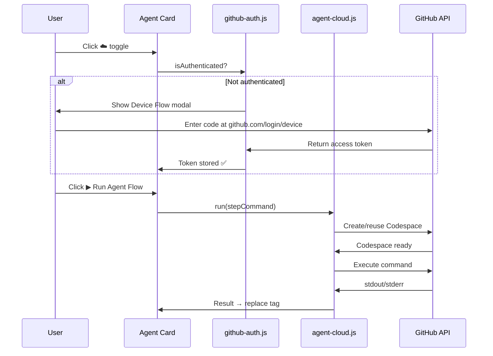

# Agent Cloud Execution — Walkthrough

## What Was Built

External agent execution via GitHub Codespaces, integrated into TextAgent's existing Agent Flow system. Users can click ☁️ on any Agent card to route step execution to a cloud Codespace instead of the local LLM.

## Files Changed

| File | Change |
|:-----|:-------|
| [storage-keys.js](file:///Users/jyotibose/textagent.github.io/js/storage-keys.js) | +5 keys: `GITHUB_TOKEN`, `GITHUB_USER`, `AGENT_PROVIDER`, `AGENT_CODESPACE_ID`, `AGENT_CUSTOM_URL` |
| [modal-templates.js](file:///Users/jyotibose/textagent.github.io/js/modal-templates.js) | +50 lines: GitHub auth modal (reuses `ai-consent-modal` classes) |
| [github-auth.js](file:///Users/jyotibose/textagent.github.io/js/github-auth.js) | **NEW** — Device Flow OAuth module (~215 lines) |
| [agent-cloud.js](file:///Users/jyotibose/textagent.github.io/js/agent-cloud.js) | **NEW** — Codespaces API adapter (~270 lines) |
| [ai-docgen.js](file:///Users/jyotibose/textagent.github.io/js/ai-docgen.js) | 3 edits: `@cloud:` parsing, ☁️ toggle button, toggle event handler |
| [ai-docgen-generate.js](file:///Users/jyotibose/textagent.github.io/js/ai-docgen-generate.js) | Cloud execution branch in `generateAgentFlow()` |
| [main.js](file:///Users/jyotibose/textagent.github.io/src/main.js) | Phase 3k: loads `github-auth.js` + `agent-cloud.js` |
| [ai-docgen.css](file:///Users/jyotibose/textagent.github.io/css/ai-docgen.css) | +76 lines: cloud toggle active state, device code UI, spin animation |
| [agent-cloud.spec.js](file:///Users/jyotibose/textagent.github.io/tests/feature/agent-cloud.spec.js) | **NEW** — 20 Playwright tests |

## How It Works



## Usage in Markdown

```markdown
{{@Agent:
  @cloud: yes
  1. Clone the OpenClaw repo and install dependencies
  2. Run the agent on the provided dataset
  3. Summarize the results
}}
```

## Before You Use — Prerequisites

1. **Register GitHub OAuth App** at `github.com/settings/developers` → set callback to `http://127.0.0.1`
2. **Replace `CLIENT_ID`** in [github-auth.js:12](file:///Users/jyotibose/textagent.github.io/js/github-auth.js#L12)
3. **Create template repo** `textagent/agent-runner` with devcontainer for OpenClaw/OpenFang

## Test Results

```
✅ 20 passed (11.6s)

Storage keys ✓ | GitHub auth modal ✓ | githubAuth module ✓
agentCloud module ✓ | @cloud: parsing ✓ | Cloud toggle UI ✓
Auth gate behavior ✓
```
