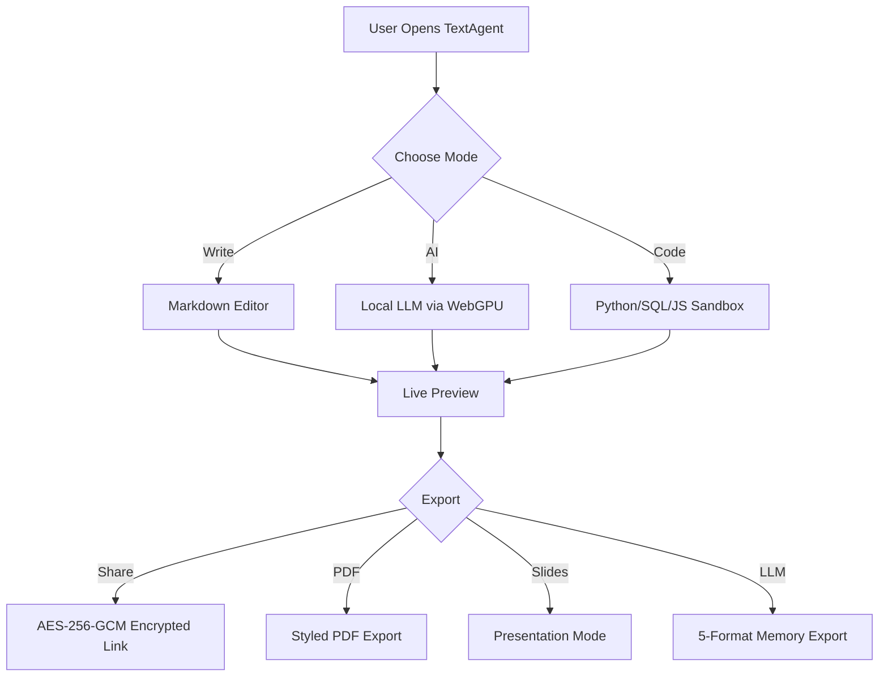

# Product Launch Brief — Project Aurora

## Overview

We're launching **Project Aurora** — a next-gen privacy platform for enterprise teams who refuse to compromise on data sovereignty.

## Key Metrics

| Metric          | Target   | Current  | Status       |
|-----------------|----------|----------|--------------|
| Daily Active    | 50,000   | 47,200   | 🟢 On Track  |
| NPS Score       | 70+      | 64       | 🟡 At Risk   |
| Monthly Churn   | < 3%     | 2.1%     | 🟢 On Track  |
| Avg Session     | 12 min   | 14.3 min | 🟢 Exceeding |
| Enterprise Tier | 200 orgs | 187 orgs | 🟡 At Risk   |

---

## 🤖 AI-Powered Analysis

{{AI: Based on the metrics table above, write a 3-paragraph executive summary analyzing the launch readiness of Project Aurora. Highlight the NPS risk and recommend 2 specific actions to address it before launch.}}

---

## 🧠 Deep Reasoning — Think Mode

{{@AI:
  @think: yes
  Analyze the strategic implications of Project Aurora's metrics: the NPS score is 64 vs target 70+, while daily active users are at 94% of target. Is it better to delay launch to fix NPS, or launch on time and iterate? Consider the trade-offs of each approach and recommend a decision with supporting reasoning.
}}

> 💡 **Demo tip:** The `@think: yes` flag activates deep reasoning mode — the AI shows its step-by-step thought process before giving a final answer.

---

## 🔗 Agent Flow — Competitive Intelligence Pipeline

{{Agent:
  Step 1: Research the top 5 privacy-first productivity platforms in 2026, including Notion, Obsidian, Anytype, Logseq, and TextAgent
  Step 2: For each platform, summarize their privacy model in one sentence and rate it on a scale of 1-5 for true client-side privacy
  Step 3: Create a comparison table with columns: Platform, Privacy Model, Client-Side Score (1-5), Key Weakness
}}

---

## 🔧 Web Scrape & Search — Tools Tag

{{@Tools:
  @scrape: https://news.ycombinator.com
}}

> 💡 **Demo tip:** The `{{Tools:}}` tag uses Jina AI to scrape any URL and return clean, structured markdown. You can also use `@search: your query` to search the web and get summarized results.

---

## 🔌 Live API Call — REST API Explorer

{{API:
  URL: https://catfact.ninja/fact
  Method: GET
  Variable: catFact
}}

{{API:
  URL: https://api.adviceslip.com/advice
  Method: GET
  Variable: adviceSlip
}}

> 💡 **Demo tip:** API responses are stored in variables like `$(api_catFact)` — use them anywhere in your document! Try the **API Explorer** template for 1400+ public APIs with working `{{API:}}` blocks.

---

## 🎨 AI Image Generation

{{Image: A futuristic privacy-first productivity dashboard floating in space, with holographic markdown documents and glowing encryption shields, digital art style}}

> 💡 **Demo tip:** The `{{Image:}}` tag generates images using Gemini Imagen. Describe what you want and click **Generate** — the image appears inline.

---

## 📊 Code Execution — Visualize the Data

```python
import matplotlib.pyplot as plt
import numpy as np

categories = ['Privacy', 'Speed', 'AI Power', 'Offline', 'Cost']
scores = [95, 88, 82, 100, 100]

fig, ax = plt.subplots(figsize=(8, 4))
colors = ['#6366f1', '#8b5cf6', '#a78bfa', '#c4b5fd', '#7c3aed']
bars = ax.barh(categories, scores, color=colors, height=0.6, edgecolor='white', linewidth=0.5)

for bar, score in zip(bars, scores):
    ax.text(bar.get_width() - 5, bar.get_y() + bar.get_height()/2,
            f'{score}%', va='center', ha='right', color='white', fontweight='bold', fontsize=12)

ax.set_xlim(0, 105)
ax.set_title('TextAgent Feature Scores', fontsize=14, fontweight='bold', pad=15)
ax.spines['top'].set_visible(False)
ax.spines['right'].set_visible(False)
plt.tight_layout()
plt.show()
```

---

## 🗃️ SQL Analysis — Launch Database

```sql
CREATE TABLE IF NOT EXISTS launches (
    id INTEGER PRIMARY KEY,
    product TEXT,
    category TEXT,
    launch_month TEXT,
    privacy_score INTEGER
);

INSERT INTO launches VALUES (1, 'TextAgent', 'Productivity', 'March 2026', 5);
INSERT INTO launches VALUES (2, 'Aurora AI', 'Security', 'March 2026', 4);
INSERT INTO launches VALUES (3, 'DataVault', 'Storage', 'Feb 2026', 3);
INSERT INTO launches VALUES (4, 'PrivacyOS', 'Platform', 'March 2026', 5);
INSERT INTO launches VALUES (5, 'CloudSync', 'Productivity', 'Jan 2026', 2);

SELECT product, category, privacy_score,
       CASE
           WHEN privacy_score >= 4 THEN '🟢 Strong'
           WHEN privacy_score >= 3 THEN '🟡 Moderate'
           ELSE '🔴 Weak'
       END as privacy_rating
FROM launches
ORDER BY privacy_score DESC;
```

---

## 🌐 Web Search — Latest Intelligence

{{AI: What were the most significant AI-powered productivity tool launches in March 2026? Focus on tools that emphasize privacy or local-first architecture.}}

> 💡 **Demo tip:** Toggle "Web Search" ON and select DuckDuckGo to see live citations.

---

## 📊 Mermaid Diagram — Architecture Overview



> 💡 **Demo tip:** Hover any Mermaid diagram for the toolbar — zoom, pan, download as PNG/SVG, or copy to clipboard.

---

## 🔀 Template Variables — Dynamic Documents

This document was generated on **$(date)** at **$(time)**.

Project: **$(projectName)** | Author: **$(authorName)** | Version: **$(version)**

> 💡 **Demo tip:** Click the **⚡ Vars** button — the system auto-detects all `$(...)` variables in the document, generates a variable table at the top, and lets you fill in values. Click ⚡ Vars again to apply. Built-in globals like `$(date)` and `$(uuid)` resolve automatically.

---

## 🐧 Linux Terminal — Compile & Run

> 💡 **Demo tip:** The `{{Linux:}}` tag supports two modes:
> - **Terminal mode** — opens a full Debian Linux desktop via WebVM in a new window
> - **Compile & Run** — compiles and executes code in 25+ languages (C++, Rust, Go, Java, etc.) via Judge0 CE with inline output

Example (paste in editor to try):
```
{{Linux:
  Language: rust
  Script: |
    fn main() {
        let features = vec!["Privacy", "AI", "Code Execution", "Sharing"];
        println!("🚀 TextAgent Powers:");
        for (i, f) in features.iter().enumerate() {
            println!("  {}. {}", i + 1, f);
        }
    }
}}
```

---

## 📷 GLM-OCR — Browser-Based OCR

> 💡 **Demo tip:** Use the `{{@OCR:}}` tag to extract text from images — all processing happens locally in the browser using the GLM-OCR 1.5B model (~650 MB, WebGPU). Three modes: Text, Math, and Table extraction. Also supports Granite Docling and Florence-2 models.

---

## 📑 Presentation Mode

> **Demo tip:** Click the **Presentation** icon in the toolbar to turn this document into a slide deck. Each `## Heading` becomes a new slide.

---

## ⚡ Power Features — Quick-Fire Demos

### 📁 Workspace & File Tree
> Press <kbd>Ctrl</kbd>+<kbd>B</kbd> to open the **workspace sidebar** — manage multiple markdown files, rename, duplicate, and switch between documents.

### 🧘 Focus Mode & Zen Mode
> Press <kbd>Ctrl</kbd>+<kbd>Shift</kbd>+<kbd>Z</kbd> for **Zen Mode** — distraction-free writing. Or enable **Focus Mode** to dim surrounding paragraphs and stay locked on your current text.

### 🎨 Theme Gallery
> Switch between **6 preview themes**: GitHub · GitLab · Notion · Dracula · Solarized · Evergreen. Plus **Dark Mode** toggle for the entire editor.

### 🎤 Voice Input
> Click the **🎤 Microphone** button for hands-free dictation: Voxtral Mini 3B (WebGPU, 13 languages) or Whisper V3 (WASM fallback). Say "bold", "new paragraph", "heading", "bullet", and 50+ other markdown voice commands.

### 🔗 Custom Named Share Links
> When sharing, enter a custom name like `mynotes` to get a memorable link (`#s=mynotes`) instead of a random ID. The system checks availability in real-time.

### 🔌 API Explorer Template
> Open **Templates** → **API Explorer** to browse **1400+ public APIs** organized by category — Animals, Anime, Finance, Weather, and more. Click ▶ on any no-auth API to try it instantly!

---

## ✅ Demo Checklist

- [x] Privacy hero — zero network requests
- [x] Live Markdown preview with table tools
- [x] AI generation with local Qwen model
- [x] Deep reasoning with Think mode
- [x] Agent Flow multi-step pipeline
- [x] Web Scrape & Search with `{{Tools:}}` tag
- [x] Live API calls with `{{API:}}` tag
- [x] AI Image Generation with `{{Image:}}` tag
- [x] Python code execution with chart
- [x] SQL query with formatted output
- [x] Web search with citations
- [x] Mermaid diagram rendering
- [x] Template variables with `$(date)` auto-resolve
- [x] Linux Compile & Run (25+ languages)
- [x] GLM-OCR browser-based image-to-text
- [ ] Encrypted sharing + Custom Named Links (do live)
- [ ] Presentation mode (do live)
- [ ] LLM Memory Export (do live)
- [ ] Workspace sidebar — Ctrl+B (do live)
- [ ] Focus/Zen Mode — Ctrl+Shift+Z (do live)
- [ ] Theme Gallery — switch themes (do live)
- [ ] Voice Input — 🎤 mic button (do live)
- [ ] API Explorer Template — load from gallery (do live)
